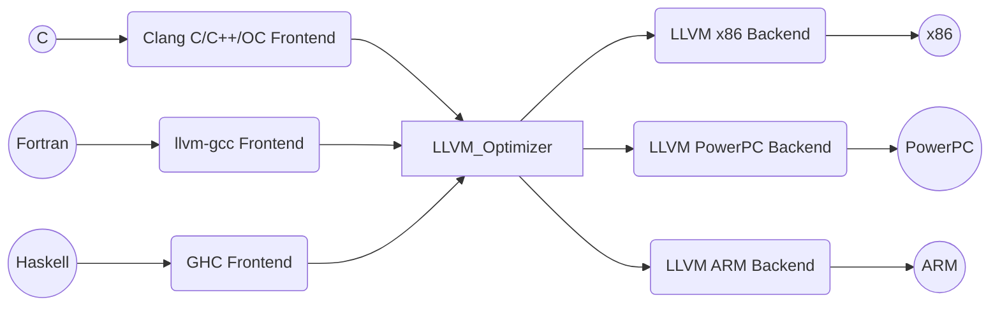
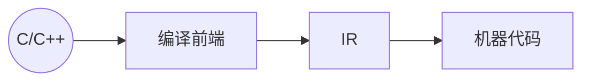

本文是课程 [*LLVM 应用与实践*](https://ke.qq.com/course/322016) 的课程笔记，包含了一些使用资料。

<!-- more -->

# 1. 什么是 LLVM

> 美国计算机协会（ACM）将其 2012 年软件系统奖项颁给了 LLVM，之前曾经获得此奖项的软件和技术包括：Java、Apache、Mosaic、the World Wide Web、Smalltalk、UNIX、Eclipse 等等。
> 
> 官网：<https://llvm.org/>
> 
> 其官网的介绍为：“The LLVM Project is a collection of modular and reusable compiler and toolchain technologies.”

LLVM 项目是模块化、可重用的编译器以及工具链技术的集合。一些文章会将 LLVM 解释为 Low Level Virtual Machine 的缩写，但实际上 LLVM 这个名称本身不是首字母缩略词，它是项目的全名。

LLVM 的创始人是 Chris Lattner，亦是 Swift 之父。

# 2. LLVM 编译器结构

## 2.1 编译器结构

有很多不同类型的编译器，例如 GCC、Clang、MSVC 等。

我们在编译原理中学过，编译器的基本结构：

- 编译前端
    - 词法分析
    - 语法分析
    - 语义分析
    - 中间代码生成
- 优化器
    - 中间代码优化
- 编译后端
    - 机器代码生成

## 2.2 LLVM 结构

LLVM 编译器特点：
- 不同的前端后端使用统一的中间代码 LLVM Intermediate Representation （LLVM IR）
- 如果需要支持一种新的编程语言，那么只需要实现一个新的前端
- 如果需要支持一种新的硬件设备，那么只需要实现一个新的后端
- 优化阶段是一个通用的阶段，它针对的是统一的 LLVM IR，不论是支持新的编程语言，还是支持新的硬件设备，都不需要对优化阶段做修改
- 相比之下，GCC 的前端和后端没分得太开，前端后端耦合在了一起。所以 GCC 为了支持一门新的语言，或者为了支持一个新的目标平台，就变得特别困难
- LLVM 现在被作为实现各种静态和运行时编译语言的通用基础结构（GCC 家族、Java、.NET、Python、Ruby、Scheme、Haskell、D 等）

## 2.3 Clang

什么是 Clang？
- LLVM 项目的一个子项目
- 基于 LLVM 架构的 C/C++/Objective-C 编译器前端
- 官网：<http://clang.llvm.org>

相比于 GCC，Clang 具有如下优点：
- 编译速度快
    - 在某些平台上，Clang 的编译速度显著的快过 GCC
    - 很多情况下，Debug 模式下编译 OC 速度比 GGC 快 3 倍
- 占用内存小
    - Clang 生成的 AST 所占用的内存是 GCC 的五分之一左右
- 模块化设计
    - Clang 采用基于库的模块化设计
    - 易于 IDE 集成及其他用途的重用
- 诊断信息可读性强
    - 在编译过程中，Clang 创建并保留了大量详细的元数据（metadata），有利于调试和错误报告
- 设计清晰简单，容易理解，易于扩展增强

广义的 LLVM 指的是整个 LLVM 编译器架构，包含各种各样语言的编译器及其组合。

狭义的 LLVM 指的是 LLVM 中间代码优化和 LLVM 目标代码生成，包括编译后端的工具集合。

