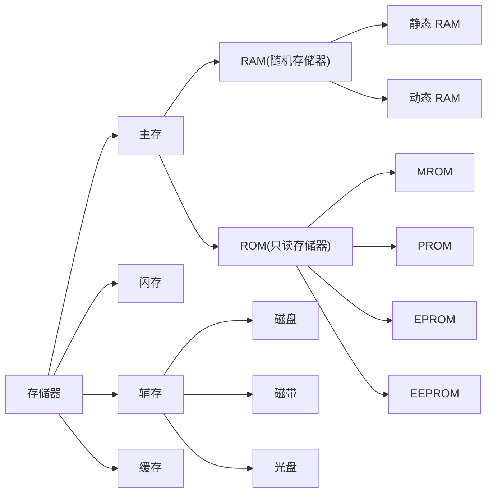
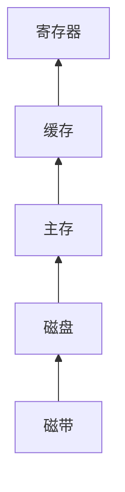
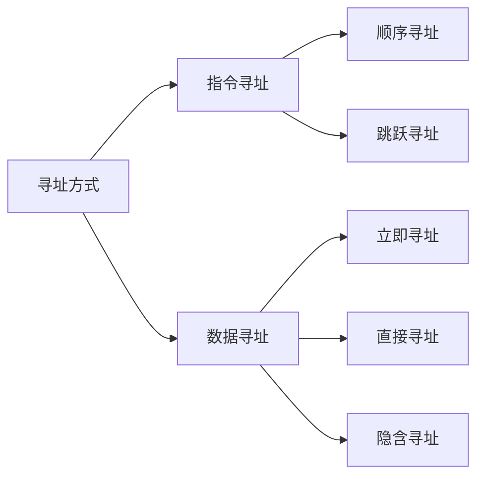

本文是 *唐朔飞.计算机组成原理* 的课程复习指南。

<!-- more -->

# 1. 计算机系统概论

## 1.1 计算机的结构特点和组成

计算机硬件的基本部件有
- 中央处理器
    - CPU：CPU 主要用于处理数据和控制程序的执行，发出执行每条指令所需要的控制信号
    - 运算器：
    - 控制器：
- 存储器：存储器用于存储信息（程序和数据）
- 输入输出设备
    - 输入设备用来输入原始数据和处理这些数据的程序
    - 输出设备用来输出计算机的处理结果，可以由 CPU 或存储器直接送来输出的内容
    - 输出设备由 CPU 或输出设备给出存储器地址和读命令

计算机内各部件之间都是通过总线联系的，根据作用的不同，分成
- 地址总线
- 数据总线
    - 能双向传送数据
- 控制总线
    - 传送命令和应答信号
    - 各部件之间的控制或应答信号也要相互传送

## 1.2 冯·诺依曼计算机的特点

1. 计算机由运算器、存储器、控制器和输入设备、输出设备 5 大部分组成
2. 采用存储程序的方式、程序和数据放在同一个存储器中，并以二进制码表示
3. 指令由操作码和地址码组成
4. 指令在存储器内按顺序存放。由指令计数器（即程序计数器 PC）指明要执行的指令所在的存储单元地址，一般是按顺序递增，但可按运算结果或外界条件而改变
5. 机器以运算器为中心，输入输出设备与存储器间的数据传送都通过运算器

## 1.3 计算机的技术指标

## 1.4 常见名称释义

名词参考：
| 缩写    | 含义                                                                                                                             |
| ------- | -------------------------------------------------------------------------------------------------------------------------------- |
| `CPU`   | 中央处理器，运算器 + 控制器                                                                                                      |
| `PC`    | 程序计数器，用来存放当前欲执行指令的地址，它与主存的 MAR 之间有一条直接通路，且具有自动加 1 的功能，即可自动形成下一条指令的地址 |
| `IR`    | 用来存放当前的指令，IR 的内容来自于主存的 MDR                                                                                    |
| `CU`    | 控制单元，用来解释存储器中的指令，并发出各种操作命令来执行指令                                                                   |
| `ALU`   | 算逻部件，用来完成算术逻辑运算                                                                                                   |
| `ACC`   | 累加器，运算器中的寄存器的一种                                                                                                   |
| `MQ`    | 乘商寄存器                                                                                                                       |
| `X`     | 操作数寄存器                                                                                                                     |
| `MAR`   | 存储器地址寄存器，用来存放欲访问的存储单元的地址，其位数对应存储单元的个数                                                       |
| `MDR`   | 存储器数据寄存器，用来存放从存储体某单元取出的代码或者准备往某存储单元存入的代码，其位数与存储字长相等                           |
| `I/O`   | 输入与输出设备，也称外部设备                                                                                                     |
| `MIPS`  | 单位时间内执行指令的平均条数（百万条指令每秒）                                                                                   |
| `CPI`   | 执行一条指令所需的时钟周期（机器主频的倒数）                                                                                     |
| `FLOPS` | 浮点运算次数每秒                                                                                                                 |

# 2. 计算机的发展及应用

## 2.1 计算机的更新换代以什么为依据？

主要以组成计算机基本电路的元器件为依据，如电子管、晶体管、集成电路等。

# 3. 系统总线

## 3.1 总线基础概念

**总线** 是连接各个部件的信息传输线，是各个部件共享的传输介质。

> 为了更好的解决 I/O 设备和主机之间连接的灵活性问题，计算机的结构从分散连接发展为总线连接。

总线有三类：
1. 片内总线
    - **芯片内部** 的总线
2. 系统总线
    - **计算机各部件之间** 的信息传输线
    - 分类
        - 数据总线：**双向** 与机器字长、存储字长有关
        - 地址总线：**单向** 与存储地址、 I/O 地址有关
        - 控制总线：**有出**（存储器读、存储器写、总线允许、中断确认）**有入**（中断请求、总线请求）
3. 通信总线
    - 用于 **计算机系统之间** 或 **计算机系统与其他系统**（如控制仪表、移动通信等）之间的通信

传输方式：
- 串行通信总线
- 并行通信总线

## 3.2 总线判优

为什么要设置总线判优控制？总线判优控制解决多个部件同时申请总线时的使用权分配问题。

常见的集中式总线控制有三种：
- 链式查询
    - 链式查询方式连线简单，易于扩充
    - 对电路故障最敏感
- 计数器定时查询
    - 计数器定时查询方式优先级设置较灵活
    - 对故障不敏感
    - 连线及控制过程较复杂
- 独立请求
    - 独立请求方式速度最快
    - 但硬件器件用量大，连线多，成本较高

## 3.3 比较同步通信和异步通信

- 同步通信
    - 指由统一时钟控制的通信，控制方式简单
    - 灵活性差
    - 当系统中各部件工作速度差异较大时，总线工作效率明显下降
    - 适合于速度差别不大的场合
- 异步通信
    - 指没有统一时钟控制的通信，部件间采用应答方式进行联系
    - 控制方式较同步复杂
    - 灵活性高
    - 当系统中各部件工作速度差异较大时，有利于提高总线工作效率

## 3.4 总线带宽

设总线的时钟频率为 $8\,\mathrm{MHz}$，一个总线周期等于一个时钟周期。如果一个总线周期中并行传送 $16$ 位数据，试问总线的带宽是多少？

解：由于 $f = 8\,\mathrm{MHz},\,T=\dfrac{1}{f}=\dfrac{1}{8\mathrm{M}}$ 秒，一个总线周期等于一个时钟周期。所以，总线带宽为 $\dfrac{16}{1 / 8\rm M} = 128\,\rm Mbps$ 。

## 3.5 波特率和比特率

概念：
- **波特率**：在信息传输通道中，携带数据信息的信号单元叫码元，每秒钟通过信道传输的码元数称为码元传输速率，简称波特率
- **比特率**：每秒钟通过信道传输的信息量称为位传输速率，简称比特率。比特率表示有效数据的传输速率

在异步串行传送系统中，字符格式为：$1$ 个起始位、$8$ 个数据位、$1$ 个校验位、$2$ 个终止位。若要求每秒传送 $120$ 个字符，试求传送的波特率和比特率。

解：一帧包含：$1+8+1+2=12$ 位。

故波特率为：$(1+8+1+2) \cdot 120 = 1440 \,\rm bps$，比特率为: $8 \cdot 120 = 960\,\rm bps$ 。

# 4. 存储器

## 4.1 相关概念

存储器的结构层次：

越往上：
- 速度越快
- 单位空间价格越高
- 容量越小

> RAM 在掉电或关机后数据会消失，与 RAM 不同，即使计算机关闭，ROM 也会保留其内容。ROM 被称为非易失性，现在有很多非易失性存储器。由于历史原因，虽然 ROM 中有的类型可以读也可以写，但是整体上都被称为只读存储器（Read Only Memory）。

主存的技术指标：
- 存储容量，计算公式如下（单位：字节）  
    $$
    \begin{aligned}
        \text{存储容量} &= \text{存储单元个数} \times
        \text{存储字长} / 8
    \end{aligned}
    $$
- 存储速度
    - 存取时间
        - 读出时间
        - 写入时间
    - 存取周期
        - 连续两次独立操作的间隔时间
- 存储器带宽
    - 单位时间内存取信息量
    - 例如存取周期 $\rm 500\,ns$，每个周期访问 $16$ 位，则带宽为 $\rm 32\,M\text{位} / s$

## 4.2 比较 DRAM 和 SRAM

| 比较指标 |   动态 RAM(DRAM)   | 静态 RAM(SRAM) |
| :------: | :----------------: | :------------: |
| 存储原理 | 电容存储电荷的方式 |  触发器的方式  |
|  集成度  |         高         |       低       |
| 芯片引脚 |         少         |       多       |
|   功耗   |         小         |       大       |
|   价格   |         低         |       高       |
|   速度   |         慢         |       快       |
|   刷新   |         有         |       无       |

- 静态 RAM
    - 静态 RAM 是靠双稳态触发器来记忆信息的
- 动态 RAM
    - 动态 RAM 是靠 MOS 电路中的栅极电容来记忆信息的
    - 由于电容上的电荷会泄漏，需要定时给与补充，所以动态 RAM 需要设置刷新电

但动态 RAM 比静态 RAM 集成度高、功耗低，从而成本也低，适于作大容量存储器。所以主内存通常采用动态 RAM，而高速缓冲存储器（Cache）则使用静态 RAM 。

## 4.3 动态 RAM 刷新时间

一个 $\rm 8\,K \times 8$ 位的动态 RAM 芯片，其内部结构排列成 $256 \times 256$ 形式，存取周期为 $0.1\,\text{μs}$ 。试问采用集中刷新、分散刷新和异步刷新三种方式的刷新间隔各为多少？

- 采用分散刷新方式刷新间隔为 $\rm 2\,ms$ ，其中刷新死时间为： $256 × 0.1 \,\text{μs} = 25.6 \,\text{μs}$
- 采用分散刷新方式刷新间隔为 $256 × (0.1 \,\text{μs} + 0.1 \,\text{μs}) = 51.2 \,\text{μs}$
- 采用异步刷新方式刷新间隔为 $\rm 2\,ms$

## 4.4 存储器和 CPU 的连接

### 4.4.1 存储容量扩展

扩展方法：
- 位扩展
    - 将 $\rm 1\,K \times 4$ 扩展为 $\rm 1\,K \times 8$
- 字扩展
    - 将 $\rm 1\,K \times 4$ 扩展为 $\rm 2\,K \times 4$
- 字、位扩展
    - 将 $\rm 1\,K \times 4$ 扩展为 $\rm 2\,K \times 8$

### 4.4.2 存储器和 CPU 的连接

需要连接的内容：
- 地址线
    - 通常将 CPU 的低地址和存储器连接
    - CPU 的高地址用于扩展
- 数据线
    - 存储芯片的位宽必须和 CPU 数据位宽一致
    - CPU 的数据线数和存储芯片的数据线数也不相等时必须扩位
- 读写线
    - 直接连接
    - 如果只有一根：一般高电平读、低电平写
- 片选线
    - 片选信号与访存控制信号 $\rm\overline{MREQ}$ 有关
- 选择合适的存储芯片
    - ROM 还是 RAM
    - 大小

74LS138 是题目中的常见结构，其引脚常见的连接方式如下：
- $E1$（或 $G1$）连接 +5V
- $\overline{E2}$（或 $\overline{G2}$）连接 $\rm\overline{MREQ}$
- $\overline{E1}$（或 $\overline{G1}$）连接 $\rm\overline{MREQ}$
- $A_{0,1,2}$（或 $A,\,B,\,C$）分别连接最高的地址三位
- $Y_{0-7}$ 连接到每个存储器的片选
- 低地址位连接到每一个存储器的地址位
- 数据和 $\rm\overline{WR}$ 连接每一个存储器的对应脚

CPU 有 $16$ 根地址线，$8$ 根数据线，包含：
- ROM（$\rm 2\,K \times 8$ 位，$\rm 4\,K \times 4$ 位，$\rm 8\,K \times 8$ 位）
- RAM（$\rm 1\,K \times 4$ 位，$\rm 2\,K \times 8$ 位，$\rm 4\,K \times 8$ 位）

提供 74LS138 译码器及其他门电路，选择合适的芯片，画出 CPU 和储存器的连接图，满足：最小的 $4\,K$ 地址为系统程序区，$4096 \sim 16383$ 为用户程序区。

系统程序区：
- ROM，$\rm 4\,KB$（`0x000 ~ 0xfff`）
- RAM，$\rm 12\,KB$（`0x1000 ~ 0xffff`）

片选：
- ROM，$\rm 4\,K \times 4$ 位芯片，$2$ 片位并联
- RAM，$\rm 4\,K \times 8$ 位芯片，$3$ 片字串联

地址：
- RAM1：`0x1000 ~ 0x1fff`
- RAM2：`0x2000 ~ 0x2fff`
- RAM3：`0x3000 ~ 0x3fff`

各芯片二进制地址分配如下：

| ~ | A15 | A14 | A13 | A12 | A11 | A10 | A9 | A8 | A7 | A6 | A5 | A4 | A3 | A2 | A1 | A0 |
| -- | - | - | - | - | - | - | - | - | - | - | - | - | - | - | - | - |
| RMO1，2| 0 | 0 | 0 | 0 | 0 | 0 | 0 | 0 | 0 | 0 | 0 | 0 | 0 | 0 | 0 | 0 |
| RMO1，2| 0 | 0 | 0 | 0 | 0 | 1 | 1 | 1 | 1 | 1 | 1 | 1 | 1 | 1 | 1 | 1 |
| RAM1 | 0 | 0 | 0 | 1 | 0 | 0 | 0 | 0 | 0 | 0 | 0 | 0 | 0 | 0 | 0 | 0 |
| RAM1 | 0 | 0 | 0 | 1 | 1 | 1 | 1 | 1 | 1 | 1 | 1 | 1 | 1 | 1 | 1 | 1 |
| RAM2 | 0 | 0 | 1 | 0 | 0 | 0 | 0 | 0 | 0 | 0 | 0 | 0 | 0 | 0 | 0 | 0 |
| RAM2 | 0 | 0 | 1 | 0 | 1 | 1 | 1 | 1 | 1 | 1 | 1 | 1 | 1 | 1 | 1 | 1 |
| RAM3 | 0 | 0 | 1 | 1 | 0 | 0 | 0 | 0 | 0 | 0 | 0 | 0 | 0 | 0 | 0 | 0 |
| RAM3 | 0 | 0 | 1 | 1 | 1 | 1 | 1 | 1 | 1 | 1 | 1 | 1 | 1 | 1 | 1 | 1 |

## 4.5 Cache —主存系统效率提升比率

在一个程序执行期间，设 $N_c$ 为访问 Cache 的总命中次数，$N_m$ 为访问主存的总次数，则命中率为

$$
h = \frac{N_c}{N_c + N_m}
$$

设 $t_c$ 为命中时 Cache 访问时间，$t_m$ 为未命中时的主存访问时间，$1-h$ 表示未命中率，平均访问时间 $t_a$ 为

$$
t_a = ht_c + \left(1-h\right)t_m
$$

Cache —主存系统效率

$$
e = \frac{t_e}{t_a} \times 100\%
$$

性能提升倍数

$$
k = \frac{t_m}{t_a}
$$

假设 CPU 执行某段程序时共访问 Cache 命中 $4800$ 次，访问主存 $200$ 次，已知 Cache 的存取周期为 $\rm 30\,ns$，主存的存取周期为 $\rm 150\,ns$，求 Cache 的命中率以及 Cache —主存系统的平均访问时间和效率，试问该系统的性能提高了多少倍？

答：Cache 被访问命中率为：

$$
\frac{4800}{4800 + 200} = 96\%
$$

则 Cache —主存系统的平均访问时间为

$$
t_a = 0.96 \times 30\,\mathrm{ns} +
(1-0.96) \times 150\,\mathrm{ns} = 34.8\,\mathrm{ns}
$$

Cache —主存系统的访问效率为

$$
e = \frac{t_e}{t_a} \times 100\% =
\frac{30}{34.8} \times 100\% = 86.2\%
$$

性能为原来的 $\rm 150\,ns/34.8\,ns=4.31$ 倍，即提高了 $3.31$ 倍。

## 4.6 Cache 三种映射方式

- 直接映射
    - 每个缓存块对应若干个主存块
    - 实施简单
    - 利用率不高
    - 命中率低
    - 不够灵活
- 全相联映射
    - 每一个字块可以映射到任何一个块上
    - 灵活
    - 命中率高
    - 成本高，实施复杂
- 组相联映射
    - 是上面两种方式的折中
    - 把 Cache 分为 $Q$ 组，每组 $R$ 块

设主存容量为 $\rm 256\,K$字，Cache 容量为 $\rm 2\,K$ 字，块长为 $4$。
1. 设计 Cache 地址格式，Cache 中可装入多少块数据？
2. 在直接映射方式下，设计主存地址格式
3. 在四路组相联映射方式下，设计主存地址格式
4. 在全相联映射方式下，设计主存地址格式
5. 若存储字长为 $32$ 位，存储器按字节寻址，写出上述三种映射方式下主存的地址格式

> 参见书后习题 4.28 。

## 4.7 汉明码的纠错

设收到的汉明码为 $C_1,\,C_2,\,B_4,\,C_3,\,B_3,\,B_2,\,B_1$ ：

偶性配置：

$$
\begin{aligned}
    P_1 &= C_1 \oplus B_4 \oplus B_3 \oplus B_1 \\
    P_2 &= C_2 \oplus B_4 \oplus B_2 \oplus B_1 \\
    P_3 &= C_3 \oplus B_3 \oplus B_1
\end{aligned}
$$

奇性配置：

$$
\begin{aligned}
    P_1 &= C_1 \oplus B_4 \oplus B_3 \oplus B_1 \oplus 1 \\
    P_2 &= C_2 \oplus B_4 \oplus B_2 \oplus B_1 \oplus 1 \\
    P_3 &= C_3 \oplus B_3 \oplus B_1 \oplus 1
\end{aligned}
$$

计算下列汉明码的传送的代码：
1. `1100000`（按偶性配置）

$$
\begin{aligned}
    P_1 &= 1 \oplus 0 \oplus 0 \oplus 0 &= 1 \\
    P_2 &= 1 \oplus 0 \oplus 0 \oplus 0 &= 1 \\
    P_3 &= 0 \oplus 0 \oplus 0 &= 0
\end{aligned}
$$

$P_3P_2P_1 = 011$，第 $3$ 位出错，可纠正为 $1110000$，故传送信息为 $1000$ 。

2. `1100010`（按偶性配置）

$$
\begin{aligned}
    P_1 &= 1 \oplus 0 \oplus 0 \oplus 0 &= 1 \\
    P_2 &= 1 \oplus 0 \oplus 1 \oplus 0 &= 0 \\
    P_3 &= 0 \oplus 0 \oplus 0 &= 0
\end{aligned}
$$

$P_3P_2P_1 = 001$，第 $1$ 位出错，可纠正为 $0100010$，故传送信息为 $0010$ 。

3. `1101001`（按偶性配置）

$$
\begin{aligned}
    P_1 &= 1 \oplus 0 \oplus 0 \oplus 1 &= 0 \\
    P_2 &= 1 \oplus 0 \oplus 0 \oplus 1 &= 0 \\
    P_3 &= 1 \oplus 0 \oplus 1 &= 0
\end{aligned}
$$

$P_3P_2P_1 = 000$，没有出错，故传送信息为 $0001$ 。

4. `0011001`（按奇性配置）

$$
\begin{aligned}
    P_1 &= 0 \oplus 1 \oplus 0 \oplus 1 \oplus 1 &= 1 \\
    P_2 &= 0 \oplus 1 \oplus 0 \oplus 1 \oplus 1 &= 1 \\
    P_3 &= 1 \oplus 0 \oplus 1 \oplus 1 &= 1
\end{aligned}
$$

$P_3P_2P_1 = 111$，第 $7$ 位出错，可纠正为 $0011000$，故传送信息为 $1000$ 。

5. `1000000`（按奇性配置）

$$
\begin{aligned}
    P_1 &= 1 \oplus 0 \oplus 0 \oplus 0 \oplus 1 &= 0 \\
    P_2 &= 0 \oplus 1 \oplus 0 \oplus 0 \oplus 1 &= 0 \\
    P_3 &= 0 \oplus 0 \oplus 0 \oplus 1 &= 1
\end{aligned}
$$

$P_3P_2P_1 = 100$，第 $4$ 位出错，可纠正为 $1001000$，故传送信息为 $0000$ 。

6. `1110001`（按奇性配置）

$$
\begin{aligned}
    P_1 &= 1 \oplus 1 \oplus 0 \oplus 1 \oplus 1 &= 0 \\
    P_2 &= 1 \oplus 1 \oplus 0 \oplus 1 \oplus 1 &= 0 \\
    P_3 &= 0 \oplus 0 \oplus 1 \oplus 1 &= 0
\end{aligned}
$$

$P_3P_2P_1 = 000$，没有出错，故传送信息为 $1001$ 。

# 5. 输入输出系统

## 5.1 常用的 I/O 编址方式

- I/O 与内存统一编址
    - 存储器和 I/O 端口共用统一的地址空间，当一个地址空间分配给 I/O 端口以后，存储器就不能再占有这一部分的地址空间
    - 优点
        - 不需要专用的 I/O 指令，程序设计比较灵活
        - 由于 I/O 端口的地址空间是内存空间的一部分，外设的数量几乎不受限制
    - 缺点
        - I/O 端口占用了内存空间的一部分，影响了系统的内存容量
        - 访问 I/O 端口也要同访问内存一样，由于内存地址较长，导致执行时间增加
- I/O 独立地址
    - 存储器和 I/O 端口在两个独立的地址空间中
    - 优点
        - I/O 端口的地址码较短，译码电路简单
        - 存储器同 I/O 端口的操作指令不同，程序比较清晰
        - 存储器和 I/O 端口的控制结构相互独立，可以分别设计
    - 缺点
        - 需要有专用的 I/O 指令，程序设计的灵活性较差

## 5.2 I/O 设备的数据传送方式

I/O 设备与主机间进行数据输入输出主要有直接程序控制方式、中断方式、DMA 方式和通道控制方式。

直接程序控制方式的主要特点是：CPU 直接通过 I/O 指令对 I/O 接口进行访问操作，主机与外设之间交换信息的每个步骤均在程序中表示出来，整个输入输出过程是由 CPU 执行程序来完成的。

中断方式的特点是：当 I/O 接口准备好接收数据或向 CPU 传送数据时，就发出中断信号通知 CPU 。对中断信号进行确认后，CPU 保存正在执行的程序的现场，转而执行提前设置好的 I/O 中断服务程序，完成一次数据传送的处理。这样，CPU 就不需要主动查询外设的状态，在等待数据期间可以执行其他程序，从而提高了 CPU 的利用率。采用中断方式管理 I/O 设备，CPU 和外设可以并行地工作。

虽然中断方式可以提高 CPU 的利用率，能处理随机事件和实时任务，但一次中断处理过程需要经历保存现场、中断处理和恢复现场等阶段，需要执行若干条指令才能处理一次中断事件，因此这种方式无法满足高速的批量数据传送要求。

直接内存存取（DirecE Memory Access，DMA）方式的基本思想是：通过硬件控制实现主存与 I/O 设备间的直接数据传送，数据的传送过程由 DMA 控制器（DMAC）进行控制，不需要 CPU 的干预。在 DMA 方式下，需要 CPU 启动传送过程，即向设备发出 “传送一块数据” 的命令。在传送过程结束时，DMAC 通过中断方式通知 CPU 进行一些后续处理工作。

DMA 方式简化了 CPU 对数据传送的控制，提高了主机与外设并行工作的程度，实现了快速外设和主存之间成批的数据传送，使系统的效率明显提高。

通道是一种专用控制器，它通过执行通道程序进行 I/O 操作的管理，为主机与 I/O 设备提供一种数据传输通道。用通道指令编制的程序存放在存储器中，当需要进行 I/O 操作时，CPU 只要按约定格式准备好命令和数据，然后启动通道即可；通道则执行相应的通道程序，完成所要求的操作。用通道程序也可完成较复杂的 I/O 管理和预处理，从而在很大程度上将主机从繁重的 I/O 管理工作中解脱出来，提高了系统的效率。

1. 程序查询方式
    - 依赖软件
    - 传递数据基本单位是字或字节
    - I/O 与主机串行工作
    - 被动接受
    - 全部占用 CPU 时间
    - 最便宜
    - 用于中低速设备的 I/O 数据交换
2. 程序中断方式
    - 依赖软件
    - 传递数据基本单位是字或字节
    - IO 与主机并行工作
    - 被动接受
    - 由于软件开销较大，时间花费较高，比较慢
    - 稍复杂，经济一般
    - 用于低速设备的 I/O 数据交换
3. DMA 方式
    - 依赖硬件
    - 传递数据的基本单位是数据块
    - IO 与主机并行工作
    - 主动请求
    - 速度最快
    - 依赖硬件，最贵
    - 用于高速设备的 I/O 数据交换
4. 通道方式
    - 使用专用控制器
    - 有专用的通道指令
5. 输入输出处理机（IOP 方式）
    - 有单独的存储器和独立的运算部件，可访问系统的内部存储器
    - 除数据传输外，还应有以下功能：
        - 能处理传送过程中出错及异常情况
        - 数据格式翻译
        - 数据块校验
    - IOP 方式是通道方式的进一步的发展
    - 大多应用在中、大型计算机中

DMA 请求的响应中断是在存取周期结束后执行，而程序中断则是在每条指令结束后执行。CPU 必须以更短的时间响应 DMA 请求，响应请求后 CPU 释放总线控制权，将总线控制权交给 DMA 。

## 5.3 选择数据传送方式

某设备向 CPU 传送信息，最高频率 $40000$ 次/秒，相应的中断处理程序执行时间为 $\rm 40\,\text{μs}$，试问外设是否可用程序中断的方式与主机交换信息？

设备向 CPU 传送信息的时间间隔 $1 / 40000 = 0.025 \times 10^{-3} = 25\text{μs} < 40\text{μs}$，该设备不能用程序中断方式与主机交换信息，因为其中断处理程序的执行速度比该外设的交换速度慢。

# 6. 计算机的运算方法

## 6.1 数字表示

在限定位宽下，无符号数和有符号数表示的范围不一样。当表示有符号数的情况下，需要将最高位留出给符号位，符号位为 $1$ 时为负数。

有符号数有下面几种表示方法：
- 原码
    - 符号位决定正负
    - 其余保持原值
- 补码
    - 符号位决定正负
    - 负数取反加一
- 反码
    - 符号位决定正负
    - 负数取反

> 由于 “零” 在补码中只有一种表示形式，故补码比原码和反码可以多表示一个负数。

| 真值     | 原码        | 补码        | 反码        |
| -------- | ----------- | ----------- | ----------- |
| $-13/64$ | $1.0011010$ | $1.1100110$ | $1.1100101$ |
| $29/128$ | $0.0011101$ | $0.0011101$ | $0.0011101$ |
| $100$    | $01100100$  | $01100100$  | $01100100$  |
| $-87$    | $11010111$  | $10101001$  | $10101000$  |

在通过补码计算浮点数或定点数时，如果出现进位，判断是否溢出等于最高有效位进位值和符号位值，其中最高位的符号是真正的符号。

变形补码是两位符号位的补码，通过变形补码参与运算可以得到正确结果，如果两个符号位相同则没有溢出，否则产生了溢出。

## 6.2 Booth 算法

计算 $x \times y$（补码一位乘），$[x]_{\text{补}} = 0.110111$，$[y]_{\text{补}} = 1.010010$：

|                               部分积                               |                      乘数                      | 说明                                                                                                          |
| :----------------------------------------------------------------: | :--------------------------------------------: | :------------------------------------------------------------------------------------------------------------ |
| $\begin{aligned}00.000000 \\ 00.000000 \\ +00.110111\end{aligned}$ | $\begin{aligned}010010 \\ 001001\end{aligned}$ | 初值 $[z_0]_{\text{补}} = 0$，$y_0 = 0$，右移一位，得 $[z_1]_{\text{补}}$，乘数右移一位，$y_5 = 1, +[x]_{\text{补}}$ |
| $\begin{aligned}00.110111 \\ 00.011011 \\ +00.000000\end{aligned}$ |   $\begin{aligned}10 \\ 100100\end{aligned}$   | 右移一位，得 $[z_2]_{\text{补}}$，乘数右移一位，$y_4 = 1, +0$                                                        |
| $\begin{aligned}00.011011 \\ 00.001101 \\ +00.110111\end{aligned}$ |  $\begin{aligned}010 \\ 110010\end{aligned}$   | 右移一位，得 $[z_3]_{\text{补}}$ 乘数右移一位，$y_3 = 0, +0$                                                         |
| $\begin{aligned}00.001101 \\ 00.000110 \\ +00.110111\end{aligned}$ |  $\begin{aligned}0010 \\ 111001\end{aligned}$  | 右移一位，得 $[z_4]_{\text{补}}$，乘数右移一位，$y_2 = 1, +[x]_{\text{补}}$                                          |
| $\begin{aligned}00.111101 \\ 00.011110 \\ +00.110111\end{aligned}$ | $\begin{aligned}10010 \\ 111100\end{aligned}$  | 右移一位，得 $[z_5]_{\text{补}}$，乘数右移一位，$y_1 = 1, +0$                                                        |
| $\begin{aligned}00.011110 \\ 00.001111 \\ +00.110111\end{aligned}$ | $\begin{aligned}010010 \\ 011110\end{aligned}$ | 右移一位，得 $[z_6]_{\text{补}}$，乘数右移一位，$y_0 = 1, +[-x]_{\text{补}}$ 进行校正                                |
|                            $11.011000$                             |                    $011110$                    |                                                                                                               |

故 $[x \cdot y]_{\text{补}} = 1.011000011110$ 。

# 7. 指令系统

## 7.1 寻址方式

## 7.2 RISC 和 CISC

与 CISC 相比，RISC 机的主要优点：
1. 充分利用 VLSI 芯片的面积
    - CISC 控制器大多使用微程序控制，而 RISC 使用组合逻辑电路
    - RISC 的硬布线只占芯片面积的 $10\%$ 左右
2. 提高计算机的运算速度
    1. RISC 的指令数、寻址方式和指令格式较少，指令编码有规律，指令译码更快
    2. RISC 内的通用寄存器多，减少了访问内存次数，加快程序运行
    3. 采用寄存器窗口重叠技术，程序嵌套时不必将寄存器内容保存到储存器中
    4. 组合逻辑控制，比 CISC 指令延迟小，缩短了 CPU 周期
    5. RISC 选用精简指令系统，适合流水线工作，大多数指令在一个周期内完成
3. 便于设计，可降低成本，提高可靠性
4. 有效支持高级语言编程

RISC 机简化了系统，指令数量少也不兼容老机器，大多数 RISC 机不能和老机器兼容。

> 近年来，随着 RISC 指令的扩充和增强，RISC 系统也越来越复杂，而 CISC 也在挖掘最大性能的过程中，加入了更多的通用寄存器和指令流水线设计，已经很难评价它们的优越性了。

# 10. 控制单元的设计

## 10.1 微指令的设计格式

- 水平型微指令
    - 并行能力强，效率高
    - 灵活性强
    - 执行一条机器指令所需的微指令数目少
    - 水平微指令用较短的微程序换取较长的微指令结构，垂直型相反
- 垂直型微指令
    - 与机器指令差别小，而水平型与机器差别大

## 10.2 微程序控制器和硬布线控制器

控制器：
- 微程序控制器
    - 微操作控制信号由组合逻辑电路根据当前的指令码、状态和时序，即时产生。
- 硬布线控制器
    - 硬布线控制器是将控制部件做成产生专门固定的 **时序控制信号** 的逻辑电路，产生各种控制信号，因而又称为 **组合逻辑控制器**

