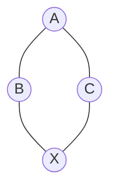
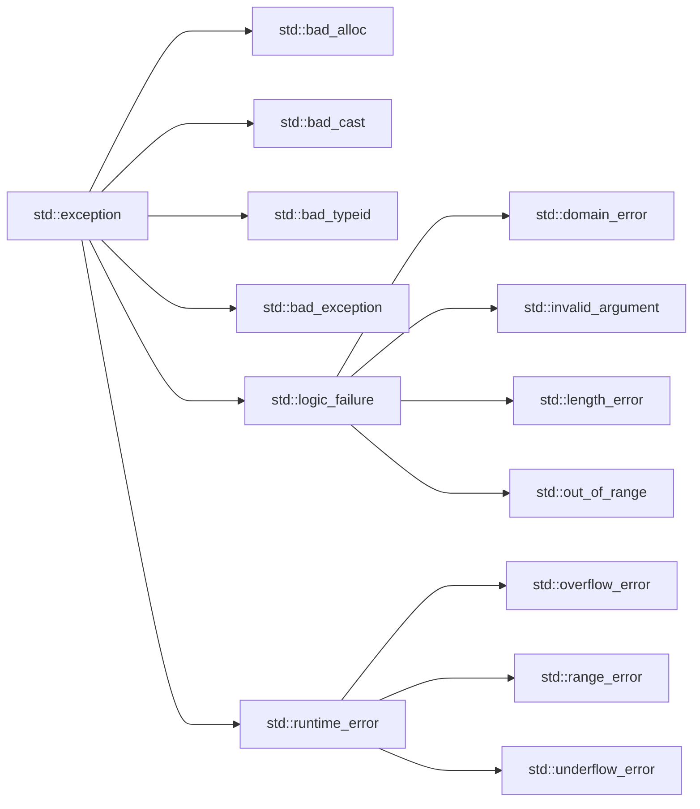
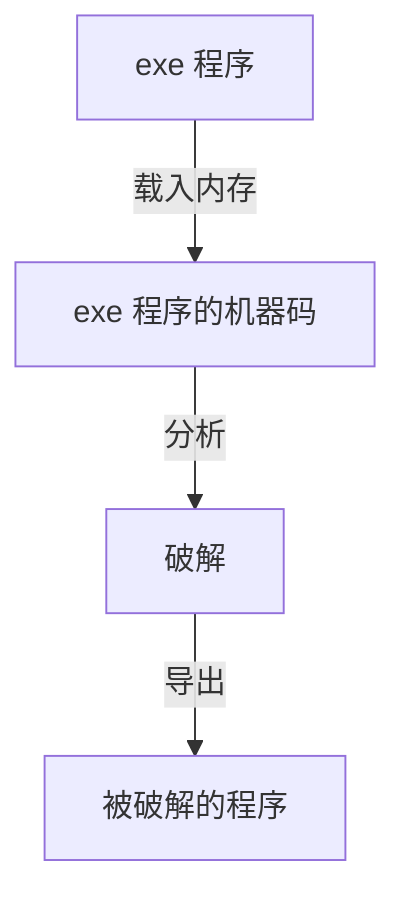

本文是 C++ 学习笔记，结合 C++11 底层和特征讲解，并包含实战。全课程一共 16 章，这里讲解 9~16 章的内容。

<!-- more -->

<div class="note note-warning">

关于课程、笔记的信息参考 [*C++ 学习笔记（上）*](./cpp-note-01.md) 。

</div>

# 9. 面向对象 D

## 9.1 多态 8 虚析构函数

我们先测试如下代码：

```c++
struct Animal {
    Animal() {
        cout << "Animal::Animal()" << endl;
    }
    ~Animal() {
        cout << "Animal::~Animal()" << endl;
    }
};
struct Cat: Animal {
    Cat() {
        cout << "Cat::Cat()" << endl;
    }
    ~Cat() {
        cout << "Cat::~Cat()" << endl;
    }
};
```

调用的时候，不会调用 `~Cat()` 。为了调用子类的析构函数，使用 **虚析构函数** `virtual ~Animal()` 。

## 9.2 多态 9 纯虚函数、抽象类

没有函数体，且初始化为 `0` 的虚函数是 **纯虚函数**：
```c++
struct Animal {
    virtual void speak() = 0;
    virtual void run() = 0;
};
```

**抽象类**（Abstract Class）是含有纯虚函数的类，不可以实例化（不可以创建对象）
- 抽象类也可以包含非纯虚函数、成员变量
- 如果父类是抽象类，子类没有完全重写纯虚函数，那么这个子类依然是抽象类

## 9.3 多继承 1

C++ 允许一个类可以有多个父类，**不建议使用**，会增加程序设计复杂度。

```c++
class Student {
    int m_score;
public:
    Student(int score) {
        this->m_score = score;
    }
};
class Worker {
    int m_salary;
public:
    Worker(int salary) {
        this->m_salary = salary;
    }
};
class Undergraduate: public Student, public Worker {
public:
    int m_grade;
    Undergraduate(int score, int salary, int grade)
        :m_grade(grade), Student(score), Worker(salary) {
    }
}
```

如果子类继承的多个父类都有虚函数，那么子类对象就会产生对应的多张虚表。


如果父类与子类包含同名函数或变量，可以加上类名：

```c++
Undergraduate ug;
ug.m_age = 10;
ug.Student::m_age = 11;
ug.Worker::m_age = 13;
```

## 9.4 多继承 2 菱形继承



如果类 `A` 有一个成员变量 `m_age`，那么 `B` 和 `C` 也包含成员变量 `m_age`，类 `X` 就会出现两个 `m_age`

菱形继承带来的问题：
- 最底下子类从基类继承的成员变量冗余、重复
- 最底下子类无法访问基类的成员，有二义性

如果需要解决这个问题，使用 **虚继承**。

## 9.5 多继承 3 虚继承

```c++
class Person {
    int m_age;
};
class Student: virtual Person {
    int m_score;
};
class Worker: virtual Person {
    int m_salary;
};
class Undergraduate: Student, Worker {
    int m_grade;
}
```

`Student` 类的内存布局：
1. 虚表指针
2. `m_score`
3. `m_age`

- 虚表里面第一个是虚表指针与本类起始的偏移量，一般都是 `0`
- 第二个值是虚基类第一个成员变量与本类起始的偏移量

`Undergraduate` 类的内存布局：
1. 虚表指针
2. `m_salary`
3. 虚表指针
4. `m_grade`
5. `m_age`

## 9.6 多继承 4 应用

C++ 的多继承机制复杂，容易增加项目复杂度，不建议大量使用。

父类定义接口规范，包含纯虚函数，如果子类可以实现，那么子类可以继承多个类，此时是合理的。

## 9.7 `static` 1 成员变量

**静态成员** 是被 `static` 修饰的成员变量或函数。

访问方式：
- 通过对象（`obj.static_member`）
- 通过对象指针（`obj->static_member`）
- 通过类（`cls::static_member`）

静态变量只有一份，存储在数据段（全局区，类似于全局变量），整个程序运行过程中只有一份内存。

对比全局变量，它可以设定访问权限（`public`、`protected`、`private`），达到局部共享的目的。

静态成员变量必须初始化，但是放到类的外部初始化：

```c++
class Car {
public:
    static int m_price;
}
int Car::m_price = 0;
```

如果声明和实现分离的，那么初始化只能放在实现里面，且实现部分不能被 `static` 修饰。

## 9.8 `static` 2 成员函数

静态成员函数：
- 内部不能使用 `this` 指针
- 不能是虚函数
- 内部只能访问静态成员变量或函数
- 构造函数、析构函数不能是静态
- 当声明和实现分离时，实现部分不能被 `static` 修饰

## 9.9 `static` 3 汇编分析

静态成员变量被继承的时候也只有一份。

## 9.10 `static` 4 应用

例如，统计当前已经有多少个对象实例：

```c++
class Car {
private:
    static int ms_count;
public:
    Car() {
        // 注意多线程安全
        ms_count++;
    }
    ~Car() {
        // 注意多线程安全
        ms_count--;
    }
    static int getCount() {
        return ms_count;
    }
};
int Car::ms_count = 0;
```

# 10. 面向对象 E

## 10.1 `static` 5 单例模式

> 静态成员经典应用 —— 单例模式。

单例模式是 **设计模式**（Design Pattern）的一种，保证某个类只创建一个对象。

```c++
class Rocket {
private:
    Rocket() {}
    ~Rocket() {}
    static Rocket *ms_rocket;
public:
    static Rocket *sharedRocket() {
        // 注意多线程安全
        if(ms_rocket == NULL) {
            ms_rocket = new Rocket();
        }
        return ms_rocket;
    }
    static void deleteRocket() {
        // 注意多线程安全
        if(ms_rocket != NULL) {
            delete ms_rocket;
            ms_rocket = NULL;
        }
    }
};
```

## 10.2 `new`、`delete` 的误区

- `new` 不会将申请的空间清空原有数据
- `delete` 也不会清空已经使用的数据

## 10.3 `const` 成员、引用成员

`const` 成员是被 `const` 修饰的成员变量或非静态成员函数

```c++
class Car {
    const int m_price;
    void run() const {
        cout << "Car::run()" << endl;
    }
};
```

`const` 成员变量：
- 必须初始化，在类内部初始化，可以在声明的时候直接初始化赋值
- 非 `static` 的 `const` 成员变量还可以在初始化列表中初始化

`const` 成员函数：
- 内部不能修改非 `static` 成员变量
- 内部只能调用 `const` 成员函数、`static` 成员函数
- 被修饰的函数必须是非静态的
- `const` 关键字写在参数列表后面，函数的声明和实现都必须带 `const`
- 非 `const` 成员函数可以调用 `const` 成员函数
- `const` 成员函数和非 `const` 成员函数构成重载
    - 非 `const` 对象（指针）优先调用非 `const` 成员函数
    - `const` 对象（指针）只能调用 `const` 成员函数、static 成员函数

引用类型成员变量必须初始化（不考虑 `static` 情况）
- 在声明的时候直接初始化
- 通过初始化列表初始化

```c++
class Car {
    int age;
    int &m_price = age;
public:
    Car(int &price): m_price(price) { }
};
```

## 10.4 拷贝构造 1

```c++
class Car {
    int m_price;
    int m_length;
public:
    Car(int price=0, int length=0): m_price(price), m_length(length) {
        cout << "Car()" << endl;
    }
    void display() {
        cout << "price=" << m_price << ", m_length=" << m_length << endl;
    }
};
```

**拷贝构造函数**（Copy Constructor）
- 拷贝构造函数是构造函数的一种
- 当利用已存在的对象创建一个新对象时（类似于拷贝），就会调用新对象的拷贝构造函数进行初始化
- 拷贝构造函数的格式是固定的，接收一个 `const` 引用作为参数

例如：

```c++
Car car1();
Car car2(car1);
car1.display();
car2.display();
```

不写拷贝构造函数是没有拷贝构造函数的，但是存在拷贝构造的行为。默认的拷贝构造行为是复制对象的数据。

拷贝构造函数写法：

```c++
Car::Car(const Car &car) {
    // 内容
}
```

## 10.5 拷贝构造 2 父类

继承体系的拷贝构造：

```c++
class Person {
    int m_age;
public:
    Person(int age=0): m_age(age) { }
    Person(const Person &person): m_age(person.m_age) { }
};
class Student: public Person {
    int m_score;
public:
    Student(int age=0, int score=0): Person(age), m_score(score) { }
    Student(const Student &student): Person(student), m_score(student.m_score) { }
};
```

如果需求仅仅是复制所有的成员变量，那么不需要拷贝构造函数。

## 10.6 拷贝构造 3 注意点

使用 10.4 的代码，思考下面的代码：

```c++
// 默认构造函数
Car car1(100, 5);
// 拷贝构造
Car car2(car1);
// 拷贝构造
Car car3 = car2;
// 默认构造函数
Car car4;
// 复制对象
car4 = car3;
```

## 10.7 拷贝构造 4 疑点

子类的构造函数默认会调用父类无参的构造函数。如果已经构造了父类的构造函数，就不会再去调用父类的构造函数。

## 10.8 拷贝构造 5 浅拷贝

编译器默认的提供的拷贝是 **浅拷贝**（Shallow Copy）
- 将一个对象中所有成员变量的值拷贝到另一个对象
- 如果某个成员变量是个指针，只会拷贝指针中存储的地址值，并不会拷贝指针指向的内存空间
- 可能会导致堆空间多次 `free()` 的问题

如果需要实现 **深拷贝**（Deep Copy），就需要自定义拷贝构造函数
- 将指针类型的成员变量所指向的内存空间，拷贝到新的内存空间

如复制 C 风格字符串需求：

```c++
// 下面是 C 风格字符串
const char *name1 = "def";
char name2[] = {'d', 'e', 'f', '\0'};
```
如果类中存在 C 风格字符串，可能需要定义拷贝构造函数。

<div class="note note-warning">

**【警告】** 如果不定义拷贝构造函数，可能存在堆空间指针指向栈空间的危险行为！

</div>

## 10.9 拷贝构造 6 深拷贝 1

初始化：

```c++
class Car {
    int m_price;
    char *m_name;
public:
    Car(int price=0, const char *name=NULL): m_price(price) {
        if(name == NULL) return;
        m_name = new char[strlen(name) + 1]{};
        strcpy(m_name, name);
    }
    ~Car() {
        if(m_name == NULL) return;
        delete m_name;
    }
};
```

## 10.10 拷贝构造 7 深拷贝 2

拷贝构造实现的示例：

```c++
Car::Car(const Car& car): m_price(car.m_price) {
    if(car.m_name == NULL) return;
    m_name = new char[strlen(car.name) + 1]{};
    strcpy(m_name, car.name);
}
```

完整的示例：

```c++
class Car {
    int m_price;
    char *m_name;
    void _copyName(const char *name) {
        if(name == NULL) return;
        m_name = new char[strlen(name) + 1]{};
        strcpy(m_name, name);
    }
public:
    Car(int price=0, const char *name=NULL): m_price(price) {
        _copyName(name);
    }
    Car(const Car& car) {
        _copyName(car.m_name);
    }
    ~Car() {
        if(m_name == NULL) return;
        delete m_name;
    }
};
```

# 11. 面向对象 F

## 11.1 拷贝构造 8 总结

需要深拷贝的时候需要实现拷贝构造函数。

## 11.2 对象类型的参数和返回值

使用对象类型作为函数的参数或者返回值，可能会产生一些不必要的中间对象：

```cpp
void test(Car car) {
    // 会调用一次拷贝构造函数
}
```

更好的策略：

```c++
void test1(Car &car) { }
void test2(const Car &car) { }
void test3(Car *car) { }
```

返回值如果作为返回值时，也会产生中间对象：

```c++
Car test() {
    Car car();
    return car;
}
int main() {
    // 产生一次拷贝构造
    // ...test();
    // 产生两次拷贝构造，编译器优化后是一次拷贝构造
    Car car1 = test();
}
```

## 11.3 匿名对象（临时对象）

**匿名对象** 没有变量名、没有被指针指向的对象，用完后马上调用析构。

下面的对象是匿名对象
```c++
Car();
```

匿名对象作为函数参数会被优化，不会产生两次构造。

## 11.4 隐式构造、`explicit`

下面的几种情况会产生 **隐式构造**，或叫 **转换构造**：

```c++
class Car {
    int m_price;
public:
    Car() { }
    Car(int price): m_price(price) { }
    Car(const Car &car): m_price(car.m_price) { }
};

// 情况 1
void test1(Car car) {
}
Car test2() {
    return 70;
}
int main() {
    Car car1 = 10;
    test1(40);
    Car car2();
    car2 = 30;
    Car car3 = test2();
}
```

使用关键字 `explicit` 禁止隐式构造：

```c++
class Car {
    int m_price;
public:
    Car() { }
    explicit Car(int price): m_price(price) { }
    Car(const Car &car): m_price(car.m_price) { }
};
```

## 11.5 编译器自动生成的构造函数

C++ 的编译器在某些特定的情况下，会给类自动生成无参的构造函数，比如
- 成员变量在声明的同时进行了初始化
- 有定义虚函数
- 虚继承了其他类
- 包含了对象类型的成员，且这个成员有构造函数（编译器生成或自定义）
- 父类有构造函数（编译器生成或自定义）

<div class="note note-success">

总结：对象创建后，需要做一些额外操作时（比如内存操作、函数调用），编译器一般都会为其自动生成无参的构造函数

</div>

## 11.6 友元

```c++
class Point {
    int m_x;
    int m_y;
public:
    int getX() { return m_x; }
    int getY() { return m_y; }
    Point(int x, int y): m_x(x), m_y(y) { }
    void display() {
        cout << "(" << m_x << ", " << m_y << ")" << endl;
    }
};
Point add(Point p1, Point p2) {
    return Point(p1.getX() + p2.getX(), p1.getY() + p2.getY());
}
```

使用 **友元函数**：

```c++
class Point {
    friend Point add(Point p1, Point p2);
    int m_x;
    int m_y;
public:
    int getX() { return m_x; }
    int getY() { return m_y; }
    Point(int x, int y): m_x(x), m_y(y) { }
    void display() {
        cout << "(" << m_x << ", " << m_y << ")" << endl;
    }
};
Point add(Point p1, Point p2) {
    return Point(p1.m_x + p2.m_x, p1.m_y + p2.m_y);
}
```

- 友元包括友元函数和友元类
- 如果将函数 `A()`（非成员函数）声明为类 `C` 的友元函数，那么函数 `A()`就能直接访问类 `C` 对象的所有成员
- 如果将类 `A` 声明为类 `C` 的友元类，那么类 `A` 的所有成员函数都能直接访问类 `C` 对象的所有成员
- 友元破坏了面向对象的封装性，但在某些频繁访问成员变量的地方可以提高性能

友元类使用方法 `friend class ClassName;` 。

## 11.7 内部类

如果将类 `A` 定义在类 `C` 的内部，那么类 `A` 就是一个 **内部类**（**嵌套类**）：

```c++
class Person {
    class Car {
        // 内部类
    };
};
```

内部类的特点：
- 支持 `public, protected, private` 权限
- 成员函数可以直接访问其外部类对象的所有成员（反过来则不行）
- 成员函数可以直接不带类名、对象名访问其外部类的 `static` 成员
- 不会影响外部类的内存布局
- 可以在外部类内部声明，在外部类外面进行定义

内部类与外部类唯一不同的就是访问权限。

声明和实现分离：

```c++
class Point {
    class Math;
};
class Point::Math {
    // ...实现...
};
```

## 11.8 局部类

在一个函数内部定义的类，称为 **局部类**：

```c++
void test() {
    class Car {
    public:
        void run() {
        }
    };
}
```

局部类的特点：
- 作用域仅限于所在的函数内部
- 其所有的成员必须定义在类内部，不允许定义 `static` 成员变量
- 成员函数不能直接访问函数的局部变量（`static` 变量除外）

局部类与外部的类也只是访问权限的区别。

# 12. 其他语法 A

## 12.1 运算符重载 1

**运算符重载**（Operator Overload）可以为运算符增加一些新的功能

全局函数、成员函数都支持运算符重载：

```c++
class Point {
    friend Point operator+(Point, Point);
    int m_x;
    int m_y;
public:
    Point(int x, int y): m_x(x), m_y(y) { }
    Point(const Point &point): m_x(point.m_x), m_y(point.m_y) { }
    void display() {
        cout << "x = " << this->m_x << ", y = " << this->m_y << endl;
    }
};

Point operator+(const Point &p1, const Point &p2) {
    return Point(p1.m_x + p2.m_x, p1.m_y + p2.m_y);
}
```

## 12.2 运算符重载 2 完善

尝试重载 `+ - += == != -(负号) ++ -- << >>` 。

下面的代码完全可用，可用尝试任意类型的变量进行运算符重载：

```c++
#include <iostream>
using namespace std;

class Car {
    friend int operator+(const Car&, const int &);
    int m_price;
public:
    Car(int price): m_price(price) {}
};

int operator+(const Car &car1, const int &a) {
    return car1.m_price + a;
}

int main() {
    Car c1 = Car(3);
    cout << c1 + 7 << endl;
    return 0;
}
```

## 12.3 运算符重载 3 更多运算符

将运算符重载改成成员函数：

```c++
class Point {
    int m_x;
    int m_y;
public:
    Point(int x, int y): m_x(x), m_y(y) { }
    Point(const Point &point): m_x(point.m_x), m_y(point.m_y) { }
    void display() {
        cout << "x = " << this->m_x << ", y = " << this->m_y << endl;
    }
    Point operator+(const Point &point) {
        return Point(m_x + point.m_x, m_y + point.m_y);
    }
};
```

全局函数，成员函数都支持重载。

如何保证：

```c++
(car1 + car2) = Car(10);
```

这样的语句不被允许（这个语句将对象赋值给临时对象）。

方法是加上两个 `const`：

```c++
// 成员函数
const Point operator+(const Point &point) const {
    return Point(m_x + point.m_x, m_y + point.m_y);
}
```

- 第一个 `const` 保证临时对象不会被赋值
- 第二个 `const` 保证多个对象可以连续操作
    - 因为返回的对象是 `const` 的，不能调用非 `const` 函数

其他示例：

```c++
// 下面都是成员函数
Point &operator+=(const Point &point) {
    m_x += point.m_x;
    m_y += point.m_y;
    return *this;
}
bool operator==(const Point &point) const {
    return (m_x == point.m_x) && (m_y == point.m_y);
}
```

## 12.4 运算符重载 4 单目运算符

```c++
// 下面都是成员函数
const Point &operator-() const { // 负号
    return Point(-m_x, -m_y);
}
Point &operator++() { // ++p
    m_x++;
    m_y++;
    return *this;
}
const Point &operator++(int) { // p++
    Point old(m_x, m_y);
    m_x++;
    m_y++;
    return old;
}
```

注意，`operator++(int)` 是固定写法，代表后置 `++`

## 12.5 运算符重载 5 输出

如何实现：

```c++
cout << point << endl;
```

重载 `ostream << ...`：

```c++
// 该函数不是成员函数，可声明为友元函数
ostream &operator<<(ostream &stream, const Point &point) {
    stream << "(" << point.m_x << ", " << point.m_y << ")";
    return stream;
}
```

这个函数不能加上 `const` 修饰，即使没有使用 `const`，也不能将返回的对象赋值（因为它的赋值操作是私有函数）。

## 12.6 运算符重载 6 输入

重载 `istream >> ...`：

```c++
// 声明为友元函数
istream &operator>>(istream &stream, Point &point) {
    stream >> point.m_x;
    stream >> point.m_y;
    return stream;
}
```

重载赋值运算符：

```c++
// 成员函数
Person &operator=(const Person &person) {
    m_age = person.m_age;
    return *this;
}
```

## 12.7 运算符重载 7 单例模式完善

```c++
class Rocket {
private:
    static Rocket *ms_rocket;
    Rocket() {}
    ~Rocket() {}
    // <Add>
    Rocket(const Rocket &rocket);
    void operator=(const Rocket &rocket);
    // </Add>
public:
    static Rocket *sharedRocket() {
        // 注意多线程安全
        if(ms_rocket == NULL) {
            ms_rocket = new Rocket();
        }
        return ms_rocket;
    }
    static void deleteRocket() {
        // 注意多线程安全
        if(ms_rocket != NULL) {
            delete ms_rocket;
            ms_rocket = NULL;
        }
    }
};
```

## 12.8 运算符重载 8 父类

调用父类的运算符重载 `Person::operator=(person)`：

```c++
class Person {
    int m_age;
public:
    Person &operator=(const Person &person) {
        this->m_age = person.m_age;
    }
};

class Student : public Person {
    int m_score;
public:
    Student &operator=(const Student &student) {
        Person::operator=(student);
        this->m_score = student.m_score;
    }
};
```

## 12.9 运算符重载 9 仿函数（函数对象）

**仿函数** 是将一个对象当作一个函数一样来使用。

```c++
class Sum {
public:
    int operator()(int a, int b) {
        return a + b;
    }
};
int main() {
    Sum sum;
    cout << sum(20, 30);
}
```

对比普通函数，它作为对象可以保存状态。

有一些运算符不可以被重载
- `.`
- `::`
- `? :`
- `sizeof`

有一些运算符只能重载为成员函数，比如
- `=` 赋值
- `[]` 下标
- `()` 函数调用
- `->` 指针访问成员

## 12.10 模板 1

泛型，是一种将类型参数化以达到代码复用的技术，C++ 中使用模板来实现泛型。

模板的使用格式如下：
- `template <typename\class T>`
- `typename` 和 `class` 是等价的

注意：
1. 模板没有被使用时，是不会被实例化出来的
2. 模板的声明和实现如果分离到 `.h` 和 `.cpp` 中，会导致链接错误
3. 一般将模板的声明和实现统一放到一个 `.hpp` 文件中

编译细节：
- 泛型会生成多个不同的函数，用到什么生成什么
- 没有使用的时候是不会被编译的

# 13. 其他语法 B

## 13.1 模板 2 编译细节

普通编译：


带模板的编译：


交换两个变量的值模板：

```c++
template <class T>
void swapValues(T &v1, T &v2) {
    T temp = v1;
    v1 = v2;
    v2 = temp;
}

int main() {
    int a = 10;
    int b = 20;
    swapValues<int>(a, b);
    cout << a << ", " << b;
}
```

多参数模板：

```c++
template <class T1, class T2>
void display(T1 &v1, T2 &v2) {
    cout << v1 << endl;
    cout << v2 << endl;
}

int main() {
    int a = 10;
    double b = 20.0;
    display(a, b);
}
```

> 提示：此时 `display(a, b)` 与 `display<int, double>(a, b)` 效果一致。

## 13.2 模板 3 动态数组

实现一个动态数组：

```c++
#define DEFAULT_CAP 10

class Array {
    int *m_data = NULL;
    int m_size;
    int m_capacity;
    void resize(bool is_lager = true) {
        if(is_lager) {
            int *new_space = new int[m_capacity * 2];
            memcpy(new_space, m_data, sizeof(int) * m_size);
            delete[] m_data;
            m_data = new_space;
            m_capacity *= 2;
        } else {
            if(m_capacity <= DEFAULT_CAP) return;
            int *new_space = new int[m_capacity / 2];
            memcpy(new_space, m_data, sizeof(int) * m_capacity / 2);
            delete[] m_data;
            m_data = new_space;
            m_capacity /= 2;
        }
    }
public:
    Array(int capacity = DEFAULT_CAP) {
        m_capacity = (capacity > 0) ? capacity : DEFAULT_CAP;
        m_data = new int[m_capacity];
    }
    ~Array() {
        if(m_data == NULL) return;
        delete[] m_data;
    }
    int get(int index) {
        if(index < 0 || index > m_size) {
            throw "Array Overflow";
        }
        return m_data[index];
    }
    void add(int value) {
        if(m_size == m_capacity) {
            resize();
        }
        m_data[m_size++] = value;
    }
    int size() {
        return m_size;
    }
};
```

这是示例代码，其中 `resize()` 函数为自己写的实现。

## 13.3 模板 4 类模板

```c++
#define DEFAULT_CAP 10

template <class Item>
class Array {
    Item *m_data = NULL;
    int m_size;
    int m_capacity;
    void resize(bool is_lager = true) {
        if(is_lager) {
            int *new_space = new Item[m_capacity * 2];
            memcpy(new_space, m_data, sizeof(Item) * m_size);
            delete[] m_data;
            m_data = new_space;
            m_capacity *= 2;
        } else {
            if(m_capacity <= DEFAULT_CAP) return;
            int *new_space = new Item[m_capacity / 2];
            memcpy(new_space, m_data, sizeof(Item) * m_capacity / 2);
            delete[] m_data;
            m_data = new_space;
            m_capacity /= 2;
        }
    }
public:
    Array(int capacity = DEFAULT_CAP) {
        m_capacity = (capacity > 0) ? capacity : DEFAULT_CAP;
        m_data = new Item[m_capacity];
    }
    ~Array() {
        if(m_data == NULL) return;
        delete[] m_data;
    }
    Item get(int index) {
        if(index < 0 || index > m_size) {
            throw "Array Overflow";
        }
        return m_data[index];
    }
    void add(Item value) {
        if(m_size == m_capacity) {
            resize();
        }
        m_data[m_size++] = value;
    }
    int size() {
        return m_size;
    }
    Item operator[](int index) {
        return get(index);
    }
};
```

扩容使用 **均摊策略**。

声明和实现分离时要写两份 `template <class Item>`：

```c++
template <class Item>
void Array<Item>::add(Item value) {
    // ...
}
```

类模板中的友元函数：

```c++
template <class Item>
class Array {
    friend ostream &operator<<<>(ostream &, const Array<Item> &);
    int m_size;
    int m_capacity;
    Item *m_data = NULL;
};

template <class Item>
ostream &operator<<<>(ostream &stream, const Array<Item> &array) {
    stream << "[";
    int i;
    for (i = 0; i < array.m_size - 1; i++)
    {
        stream << array.m_data[i] << ", ";
    }
    if(array.m_size > 0)
        cout << array[array.m_size - 1];
    return stream << "]";
}
```

- 如果友元函数包含泛型，函数名后面需要加上 `<>`
- `m_data = new Item[m_capacity];` 注意类要含有无参数构造函数

## 13.4 模板 5 动态数组的删除和插入

- 越界问题可以单独判断，作为一个函数
- 删除每一个后面的元素都会向前错位，`m_size--;`
- 插入每一个后面的元素都会向后错位，`m_size++;`

## 13.5 类型转换 1 `const_cast`

- C 语言风格的类型转换符
    - `(type)expression`
    - `type(expression)`
- C++ 中有 4 个类型转换符
    - `static_cast`
    - `dynamic_cast`
    - `reinterpret_cast`
    - `const_cast`

使用格式：`xxx_cast<type>(expression)`：

```c++
int a = 3;
double b = static_cast<double>(a);
```

`const_cast` 一般用于将 `const` 转换为非 `const`：

```c++
// 不安全代码
// const * 不能赋值给非 const *
const Person *p1 = new Person();
// C 风格
Person *p2 = (Person *)p1;
// C++ 风格
Person *p3 = const_cast<Person *>(p1);
```

汇编代码一致，没有任何区别。

## 13.6 类型转换 2 `dynamic_cast`

一般用于多态类型的转换，有运行时安全检查：

```c++
// 不安全代码
class Person {
    virtual void run() { }
};
class Student : public Person {
};
int main() {
    Person *p1 = new Person();
    Person *p2 = new Student();
    // C 风格的类型转换
    Student *stu1 = (Student *)p1;
    Student *stu2 = (Student *)p2;
    // C++ 风格的类型转换
    Student *stu1 = dynamic_cast<Student *>(p1);
    Student *stu2 = dynamic_cast<Student *>(p2);
}
```

程序运行中，检测到不安全赋值会被赋值为 `NULL` 。

没有联系的类型或者子类指针指向父类对象时被认为是不安全的。

## 13.7 类型转换 3 `static_cast`

对比 `dynamic_cast`，缺乏运行时安全检测：
- 不能交叉转换（不是同一继承体系的，无法转换）
- 常用于基本数据类型的转换、非 `const` 转成 `const`
- 使用范围较广

## 13.8 类型转换 4 `reinterpret_cast`

- 属于比较底层的强制转换，没有任何类型检查和格式转换，仅仅是简单的二进制数据拷贝
- 可以交叉转换
- 可以将指针和整数互相转换

不同类型的转换要写一个 `&`，但是同类型的指针和类原型不需要：

```c++
double d = reinterpret_cast<double&>(i);
```

## 13.9 C++11

| 时间 | C++ 标准             | 名称    |
| ---- | -------------------- | ------- |
| 1998 | `ISO/IEC 14882:1998` | `C++98` |
| 2003 | `ISO/IEC 14882:2003` | `C++03` |
| 2011 | `ISO/IEC 14882:2011` | `C++11` |
| 2014 | `ISO/IEC 14882:2014` | `C++14` |
| 2017 | `ISO/IEC 14882:2017` | `C++17` |
| 2020 | `ISO/IEC 14882:2020` | `C++20` |

`auto`：
- 可以从初始化表达式中推断出变量的类型，大大简化编程工作
- 属于编译器特性，不影响最终的机器码质量，不影响运行效率

```c++
auto a = 10;
```

`decltype`：
- 可以获取变量的类型

```c++
int a = 10;
decltype(a) b = 20;
```

`nullptr`：
- 可以解决 `NULL` 的二义性问题
- 因为 C 语言宏定义 `#define NULL (void *)0`

```c++
void printInt(int *p) {
}
void printInt(int p) {
}
int main() {
    // 这句代码将调用 void printInt(int p)
    printInt(NULL);
    // 将调用 void printInt(int *p)
    printInt(nullptr);
}
```

快速遍历：

```c++
int array[] = {12, 23, 34, 45, 56};
for(int item : array) {
    cout << item << " ";
}
```

精简的初始化方法：

```c++
int array[]{12, 23, 34, 45, 56};
```

## 13.10 `Lambda` 1

`Lambda` 表达式：
- 有点类似于 JavaScript 中的闭包、iOS 中的 `Block`，本质就是函数
- 完整结构 `[capture list] (params list) mutable exception -> return type { function body }`
- 参数
    - `capture list` 捕获外部变量列表
    - `params list` 形参列表，不能使用默认参数，不能省略参数名
    - `mutable` 用来说用是否可以修改捕获的变量
    - `exception` 异常设定
    - `return type` 返回值类型
    - `function body` 函数体
- 有时可以省略部分结构
    - `[capture list] (params list) -> return type {function body}`
    - `[capture list] (params list) {function body}`
    - `[capture list] {function body}`

```c++
int (*p1)(int, int) = [] (int v1, int v2) -> int {
    return v1 + v2;
};

auto p2 = [] (int v1, int v2) {
    return v1 + v2;
};

auto p3 = [](int v1, int v2) { return v1 - v2; }(20, 10);

auto p4 = []{
    cout << "test" << endl;
};
```

其他示例：

```c++
int exec(int a, int b, int(*func)(int, int)) {
    if(func == nullptr) return 0;
    return func(a, b);
}

int main() {
    cout << exec(20, 10, [] (int v1, int v2) { return v1 + v2;}) << endl;
    cout << exec(20, 10, [] (int v1, int v2) { return v1 - v2;}) << endl;
    cout << exec(20, 10, [] (int v1, int v2) { return v1 * v2;}) << endl;
    cout << exec(20, 10, [] (int v1, int v2) { return v1 / v2;}) << endl;
    return 0;
}
```

# 14. 其他语法 C

## 14.1 `Lambda` 2 变量捕获

两次打印的值是一致的：

```c++
int main() {
    int a = 10, b = 20;
    // 值捕获
    auto func = [a, b] {
        cout << a << endl;
        cout << b << endl;
    };
    func();
    a = 11;
    b = 22;
    func();
    return 0;
}
```

上面的捕获可以改为 **隐式捕获**：

```c++
auto func = [=] {
    cout << a << endl;
    cout << b << endl;
};
```

地址捕获，`a` 是地址捕获，`b` 是值捕获：

```c++
auto func = [&a, b] {
    cout << a << endl;
    cout << b << endl;
};
```

地址捕获（隐式）：

```c++
auto func = [&] {
    cout << a << endl;
    cout << b << endl;
};
```

`a` 是地址捕获，其余是值捕获：

```c++
auto func = [=, &a] {
    cout << a << endl;
    cout << b << endl;
};
```

`mutable` 可以更改值捕获的值：

```c++
int a = 10;
auto func = [a]() mutable {
    cout << ++a << endl;
};
func(); // 输出 11
cout << a << endl; // 输出 10
```

## 14.2 C++14、C++17

VS 设置 C++ 标准
1. 调试(D)
2. 测试 属性...
3. 配置属性 C/C++
4. C++ 语言标准

<div class="note note-warning">

**【警告】** 还没有普及的特征，谨慎使用。

</div>

-   **[C++14]+** 泛型 `Lambda` 表达式  
    ```c++
    auto func = [](auto v1, auto v2) { return v1 + v2 };
    cout << func(10, 20.5) << endl;
    ```
-   **[C++17]+** 

可以初始化的 `if` 语句，作用域就是 `if` 语句：

```c++
if (int a = 10; a > 10) {
    a = 1;
} else if (int b = 20; a > 5 && b > 10) {
    b = 2;
} else {
    b = 4;
    a = 4;
    // ...
}
```

可以初始化的 `switch` 语句：

```c++
switch (int a = 10; a) {
    // ...
}
```

## 14.3 异常 1 捕捉

编程过程中的常见错误类型：
- 语法错误
- 逻辑错误
- 异常
- .....

异常：
- 异常是一种在程序运行过程中可能会发生的错误（比如内存不够）
- 异常没有被处理，会导致程序终止

`try` 语句捕捉异常：

```c++
try {
    // ...
} catch (exception [name2]) {
    // ...
} catch (exception [name1]) {
    // ...
}
```

捕捉全部异常：

```c++
try {
    // ...
} catch (...) {
    // ...
}
```

## 14.4 异常 2 抛出

`throw` 异常后，会在当前函数中查找匹配的 `catch`，找不到就终止当前函数代码，去上一层函数中查找。如果最终都找不到匹配的 `catch`，整个程序就会终止。

抛出示例：

```c++
int divide(int v1, int v2) {
    if(v2 == 0) throw "DivideByZeroError";
    return v1 / v2;
}
try {
    int a = 10;
    int b = 0;
    int c = divide(a, b);
} catch (const char *exception) {
    cout << exception << endl;
}
```

捕捉异常是严谨的，类型必须严格匹配。

异常抛出声明：

```c++
// 可能抛出 int 类型异常
int divide(int v1, int v2) throw(int) {
    // ...
}
// 可能抛出任意类型异常
void func1() {
    // ...
}
// 不抛出任何异常
void func2() throw() {
    // ...
}
// 可能抛出 int, double 类型的异常
void func3() throw(int, double) {
    // ...
}
```

## 14.5 异常 3 自定义

构建异常类，抛出异常：

```c++
class Exception { };

class DivideByZeroError : public Exception { };

class AddError : public Exception { };
```

包含异常信息的异常类的一种示例：

```c++
class Exception {
public:
    virtual const char *what() const = 0;
    virtual int code() const = 0;
};

class DivideByZeroError : public Exception {
    const char *what() const {
        return "DivideByZeroError";
    }
    int code() const {
        return 304;
    }
};

class AddError : public Exception {
    const char *what() const {
        return "AddError";
    }
    int code() const {
        return 204;
    }
};

int main() {
    try {
        throw DivideByZeroError();
    } catch (const Exception &error) {
        cout << error.code() << endl;
    }
    return 0;
}
```

标准异常：



| 异常名称            | 说  明                                                                                                                                                                                                 |
| ------------------- | ------------------------------------------------------------------------------------------------------------------------------------------------------------------------------------------------------ |
| `logic_error`       | 逻辑错误                                                                                                                                                                                               |
| `runtime_error`     | 运行时错误                                                                                                                                                                                             |
| `bad_alloc`         | 使用 `new` 或 `new[]` 分配内存失败时抛出的异常                                                                                                                                                         |
| `bad_typeid`        | 使用 `typeid` 操作一个 `NULL` 指针，而且该指针是带有虚函数的类，这时抛出 `bad_typeid` 异常                                                                                                             |
| `bad_cast`          | 使用 `dynamic_cast` 转换失败时抛出的异常                                                                                                                                                               |
| `ios_base::failure` | `io` 过程中出现的异常                                                                                                                                                                                  |
| `bad_exception`     | 这是个特殊的异常，如果函数的异常列表里声明了 `bad_exception` 异常，当函数内部抛出了异常列表中没有的异常时，如果调用的 `unexpected()` 函数中抛出了异常，不论什么类型，都会被替换为 `bad_exception` 类型 |

`logic_error` 的派生类
| 异常名称           | 说  明                                                                                                             |
| ------------------ | ------------------------------------------------------------------------------------------------------------------ |
| `length_error`     | 试图生成一个超出该类型最大长度的对象时抛出该异常，例如 vector 的 resize 操作                                       |
| `domain_error`     | 参数的值域错误，主要用在数学函数中，例如使用一个负值调用只能操作非负数的函数                                       |
| `out_of_range`     | 超出有效范围                                                                                                       |
| `invalid_argument` | 参数不合适在标准库中，当利用 `string` 对象构造 `bitset` 时，而 `string` 中的字符不是 `0` 或 `1` 的时候，抛出该异常 |

`runtime_error` 的派生类
| 异常名称          | 说  明                         |
| ----------------- | ------------------------------ |
| `range_error`     | 计算结果超出了有意义的值域范围 |
| `overflow_error`  | 算术计算上溢                   |
| `underflow_error` | 算术计算下溢                   |

## 14.6 智能指针 1 `auto_ptr`

传统指针的问题：
- 传统指针存在的问题
- 需要手动管理内存
- 容易发生内存泄露（如忘记释放、出现异常等）
- 释放之后产生野指针

智能指针就是为了解决传统指针存在的问题：
- **[过时的]** `auto_ptr` 属于 C++98 标准（在 C++11 中已经不推荐使用，有缺陷，如不能用于数组）
- **[C++11]+** `shared_ptr`
- **[C++11]+** `unique_ptr`

智能指针指向堆空间的值：

```c++
auto_ptr<Person> p(new Person());
```

在 `auto_ptr` 被销毁的时候指针指向的空间被释放。

## 14.7 智能指针 2 自实现

```c++
template <class T>
class SmartPointer {
    T *m_pointer;
public:
    SmartPointer(T *pointer) : m_pointer(pointer) { }
    ~SmartPointer() {
        if (m_pointer == nullptr) return;
        delete m_pointer;
    }
    T *operator->() {
        return m_pointer;
    }
};

class Car {
public:
    int m_price;
    ~Car() {
        cout << "Car over!" << endl;
    }
};

int main() {
    SmartPointer<Car> p1(new Car());
    return 0;
}
```

## 14.8 智能指针 3 `shared_ptr`

`shared_ptr` 的设计理念：
- 多个 `shared_ptr` 可以指向同一个对象，当最后一个 `shared_ptr` 在作用域范围内结束时，对象才会被自动释放
- 可以通过一个已存在的智能指针初始化一个新的智能指针

`shared_ptr` 定义在 `<memory>` 中：

```c++
#include <memory>
```

示例：

```c++
shared_ptr<Person> p(new Person());
shared_ptr<Person> p1 = p;
shared_ptr<Person> p2 = p1;
```

下面的代码将产生 5 次构造和 5 此析构：

```c++
shared_ptr<Person[]> p(new Person[5]);
```

自定义析构 `Lambda`：

```c++
shared_ptr<Person> p(new Person[5], [](Person *p) {
    delete[] p;
});
```

`shared_ptr` 的原理：
- 一个 `shared_ptr` 会对一个对象产生 **强引用**（Strong Reference）
- 每个对象都有个与之对应的强引用计数，记录着当前对象被多少个 `shared_ptr` 强引用着
- 可以通过 `shared_ptr` 的 `use_count` 函数获得强引用计数
- 当有一个新的 `shared_ptr` 指向对象时，对象的强引用计数就会加一
- 当有一个 `shared_ptr` 销毁时，对象的强引用计数就会减一
- 当一个对象的强引用计数为 `0` 时（没有任何 `shared_ptr` 指向对象时），对象就会自动销毁

## 14.9 智能指针 4 循环引用、`weak_ptr`

下面的代码执行后不会析构这两个对象：

```c++
#include <iostream>
#include <memory>
using namespace std;

class Car;
class Person;

class Car {
public:
    shared_ptr<Person> person;
    Car() {
        cout << "Car()" << endl;
    }
    ~Car() {
        cout << "~Car()" << endl;
    }
};

class Person {
public:
    shared_ptr<Car> car;
    Person() {
        cout << "Person()" << endl;
    }
    ~Person() {
        cout << "~Person()" << endl;
    }
};

int main() {
    shared_ptr<Person> person(new Person());
    shared_ptr<Car> car(new Car());
    person->car = car;
    car->person = person;

    return 0;
}
```

使用弱引用：

```c++
class Car {
public:
    weak_ptr<Person> person;
    Car() {
        cout << "Car()" << endl;
    }
    ~Car() {
        cout << "~Car()" << endl;
    }
};

class Person {
public:
    shared_ptr<Car> car;
    Person() {
        cout << "Person()" << endl;
    }
    ~Person() {
        cout << "~Person()" << endl;
    }
};
```


## 14.10 智能指针 5 `unique_ptr`

- `unique_ptr` 也会对一个对象产生强引用，它可以确保同一时间只有 `1` 个指针指向对象
- 当 `unique_ptr` 销毁时（作用域结束时），其指向的对象也就自动销毁了
- 可以使用 `std::move` 函数转移 `unique_ptr` 的所有权

```c++
unique_ptr<Person> ptr1(new Person());
unique_ptr<Person> ptr2 = std::move(ptr1);
```

# 15. 项目实战

## 15.1 `MFC` 1 图标

GUI 程序需求：
- 程序界面
- 事件处理
- 跨进程访问

基于 Windows 桌面开发：
- C++
    - `Qt`
    - `MFC`
- C#
    - `WinForm`
    - `WPF`

<div class="note note-warning">

`MFC` 是一种 **过时** 的框架，如果项目使用请使用 `Qt`，课程用于演示开发流程。

</div>

安装过程：
1. 在 `Visual Studio Installer` 中 `修改` 组件
2. 将 `使用 C++ 的桌面开发` 勾选
3. 在 `单个组件` 中确保 `适用于最新 v142 生成工具的 C++ MFC (x86和x64)` 被勾选
4. 安装

安装结束后，创建项目：
1. 创建新项目，给项目一个名字
2. 基于模板 `MFC 应用程序`
3. 应用程序类型选择 `基于对话框`
4. 创建项目

<div class="note note-warning">

**【警告】** 如果你没有 GUI 窗体的开发经验，你可能要摸索一段时间，并尝试查找其他资料！

</div>

修改原有的控件，拖动到合适位置。

修改 LOGO：
- 方法 1：在属性窗口中更改
- 方法 2：在 `/res` 目录下替换文件

然后在属性窗口中修改标题名称，名称任意。

## 15.2 `MFC` 2 按钮

更改原有的控件，拖动 `Button` 到 GUI 界面上面。

在 `MFCApplicationDlg.cpp` 文件内写一个函数，注意 `MFCApplication` 改为你的项目的名称：

```c++
void MFCApplicationDlg::OnBnClickedDemo() {
    TRACE("age is %d\n", 20);
}
```

在 `MFCApplicationDlg.h` 中写这个函数的声明：

```c++
afx_msg void OnBnClickedDemo();
```

然后绑定这个函数，找到这个按钮控件的 `ID`，这个值在 `Resource.h` 中有预定义，可以更改它：

```c++
#define IDC_BUTTON2 1002
```

在 `MFCApplicationDlg.cpp` 中有一行：

```cpp
BEGIN_MWSSAGE_MAP(MFCApplicationDlg, CDialogEx)
    // ......
    // ......
    // <在此插入>
END_MESSAGE_MAP()
```

在插入位置加入 `ON_BN_CLICKED(IDC_BUTTON2, OnBnClickedDemo)` 。

## 15.3 `MFC` 3 调试

- `TRACE(str, ...)`
    - 类似于 C 语言的 `printf()`，只能在调试模式下看到打印信息
- `AfxMessageBox(str)`
    - 在提示窗口中显示内容
- `MessageBox()`
    - 只在 `CWnd` 的子类中使用，功能比 `AfxMessageBox()` 多

```c++
// 产生消息
CString str;
str.Format(CString("age is %d"), 20);
AfxMessageBox(str);
// 输出更多信息
CString str;
str.Format(CString("age is %d"), 20);
MessageBox(str, CString("错误"), MB_YESNO| MB_ICONERROR);
// 可以定义宏来简化信息
#define log(fmt, ...) \
CString str; \
str.Format(CString(fmt), __VA_ARGS__); \
AfxMessageBox(str);
// 使用自定义的输出
log("age is %d", 20);
```

## 15.4 `MFC` 4 打开网页

打开一个 URL
```c++
ShellExecute(
    NULL,
    CString("open"),
    CString("https://123.yali.fun/"),
    NULL,
    NULL,
    SW_SHOWNORMAL
);
```

## 15.5 `MFC` 5 `checkbox`

添加一个 `checkbox` 控件，大概像这样：

> <label>
> <input type="checkbox" />CheckBox
> </label>

手动注册事件：
1. 右键这个控件，添加事件处理程序，消息类型 `EN_CLICK`
2. 然后可以设定函数，也可以不改动，然后设定类为 `MFCApplicationDlg`

双击可以自动完成上述功能。

获取 `checkbox` 的状态：

```c++
// 方法 1
void MFCApplicationDlg::OnBnClickedDemo() {
    BOOL checked = IsDlgButtonChecked(IDC_BUTTON2);
    if(checked) {
        log("已经勾选");
    } else {
        log("没有勾选");
    }
}
// 方法 2
void MFCApplicationDlg::OnBnClickedDemo() {
    CButton *button = (CButton *)GetDlgItem(IDC_BUTTON2);
    if(button->GetCheck()) {
        log("已经勾选");
    } else {
        log("没有勾选");
    }
}
```

还有其他方法
1. 手动绑定成员变量
    - 在头文件 `MFCApplicationDlg.h` 最后添加 `CButton m_mybn2`
    - 在 `void CMFCApplicationDlg::DoDataExchange()` 函数内添加一行 `DDX_Contorl(pDX, IDC_BUTTON2, m_mybn2);`
2. 自动绑定成员变量
    - 右键控件，添加变量即可

总结，读取和修改 `checkbox` 的状态：

```c++
// 方法 1 -----------------
BOOL state = IsDlgButtonChecked(IDC_BUTTON2);
CheckDlgButton(IDC_BUTTON2, true);
// 方法 2 -----------------
CButton *button = (CButton *)GetDlgItem(IDC_BUTTON2);
BOOL state = button->GetCheck();
button->SetCheck(true);
// 方法 3 -----------------
BOOL state = this->m_mybn2.GetCheck();
this->m_mybn2.SetCheck(true);
```

## 15.6 软件破解 1 文件格式

可执行程序的文件格式
| 平台      | 格式     |
| --------- | -------- |
| Windows   | `PE`     |
| Linux     | `ELF`    |
| Mac / iOS | `Mach-O` |

Windows 破解文件要求：
- 文件格式
    - `PE`
- 汇编语言
    - x86 / x64 汇编
- 工具
    - Ollydbg / ...
- Windows API

我们先举例一个程序 `CrackMe.exe` 这个程序（在附件中）：
- 这个程序要求我们输入一段序列号，这是一个静态程序（即不联网获取序列信息的程序），这个程序的序列号在程序的内部
- 如果你能分析 `PE` 格式的文件，发现程序的字符串储存在了文件地址 `0x00003000` 到文件地址 `0x00003038` 这个区段内
- 而地址 `0x00003034` 处发现一个字符串指代了这个序列号，这个值即为序列号，这个值是字符串 `9981`，输入发现正确

## 15.7 软件破解 2 OD

1. 了解 OD 的使用方法
2. 了解 OD 的调试方法
3. 找出软件的运行时寄存器的值，并找出序列号

附件中还有 OD 英文版和 OD 的吾爱破解的加强版本。

破解汇编代码：

```x86asm
; ......
push edx
push eax
call dword ptr ds:[lstrcmpA]
test eax, eax
push 0x0
jnz short CrackMe.004010E8
push CrackMe.00403030
push CrackMe.00403024
push 0x0
call dword ptr ds:[MessageBoxA]
mov eax, 0x1
add esp, 0x14
retn 0x10
push CrackMe.0040301C
push CrackMe.00403000
; ......
```

## 15.8 软件破解 3 暴力破解

通过修改原有软件的方法，改变软件内的判断，使得软件在所有情况下都可以通过。

根据汇编分析，有下面的方法：
1. 删除 `0x004010C9` 地址的代码，跳过判断
2. 将判断改为恒为 `true`

<div class="note note-warning">

**【警告】** 不可以直接删除指令代码，会导致地址错位，而改应该成空指令 `nop`

</div>

`nop` 的代码是 `90`，下面演示第一种思路：

下面是汇编代码对应的机器码：

```x86asm
push 0x0                    ; 6A 00
jnz short CrackMe.004010E8  ; 75 1D
push CrackMe.00403030       ; 68 30304000
push CrackMe.00403024       ; 68 24304000
push 0x0                    ; 6A 00
```
改动如下
```x86asm
push 0x0                    ; 6A 00
nop                         ; 90
nop                         ; 90
push CrackMe.00403030       ; 68 30304000
push CrackMe.00403024       ; 68 24304000
push 0x0                    ; 6A 00
```

选择区域右键 -> `Fill with NOPs` 。

然后右键 -> `Edit` -> `Copy all modfiied to executable`，可以保存新的被破解的软件。

一般的软件破解思路：



破解加壳软件：


## 15.9 软件破解 4 CE

使用 `Cheat Engine` 修改游戏内存

1. 阳光现有值 `50`，首次扫描
2. 阳光现在是 `75`，再次扫描
3. 发现地址为 `1F0DC918` 的值变为 `75`
4. 把这个地址的值改为 `500` 结果更改成功

## 15.10 软件破解 5 秒杀僵尸

原理：
- 原来的代码可能是 `zombie.life -= damage;` 表示僵尸受到伤害值
- 我们把这句代码改为 `zombie.life = 0;` 直接杀死僵尸

扫描：
1. 未知的数值
2. 未变动的数值
3. 减小的数值，不断搜索
4. 找出是哪个代码修改了这个地址

找出的地址是 `0x00531319` 的代码修改了这个地址。

```x86asm
mov dword ptr [ebp+0xC8], edi   ; 89 BD C8 00
```

将减少寄存器值的代码改为：

```x86asm
sub edi, edi
```

修改 `.exe` 然后保存即可。

任务
1. 实现无线阳光
2. 实现无 CD
3. 僵尸的帽子 / 铁门等物件的秒杀
4. 实现后台运行
5. 实现植物不死
6. 实现僵尸不死

# 16. 项目实战 B

## 16.1 外挂开发 1 监控游戏

外挂的本质：
1. 修改内存的数据
2. 修改内存的代码
3. 修改中间层（网络、API、内核……）的数据

外挂分类：
1. 无检测单机游戏外挂
    - 如红警、侠盗飞车、植物大战僵尸等
    - 修改内存或本地文件比较简单，容易获取权限
2. 脚本类
    - 重复进行某个操作，或有逻辑地进行某个操作
    - 技术含量低、被追踪概率低
3. 检测弱的网络游戏
    - 可以通过更改配置、本地文件或简单抓包获得权限
    - 一般这类游戏没有做过加密
4. 多手段监测的、快速更新的网络游戏
    - 当今流行的多数网络游戏

<div class="note note-success">

大多数游戏外挂用虚假封包或向游戏服务器提交假参数从而改变游戏中的人物能力或道具设定，你可以在 [unknowncheats](https://www.unknowncheats.me/forum/index.php) 这个网站上找到关于当前外挂发展的信息。

</div>

使用 `Spy++` 查找窗口的类和窗口标题。

子线程，在初始化时创建线程：

```c++
BOOL MFCApplicationDlg::OnInitDiglog() {
    CreateThread(
        NULL,
        NULL,
        monitorThreadFunc,
        NULL,
        NULL,
        NULL
    );
}
DWORD monitorThreadFunc(LPVOID lpThreadParameter) {
    for(;;) {
        HWND handle = FindWindow(CString("类名"), CString("标题"));
        if(handle == NULL) {
            bn.SetCheck()
            bn.EnableWindow(0);
        } else {
            bn.EnableWindow(1);
        }
        Sleep(100);
    }
    return NULL;
}
```

添加线程句柄变量到头文件：

```c++
HANDLE m_monitorThread;
```

## 16.2 外挂开发 2 秒杀僵尸

```c++
void MFCApplicationDlg::OnBtClickedDemo() {
    if(bn.GetCheck()) {
        // 使用 OpenProcess() 打开进程句柄
        // 写入秒杀代码
    } else {
        // 写入不秒杀的代码
    }
}
```

1. 使用窗口类名和标题获取窗口句柄
2. 由窗口句柄获得进程 `id`
3. 由进程 `id` 获得进程句柄
4. 使用 `WriteMemory()` 写入数据

## 16.3 外挂开发 3 阳光地址分析

阳光地址发生变化，说明阳光变量的地址不是全局变量。

可能是在堆区或栈区，需要找相对地址。

## 16.4 外挂开发 4 模拟阳光

1. 通过全局变量找到其他变量的指针
2. 通过指针找到其他的变量
3. 修改这个变量

```c++
// 全局变量
struct GameData {
    // ...
    Sun *sun;
} g_data;
// 局部变量
struct Sun {
    // ...
    int val;
} *sun;
```

## 16.5 外挂开发 5 无限阳光

地址偏移链
1. `0x6a9ec0`
2. `0x320`
3. `0x8`
4. `0x0`
5. `0x8`
6. `0x144`
7. `0x2c`
8. `0x5560`

写入 `(unsigned int)(-1)` 即可，即 `4294967295` 相当于 Java `Integer.MAX_VALUE`

外挂的其他功能类似，可以按照地址偏移的方法查找。
