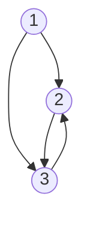
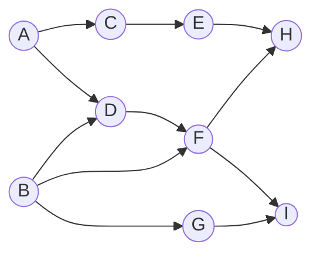

本文是图论概述。

<!-- more -->

# 1. 图的概念

## 1.1 图的定义

点用边连接起来就是 **图**（Graph），图是一种数据结构，定义为：

$$
G = \left(V,\,G\right)
$$

$V$ 是一个非空点有限的集合，代表 **顶点**（Vertex） 的集合，$E$ 代表 **边**（Edge）的集合。

<div class="note note-info">

顶点和 **结点**（Node），甚至有些地方出现的 **节点**，在图论中含义是一致的。

</div>

## 1.2 基本概念

下面是图的一些相关概念：
1.  **有向图**：图的边有方向，只能按箭头方向从一点到另一点
2.  **无向图**：图的边没有方向，可以双向
3.  **结点的度**：在无向图中，以这个结点为终点的有向边的数目
4.  **结点的入度**：在有向图中，以这个结点为起点的有向边的数目
5.  **结点的出度**：在有向图中，以这个结点为起点的有向边的数目
6.  **权值**：边的长度或者花费
7.  **连通**：如果结点 $u,\,v$ 存在一条从 $u$ 到 $v$ 的路径，那么 $u,\,v$ 是连通的
8.  **回路**：起点和终点相同的路径
9.  **完全图**：一个 $n$ 阶完全无向图含有 $n(n-1)/2$ 条边，一个 $n$ 阶完全有向图含有 $n(n+1)$ 条边
10. **稠密图**：一个边数接近完全的图
11. **稀疏图**：一个边数远远少于完全的图
12. **强连通分量**：有向图中任意两点都连通的最大子图
13. **网络**：带权图称为 **网**（Network）
14. **弧**（Arc）：表示从 $u$ 到 $v$ 的一条弧
    - $u$ 为 **弧头**（Head）或 **终端点**（Terminal node）
    - $v$ 为 **弧尾**（Tail）或 **初始点**（Initial node）
    - 有方向的弧组成的图是有向图

# 2. 图的存储结构

## 2.1 邻接矩阵存储

定义 $G[n][n]$ 储存一个图，用数学表达即为 $G^{n \times n}$，这是一个方阵，表明该图有 $n$ 个顶点。

$G[i][j]$ 的值表示从 $i$ 到 $j$ 的权值。当 $i,\,j$ 之间没有边或弧时，$G[i][j]$ 可以根据需要定义为 $0$ 或 $\infty$ 。

对于无向图，$G[i][j] = G[j][i]$ 。对于有向图，$i,\,j$ 的顺序总是行、列，也就是矩阵的第 $i$ 行第 $j$ 列表示从 $i$ 到 $j$ 的权值。

例如：



上图表示为邻接矩阵为：

$$
G = \begin{bmatrix}
    0 & 1 & 1 \\
    0 & 0 & 1 \\
    0 & 1 & 0
\end{bmatrix}
$$

<div class="note note-success">

**实用技巧**

对于 Python，创建二维数组一直是令新生比较疑惑的事情，这涉及到引用和拷贝问题。一般来说，创建二维数组（在不使用 C 类型的情况下）最快的方式是 `g = [[0] * n for _ in range(n)]`，这可以初始化为任何值，但注意初始化的值不能是引用类型。

对于 C++ 创建大数组，初始化是花费时间的任务。

如果是 `int` 等类型的数组，可以使用 `memset(g, 0x7f, sizeof(g))` 初始化数组为一个较大值（稍小于 `0x7fffffff`），使用 `memset(g, 0xaf, sizeof(g))` 初始化为非常小的负数，使用 `memset(g, 0, sizeof(g))` 初始化为零。

如果是 `double` 类型的数组，使用 `memset(g, 127, sizeof(g))` 初始化为一个较大的数（$1.38 \times 10^{306}$），使用 `memset(g, 0, sizeof(g))` 初始化为零。

</div>

## 2.2 邻接表储存

图的邻接表储存，又叫链式储存法，大多数情况下只需要使用数组实现即可。

邻接表的基本定义如下：

```python
class Edge:
    def __init__(self, next: int, to: int, dis: int) -> None:
        self.next = next
        self.to = to
        self.dis = dis
```
```c++
struct Edge {
    int next;
    int to;
    int dis;
};
Edge edge[100];
```

在 C++ 中，一般定义数组使用 C 类型的数组，除非在需求复杂、效率要求不高的场合可以使用 `vector<>` 类型。

在 Python 中，由于数组的灵活性，我们可能不需要使用邻接表来不断储存 `next` 指针，相反，我们直接将结点每一个相邻的边储存起来，这样来说，综合查询效率很高，可能的用法如下：

```python
# 集合储存，各种操作均很快，占用空间大
graph = [set() for _ in range(n)]
# 数组操作，查询可能慢，但索引很快，占用空间较小
graph = [[] for _ in range(n)]
```

# 3. 图的遍历

## 3.1 深度优先遍历

从图的某一个顶点出发系统地访问图中的所有顶点，使得每个顶点恰好被访问一次，这个操作叫做图的遍历。

为了避免数组被重复访问，可以


深度优先搜索算法要求我们遍历每一个结点，因为不是每一个结点都能遍历得到整张图，如果是无向连通图可以只遍历一个结点。

即为深度优先搜索算法：

```python
def dfs(i: int) -> None:
    visited[i] = True
    for j in range(num[i]):
        if not visited[g[i][j]]:
            dfs(g[i][j])
```

## 3.2 广度优先遍历

即为广度优先搜索算法，使用队列即可。通常在图论问题上，广度搜索并不常用，大多数情况下我们首先考虑深度搜索，特殊情况下有特殊的用法，下面将介绍。

```python

```

## 3.3 一笔画问题

**欧拉回路**：存在一个结点，使得从这个结点开始进行一次遍历，每条边都经过一次，最后回到起点，那么这个图存在欧拉回路。

**欧拉通路**：如果不要求最后回到起点，那么这个图存在欧拉通路。

**一笔画定理（欧拉回路定理）**：
- 存在欧拉通路的充要条件是图是连通的且有不超过两个奇点
- 存在欧拉回路的充要条件是图是连通的且不存在奇点

根据一笔画定理，要寻找欧拉通路，只需要从任意一点深度优先遍历即可。如果要寻找欧拉回路，只需要从奇点深度优先遍历即可。时间复杂度为 $O(m+n)$，其中 $m$ 为边数，$n$ 为点数。

## 3.4 哈密尔顿回路

欧拉回路是指不重复地走过所有路径，而 **哈密尔顿回路** 是不重复地走过所有点，最后还能回到起点的回路。而哈密尔顿通路则是存在这样的一条路，能够不重复地走完所有点，最后回到起点的这样一条路径。**哈密尔顿通路** 则不要求最后回到起点。

使用深度优先搜索查找哈密尔顿回路。

# 4. 最短路径算法

## 4.1 Floyd-Warshall 算法

简称 Floyd（弗洛伊德）算法，是最简单的最短路径算法，可以计算图中任意两点之间的最短路径，Floyd 算法的时间复杂度为 $O(n^3)$，也适用于负边权。

首先进行初始化，$\mathrm{dis}[u][v]$ 是从 $u$ 到 $v$ 的最短路径。$\mathrm{w}[u][v]$ 表示边 $u,\,v$ 点长度。

初始化：若 $u,\,v$ 有边相连，则 $\mathrm{dis}[u][v] = \mathrm{w}[u][v]$，否则 $\mathrm{dis}[u][v] = \infty$ 。

算法过程：

```python
for k in range(n):
    for i in range(n):
        for j in range(n):
            if dis[i][j] > dis[i][k] + dis[k][j]:
                dis[i][j] = dis[i][k] + dis[k][j]
```

## 4.2 Dijkstra 算法

这是计算一个点到其他所有点点最短路径的算法，时间复杂度为 $O(n^2)$，它不能处理负的边权。

设起点为 $s$，$\mathrm{dis}[v]$ 表示从 $s$ 到 $v$ 的最短路径，$\mathrm{pre}[v]$ 表示 $v$ 的前驱结点。

初始化：$\mathrm{dis}[v] = \infty\,(v \neq s)$，$\mathrm{dis}[s] = 0$，$\mathrm{pre}[s] = 0$。

```python
for i in range(n):
    # 1. 找出没有被访问点结点 u，使得 dis[u] 最小
    # 2. 标记 u 为已确定最短路径
    for v in unsure:
        # unsure 为与 u 相连未确定最短路径的结点
        if dis[v] > dis[u] + w[u][v]:
            dis[v] = dis[u] + w[u][v]
            pre[v] = u
```

算法结束：$\mathrm{dis}[v]$ 为 $s$ 到 $v$ 的最短距离，$\mathrm{pre}[v]$ 为 $v$ 的前驱结点，用来输出路径。

## 4.3 Bellman-Ford 算法

简称 Ford（福特）算法，同样是从一个点到其他所有点的最短路径算法。能够处理存在负边权的情况，但不能处理存在负权回路的情况。

设 $n$ 是顶点数，$e$ 是边数，此算法的时间复杂度为 $O(ne)$ 。

## 4.4 SPFA 算法

## 4.5 输出最短路径

## 4.6 图的连通性

### 4.6.1 Floyd 算法

将上面介绍的 Floyd-Warshall 算法变形，就得到判断图是否连通的算法。假设 $\mathrm{dis}[i][j] = \mathrm{True}$ 表示两点连接。此算法的时间复杂度为 $O(n^3)$，适用于有向图和无向图。

```python
for k in range(n):
    for i in range(n):
        for j in range(n):
            dis[i][j] = dis[i][j] or (dis[i][k] and dis[k][j])
```

### 4.6.2 遍历

从任意一个顶点出发，进行一次遍历，那么可以被遍历到的点就是连通的。如果是无向图，只需要遍历一次即可得知。如果是有向图，逐个遍历进行判断，就可以知道任意两个点的连通情况。

## 4.7 最小环问题

最小环问题指的是在图中找出一个环，使得这个环上的各边的权值之和最小。在 Floyd 算法中，可以求出最小环。

## 4.8 有向图的强连通分量

Kosaraju 算法可以求出有向图中的强连通分量个数，并且对分属于不同强连通分量的点进行标记。

# 5. 并查集

## 5.1 并查集引例

## 5.2 并查集基本思想

## 5.3 求无向图的强连通分量


# 6. 最小生成树

## 6.1 什么是最小生成树

在树一章存在一个定理：$n$ 个点用 $n-1$ 条边连接成为连通图中，形成的图形只可能是树。

当 $n$ 个顶点的图，选择 $n-1$ 条边，连接所有的 $n$ 个点，当选择的 $n-1$ 条边权值之和最小时，这棵树被成为 **最小生成树**。

## 6.2 Prim 算法

Prim 本质是使用贪心算法查找最小生成树。以第一个结点出发的最小生成树，$\min[v]$ 表示未进入最小生成树的点 $v$ 与已经进入的最小边权，使用 $\mathrm{res}$ 表示结果。Prim 算法的时间复杂度为 $O(n^2)$ 。

初始化：$\min[v] = \infty\,(v \neq 0),\,\min[0] = 0,\,\mathrm{res} = 0$ 。

```python
for i in range(n):
    # 1. 寻找 min[u] 最小的未进入最小生成树 u
    # 2. u 加入最小生成树
    # 3. res += min[u]
    for v in connected:
        # connected 是与 u 连接的未加入最小生成树的结点
        if w[u][v] < min[v]:
            min[v] = w[u][v]
```

最终 $\mathrm{res}$ 即为结果。

## 6.3 Kruskal 最小生成树

Kruskal（克鲁斯卡尔）算法是一种利用并查集求最小生成树的算法。

Kruskal 算法将连通块当做一个集合，首先将所有的边从小到大排序，并认为每一个点都是孤立的，分别属于 $n$ 个独立的集合。然后按顺序枚举每一条边，如果这条边连接着两个不同的集合，那么就把这条边加入最小生成树，这两个不同的集合就构成了一个集合。如果，这两条边连接的是同一个集合，就跳过。直到选取了 $n-1$ 条边。

初始化并查集 $\mathrm{father}[x] = x$

```python
total = 0
# 将所有的边排序
k = 0
for i in range(M):
    if in_one_set(u, v):
        # 合并 u, v 所在的集合
        # 将边 (u, v) 加入最小生成树
        total += w[u][v]
        k += 1
        if k == n - 1:
            break
```

最终 $\mathrm{total}$ 即为最小生成树的权值总和。

# 7. 拓扑排序和关键路径

## 7.1 AOV 网络

AOV 网络指的是用顶点表示活动的网络，又称 “顶点活动网络”。

例如学习课程有先后顺序，前面一门课没有学完后面一门课就不会开始。这样就可以用顶点表示课程，然后用有向箭头表示学习的次序，这样就是一种 AOV 网络。并且显然每个点都要走，因为每门课都要学。



在 AOV 网络中，有向边代表活动的先后关系。我们把一条有向边起点的活动称为终点活动的 **前驱活动**，同理，终点活动称为起点活动的 **后继活动**。只有当一个活动的前驱全部完成之后，这个活动才能进行。

一个 AOV 网络必定是一个 **有向无环图**，即不应该带有回路。

## 7.2 拓扑排序算法

拓扑排序算法只适用于 AOV 网络。

把 AOV 网络中的所有活动排成一个序列，使得每个活动的所有前驱活动都排在该活动的前面，这个过程被称为 **拓扑排序**。使得到的活动序列称为 **拓扑序列**。

算法思想：
1. 选择一个入度为 $0$ 的顶点并输出
2. 然后从 AOV 网中删除与此顶点以及以此顶点为起点的所有关联边
3. 重复上述两步，直到不存在入度为 $0$ 的顶点为止
4. 如果输出的顶点数小于 AOV 网络的顶点数，那么这个网络有回路，否则是正确的拓扑序列

从第四步可以看出，拓扑排序可以用来判断一个有向图是否有环。只有有向无环图才存在拓扑序列。

$$
\begin{aligned}
    & \textbf{Algorithm}\text{ TopologicalSort(path):} \\
    &\qquad \textbf{Input:} \text{ inDegree[i] 顶点 i 入度} \\
    &\qquad \textbf{Output:} \text{ 此路径下所有文件的磁盘占用总和} \\
    &\qquad \text{i = 0} \\
    &\qquad \text{将所有入度为 0 的顶点入栈 stack} \\
    &\qquad \textbf{while}\text{ 栈非空} \\
    &\qquad\qquad \text{栈顶顶点 v 出栈;} \\
    &\qquad\qquad \text{输出 v; i += 1} \\
    &\qquad\qquad \textbf{for\;each}\text{ v 的后继顶点 u } \\
    &\qquad\qquad\qquad \text{inDegree[u] --= 1} \\
    &\qquad\qquad\qquad \textbf{if}\text{ inDegree[u] = 0 }
    \textbf{then} \text{ 顶点 u 入栈} \\
    &\qquad \textbf{return}\text{ 结果序列}
\end{aligned}
$$

设顶点数量为 $V$，边的数量为 $E$，那么上述算法的时间复杂度为 $O(V+E)$，空间复杂度为 $O(V)$ 。

> [LeetCode：210. 课程表 II](https://leetcode-cn.com/problems/course-schedule-ii/)

本题本质是一个拓扑排序问题，可以直接套用上述算法解答：

```python
class Solution:
    def findOrder(self, numCourses: int, prerequisites: List[List[int]]) -> List[int]:
        # 入度 in_degree[i] 是序号为 i 的顶点入度
        in_degree = [0] * numCourses
        # 后继顶点 succeed_nodes[i] 为序号为 i 的后继顶点
        succeed_nodes = [[] for _ in range(numCourses)]
        res = list[int]()
        for a, b in prerequisites:
            in_degree[a] += 1
            succeed_nodes[b].append(a)
        stack = list[int]()

        # 将入度为 0 的顶点入栈
        for i, val in enumerate(in_degree):
            if val == 0:
                stack.append(i)
        while stack:
            val = stack.pop()
            res.append(val)
            for node in succeed_nodes[val]:
                in_degree[node] -= 1
                if in_degree[node] == 0:
                    stack.append(node)
        # 如果结果序列小于顶点数，那么不存在解答
        if len(res) < numCourses:
            return []
        else:
            return res
```

## 7.3 AOE 网络

为了能够估算出某个活动的开始时间，找出哪些影响工程完成时间的最主要活动，我们可以利用带权的有向网，图中的边表示活动，边上的权表示完成该活动所需的时间。一条边上的两个顶点分别表示活动的开始事件和结束事件，这种用边表示活动的网络，称为 **AOE 网络**。

这是一个 AOE 网络图，注意和上面类似这里每一条边都是要到的。我们要找的就是花费时间最长的那条路，因为那条路走完了所有活动才完成。那么这条路叫做关键路径，这条路径上的活动叫做关键活动。如果我们想缩短工期的时间，那么我们就要先缩短关键活动的时间。

几个关键名词：
- 事件最早可能开始时间 $ve(i)$
- 事件最迟允许开始时间 $vl(i)$
- 活动最早可能开始时间 $e[i]$
- 活动最迟开始时间 $l[i]$

所以关键活动就是 $e[i] == l[i]$，因为最早时间和最晚时间相同说明不能耽误。

事件最早可能开始时间是最晚到达那个路径的时间点，因为只有最晚到的路径到了这里，才可能开始完成这个路径。

事件最晚开始时间要从后往前算。最后那个点的最晚开始时间我们一般是知道的，就是截至时间。然后往前面去减，如果有多条路径到那个点就选最小的。同样的道理因为所有边走完这件事才算做完了，如果你选大的相当于到最后那个点的所需时间少，结果这边走完了那个时间小的还没有走完。

活动最早开始时间是活动的起点的最早开始时间，活动的最晚开始时间是活动的终点的最晚开始时间减去这条边的权。

算法：

<!-- 此处补充算法 -->

$$
\begin{aligned}
    & \textbf{Algorithm}\text{ KeyActivity(path):} \\
    &\qquad \textbf{Input:} \text{ inDegree[i] 顶点 i 入度} \\
    &\qquad \textbf{Output:} \text{ 此路径下所有文件的磁盘占用总和} \\
    &\qquad \text{i = 0} \\
    &\qquad \text{将所有入度为 0 的顶点入栈 stack} \\
    &\qquad \textbf{while}\text{ 栈非空} \\
    &\qquad\qquad \text{栈顶顶点 v 出栈;} \\
    &\qquad\qquad \text{输出 v; i += 1} \\
    &\qquad\qquad \textbf{for\;each}\text{ v 的后继顶点 u } \\
    &\qquad\qquad\qquad \text{inDegree[u] --= 1} \\
    &\qquad\qquad\qquad \textbf{if}\text{ inDegree[u] = 0 }
    \textbf{then} \text{ 顶点 u 入栈} \\
    &\qquad \textbf{return}\text{ 结果序列}
\end{aligned}
$$
