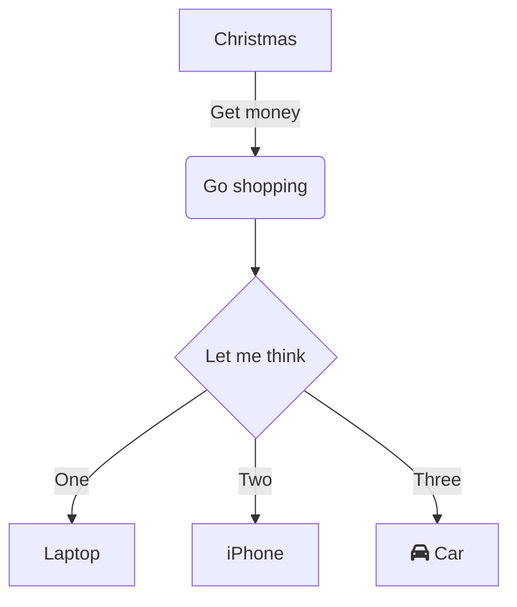

本文是 [*狂神说 Java：Java 零基础学习视频*](https://www.bilibili.com/video/BV12J41137hu) 的笔记。

<!-- more -->

# 1. Java 入门

## 1.1 如何学习 Java

此处是 Java 全栈学习路线。

<div class="note note-primary">

**可以参考下面的资料**

- [全栈学习路线](https://mp.weixin.qq.com/s?__biz=Mzg2NTAzMTExNg==&mid=2247483699&idx=1&sn=2dd9aeee040d24ad13fe4f2ce5104b05)
- [SpringBoot 教程集合](https://mp.weixin.qq.com/mp/homepage?__biz=Mzg2NTAzMTExNg==&hid=1&sn=3247dca1433a891523d9e4176c90c499)
- [JavaCore 文档集合](https://dunwu.github.io/javacore/)

</div>

### 1.1.1 Java SE 基础

1. 计算机基础
2. Java 入门学习
3. Java 基础语法
4. 流程控制方法
5. 数组
6. OOP
7. 异常
8. 常用类
9. 集合框架
10. I/O
11. 多线程
12. GUI 编程
13. 网络编程
14. 注解和反射
15. JUC 编程
16. JVM
17. 23 种设计模式
18. 数据结构和算法
19. 正则表达式

### 1.1.2 JavaWeb

1. MySQL
2. JDBC
3. HTML
4. CSS
5. JavaScript
6. jQuery
7. BootStrap
8. HTTP 协议
9. Tomcat
10. Service
11. Cookie & Session
12. JSP
13. JSTL & EL 表达式
14. MVC 架构
15. 过滤器
16. 监听器
17. 文件上传下载
18. 邮件收发
19. 富文本编辑器

### 1.1.3 SSM

1. Maven
2. Junit
3. Log4j
4. MyBatis
5. Spring
6. SpringMVC
7. JSON
8. Ajax
9. SSM 框架
10. Shiro
11. Solr
12. Git
13. MyBatis-Plus
14. MySQL 高级
15. Netty
16. MyCat

### 1.1.4 Linux

1. Linux 基础
2. Shell 编程
3. Linux 系统管理
4. Linux 网络
5. LAMP 部署
6. LNMP 部署
7. Nginx
8. ELK 日志分析
9. MySQL 集群
10. Redis
11. Linux 集群
12. Docker
13. OpenStack
14. Kubernets

### 1.1.5 微服务和分布式

1. Vue
2. Node.js
3. SpringBoot
4. SpringBoot Web 开发
5. SpringData
6. SpringSecurity
7. SpringBoot 分布式开发
8. ActiveMQ / RabbitMQ / RocketMQ / Kafka
9. ElsticSearch
10. Dobbo / Zookeeper
11. SpringCloud Netflix 全家桶
12. SpringCloud Alibaba 全家桶

### 1.1.6 大数据开发

1. 负载均衡
2. Hadoop
3. Hive
4. HBase
5. Flume
6. Sqoop
7. Zookeeper
8. Impala
9. Scale 编程
10. Spark 系列
11. Kafka

### 1.1.7 持续学习

1. Java 8-17 新特征
2. Service Mesh
3. 计算机网络原理
4. 操作系统
5. Go Web


由于笔记作者在此前就熟悉狂神所说的上述技术，包括：
- 计算机体系结构
- 软件和软件开发
- MarkDown 语法
- 基本 DOS 命令
- Windows 常用快捷键
- 计算机语言发展史

在此不多列举，如果读者还没有了解过上述知识，建议学习视频或者通过其他各种方式预先学习，帮助理解其他知识，并组建自己的知识网络，这一点比学习任何一门具体的语言更有用。

<div class="note note-success">

这个博客网站（<http://blog.alexsun.top/>）也是在狂神的启发下构建的，如果需要了解详细的构建信息，可以参考我的博客 [hexo fluid 博客配置指南](http://blog.alexsun.top/2022/05/20/hello-world/) 。

</div>

## 1.1 Java 帝国的诞生

在 1972 年，C 语言就诞生了，但直到 1995 年 Java 才问世，我们先说说 C 语言的一些特点：
- 贴近硬件，运行极快，效率极高
- 应用于操作系统、编译器、数据库和网络系统等
- 使用指针和手动内存管理

1982 年 C++ 诞生：
- 面向对象
- 兼容 C 语言
- 通用编程语言
- 多应用于图形领域、游戏等

由于 C++ 的一些特征晦涩难懂，严重依赖平台和编译器实现，因此我们迫切需要一门语言：
- 语法像 C
- 没有指针
- 自动内存管理
- 真正编写一次，到处运行
- 面向对象
- 类型安全
- 拥有高质量的类库

于是 Java 成为了那个时代最好的语言，并持续流行了 30 年：
- Java 2 SE：桌面
- Java 2 ME：移动端
- Java 2 EE：服务器

许多基于 Java 的平台和中间件、工具：
- 构建工具：Ant、Maven、Jekins
- 服务器：Tomcat、Jetty、Jboss、Websphere、weblogic
- Web 开发：Structs、Spring、Hibernate、MyBatis
- 开发工具：Eclipse、NetBeans、Intellij Idea、Jbuilder

有一些应用服务器展示了网络开发的标准：
- 高性能
- 高可用
- 高并发

跨时代的作品：
- Hadoop，2006
- Android，2008

## 1.2 Java 的特征和优势

Java 的特性和优势：
- 简单性
- 面向对象
- 可移植性
- 高性能
- 分布式
- 动态性
- 多线程
- 安全性
- 健壮性

## 1.3 JDK、JRE 和 JVM

几个概念：
- JDK：Java Development Kit
- JRE：Java Runtime Environment
- JVM：Java Virtual Machine

Java 语言：
- Java 语言
- 工具和 APIs
    - java
    - javac
    - javadoc
    - apt
    - jar
    - javap
    - JPDA
    - JConsole
    - Java VisualVM
    - Security
    - Int'I
    - RMI
    - IDL
    - Deploy
    - Monitoring
    - Troubleshoot
    - Scripting
    - JVM TI
- RIAs
    - Java Web Start
    - Applet / Java Plug-in
- 用户界面工具包
    - AWT
        - Accessibility
        - Drag n Drop
    - Swing
        - Input Methods
        - Image I/O
    - Java 2D
        - Print Service
        - Sound
- 集成库
    - IDL
    - JDBC
    - JNDI
    - RMI
    - RMI-IIOP
    - Scripting
- 其他基准库
    - Beans
    - Intl Support
    - I/O
    - JMX
    - JNI
    - Math
    - Networking
    - Override Mechanism
    - Security
    - Serialization
    - Extension Mechanism
    - XML JAXP
- 语言和工具标准库
    - lang & util
    - Collections
    - Concurrency Utilities
    - Jar
    - Logging
    - Management
    - Preferences API
    - Ref Objects
    - Reflection
    - Regular Expression
    - Versioning
    - Zip
    - Instrumentation
- JVM
    - Java Hotspot Client ans Server VM

<!-- /need-img -->

## 1.4 开发环境

安装 JDK 8+ 即可，安装过程不再赘述。如果要使用 IDEA，学生可以使用学生账号注册专业版。

## 1.5 Java 程序运行机制

<!-- /need-img -->

## 1.6 Java 语言类型

Java 是强类型语言：要求变量的使用要严格符合规定，所有的变量必须先定义才能使用。

Java 的数据分为两大类：
- 基本类型（Primitive Type）
    - 数值类型
        - 整数类型
            - `byte`，1 个字节
            - `short`，2 个字节
            - `int`，4 个字节
            - `long`，8 个字节
        - 浮点类型
            - `float`，4 个字节
            - `double`，8 个字节
        - 字符类型
            - `char`，2 个字节
    - 布尔类型
        - `boolean` 类型，占 1 位
- 引用类型（Reference Type）
    - 类
    - 接口
    - 数组

## 1.7 Java 编码习惯

变量方法、类名可遵循驼峰命名。

好的程序需要善于使用各种注释，Java 注释有下面几种：
- 单行注释
- 多行注释
- 文档注释

JDK 7 的数字支持下划线分割：

```java
int money = 10_000_000;
```

## 1.8 一些细节

浮点数的运算会产生错误：

```java
float f = 0.1f;
double d = 1.0 / 10;
System.out.println(f == d);
// false
System.out.println(f);
// 0.1
System.out.println(d);
// 0.1

float f1 = 124311224123124123f;
float f2 = f1 + 1;
System.out.println(f1 == f2);
// true
```

对于一些金融型的运算，可以在后面使用 `BigDecimal` 类进行运算。



```java
String sa = new String("hello world");
String sb = new String("hello world");
System.out.println(sa == sb);
// false

String sc = "hello world";
String sd = "hello world";
System.out.println(sc == sd);
// true
```


类型转换：
1. `byte`
2. `short`
3. `char`
4. `int`
5. `long`
6. `float`
7. `double`

不同的类型转换
- 自动类型转换
    - 从低到高
- 强制类型转换
    - 从高到低
- 不能对布尔值进行转换

JDK7+

```java
int money = 10_000_000;
```

`final` 用于定义常量，修饰符不存在先后顺序：

```java
static final double PI = 3.14;

final static double PI = 3.14;
```

命名规则：
1. 方法名、类变量、类名和局部变量用驼峰命名
2. 常量使用大小字母和下划线命名

关系运算符 `instanceof`

```java
boolean result = obj instanceof Class;

// 常见用法
Integer integer = new Integer(1);
System.out.println(integer instanceof  Integer);
// true
```

还有一种用法，Java `ArrayList<E>` 类原型如下：

```java
public class ArrayList<E> extends AbstractList<E>
    implements List<E>, RandomAccess, Cloneable, java.io.Serializable {}
```

那么：

```java
List list = new ArrayList();
System.out.println(list instanceof ArrayList);
// true
```

值得注意的是 `obj` 必须为引用类型，不能是基本类型。例如以下代码：

```java
int i = 0;
System.out.println(i instanceof Integer);    // 编译不通过
System.out.println(i instanceof Object);    // 编译不通过
```

所以，`instanceof` 运算符只能用作对象的判断，如果被测试的对象是 `null`，那么返回结果恒为 `false` 。

位运算符：`>>>`，无符号右移，如果对象非零则恒为非负数。

Java 运算时，如果运算都是整数：
- 如果存在 `long` 类型参与运算，那么结果是 `long` 类型
- 如果不是 `long` 类型参与运算，那么结果是 `int` 类型

## 包

关键字 `package` 

不断等待输入的程序：

```java
import java.util.Scanner;

public class Demo01 {
    public static void main(String[] args) {
        Scanner scanner = new Scanner(System.in);
        double sum = 0;
        int m = 0;
        while (scanner.hasNextDouble()) {
            double x = scanner.nextDouble();
            m++;
            sum += x;
        }
        System.out.println("平均数为：" + (sum / m));
    }
}
```

IDEA 可以输入 `sout` 来快捷输入 `System.out.println();`


- `Object` 类
    - `hashCode()`
    - `toString()`
    - `clone()`
    - `getClass()`
    - `notify()`
    - `wait()`
    - `equals()`
- `Math` 类
    - 常见的数学运算
- `Random` 类
    - 生成随机数
    - 生成 UUID
- `File` 类
    - 创建文件
    - 查看文件
    - 修改文件
    - 删除文件
- 包装类
    - 自动装箱
    - 自动拆箱
- `Date` 类
    - `Date`
    - `SimpleDateFormat`
    - `Calendar`（建议使用）
- `String` 类
    - `final` 不可变
- `StringBuffer` 类
    - 可变长字符串
    - 适用于多线性
    - 效率低，安全
- `StringBuilder` 类
    - 可变长字符串
    - 适用于单线程，数据量大情况
    - 效率高，不安全
- 集合框架
    - `Collection`
        - `List`
            - `ArrayList`
            - `LinkedList`
            - `Vector`
            - `Stack`
        - `Set`
            - `HashSet`
            - `TreeSet`
    - `Map`
        - `HashMap`
        - `TreeMap`
    - `Collections` 工具类
    - 泛型
- I/O 流
    - 字节流
        - OutputStream
        - InputStream
    - 字符流
        - Reader
        - Writer
    - 处理流
        - Buffer
            - BufferInputStream
            - BufferOutputStream
        - Data
            - DataInputStream
            - DataOutputStream
    - 转换流
        - InputStreamReader
        - OutputStreamWriter
    - 节点流
        - CharArray
            - CharArrayReader
            - CharArrayWriter
            - InputStream
            - OutputStream
        - String
        - Pipe
    - Object 流
    - Filter
        - 四个
    - print
        - PrintWriter
        - PrintStream
    - Serializable
        - 序列化
        - 反序列化
- 多线程
    - 进程和线程
    - run(), start()
    - 线程创建的方式
        - Thread
            - start0 本地方法
            - `private native void start0();`
        - Runnable
        - Callable
    - 线程的状态
    - 常用的方法
        - yield()
        - sleep()
        - join()
        - setPriority()
        - start()
        - isLive()
        - interrupt()
    - 线程同步
        - 多个对象操作同一个资源
        - 队列 + 锁
        - synchronized
            - 同步方法（弊端是锁太多）
            - 同步代码块
            - 线程锁
            - 死锁条件
                - 互斥
                - 请求与保持
                - 不剥夺条件
                - 循环等待条件
        - Lock
            - ReetrantLock
                - lock
                - trylock
                - unlock
    - 线程通信
        - 缓冲区：消息队列
        - 标志位：红绿灯
        - wait()
        -  notifyAll()
    - 线程池
        - 池化技术
        - 池的大小
        - 最大连接数
        - 保持时间
- 网络编程
    - IP
    - Socket 编程
    - TCP/UDP
    - Tomcat 使用
    - 文件上传，聊天通信
- 注解和反射
    - 注解
        - 元注解
        - 内置注解
        - 自定义注解
        - 反射读取注解
    - 反射
        - Class
        - 类加载机制
        - Method
        - Field
        - Constructor
            - newInstance
        - 破坏私有
        - 性能分析
            1. 正常的代码
            2. 检测关闭的反射
            3. 默认反射
        - 反射获得
            - 注解
            - 泛型
        - Stream
        - ForkJoin

静态代理：

```java
new Thread(() -> {
    System.out.println("start");
}).start();
```


-----------------------------------


