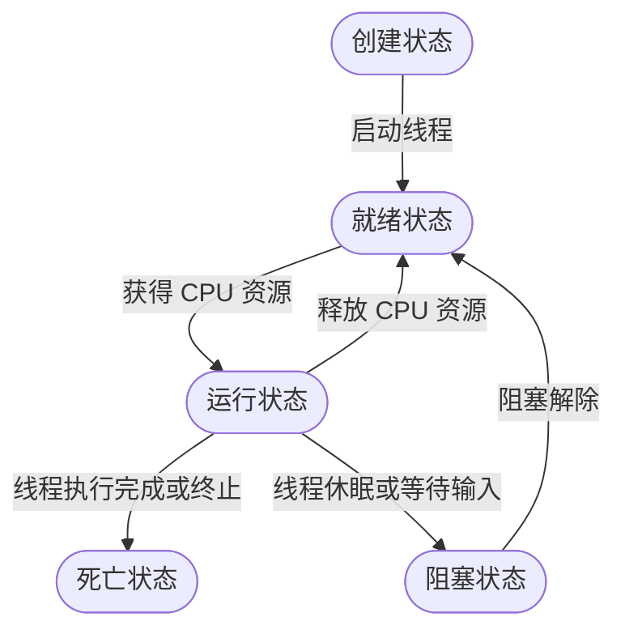

本文是 [*狂神说 Java：多线程详解*](https://www.bilibili.com/video/BV1V4411p7EF) 的课程笔记。

<!-- more -->

# 1. 多线程

## 1.1 多线程简介

为了理解各种概念之间的区别和联系，建议去了解下面的概念的具体含义：
- 并发
- 多线程
- 多进程
- 超线程
- 协程
- 纤程
- 绿色线程

一个进程（Process）可以有多个线程（Thread），例如视频中的声音、图像和其他任务。

程序是指令和数据的集合，其本身没有运行的含义，是一个静态概念。

而进程是程序的一次执行过程，是一个动态的概念，是系统分配资源的单位。

通常在一个进程中可以包含若干个线程，一个进程至少会包含一个线程，线程是 CPU 调度和执行的单位。

<div class="note note-warning">

注意：很多多线程的效果是模拟出来的，因为具体取决于 CPU 的核心数，在一个核心的情况下（没有超线程情况下）在同一个时间，CPU 只能执行一段代码，因为上下文切换比较快，所以有同时执行的错觉。

</div>

其他注意事项：
- Java 程序即使没有创建线程，后台也会有很多线程，例如主线程、gc 线程
- `main()` 函数所在的线程是主线程，是整个程序的入口
- 在一个进程中，如果开辟了多个线程，线程的运行由调度器安排调度，调度器与操作系统密切相关，不能被人为干预
- 对于同一份资源，会存在资源抢夺的问题，需要加入并发控制
- 线程会带来额外的开销，如 CPU 调度时间，并发控制开销
- 每个线程在自己工作的内存内进行交互，如果内存控制不当会造成数据的不一致

## 1.2 线程实现

线程有三种创建方式：
1. 继承 `Thread` 类
2. 实现 `Runnable` 接口
3. 实现 `Callable` 接口

### 1.2.1 继承 `Thread` 类

```java
public class TestThread extends Thread {
    public static void main(String[] args) {
        TestThread t = new TestThread();
        t.start();
        for (int i = 0; i < 1000; i++) {
            System.out.println("main thread");
        }
    }

    @Override
    public void run() {
        System.out.println("run thread");
        for (int i = 0; i < 1000; i++) {
            System.out.println("run thread");
        }
    }
}
```

下面列举一个实例：多线程下载图片。

我们需要导入 `commons-io-2.6.jar` 包，然后编写下面的测试代码：

```java
import org.apache.commons.io.FileUtils;
import java.net.URL;
import java.io.File;
import java.io.IOException;

public class TestThread extends Thread {
    private String url;
    private String fileName;

    public TestThread(String url, String fileName) {
        this.url = url;
        this.fileName = fileName;
    }

    @Override
    public void run() {
        try {
            WebDownloader webDownloader = new WebDownloader();
            webDownloader.download(url, fileName);
        } catch (IOException e) {
            e.printStackTrace();
        }
    }

    public static void main(String[] args) {
        TestThread testThread1 = new TestThread("https://www.baidu.com/img/bd_logo1.png", "baidu1.png");
        TestThread testThread2 = new TestThread("https://www.baidu.com/img/bd_logo2.png", "baidu2.png");
        TestThread testThread3 = new TestThread("https://www.baidu.com/img/bd_logo3.png", "baidu3.png");
        testThread1.start();
        testThread2.start();
        testThread3.start();
    }

}

class WebDownloader {
    public void download(String url, String fileName) throws IOException {
        FileUtils.copyURLToFile(new URL(url), new File(fileName));
    }
}
```

### 1.2.2 实现 `Runnable` 接口

实际开发时建议使用实现 `Runnable` 接口的方式来实现，因为 Java 单继承的局限性，继承 `Thread` 后无法进行扩展。而且实现接口的好处是通过代理，可以让一个对象被多个线程使用。

```java
public class TestThread implements Runnable {
    @Override
    public void run() {
        for (int i = 0; i < 100; i++) {
            System.out.println(Thread.currentThread().getName() + ": " + i);
        }
    }

    public static void main(String[] args) throws IOException {
        TestThread t1 = new TestThread();
        new Thread(t1).start();
        for (int i = 0; i < 100; i++) {
            System.out.println(Thread.currentThread().getName() + ": " + i);
        }
    }
}
```

### 1.2.3 并发问题

我们先模拟一个买票问题：

```java
public class TestThread implements Runnable {

    private int ticketNum = 10;

    @Override
    public void run() {
        while (ticketNum > 0) {
            try {
                Thread.sleep(200);
            } catch (InterruptedException e) {
                e.printStackTrace();
            }
            System.out.println(Thread.currentThread().getName() + ": " + ticketNum--);
        }
    }

    public static void main(String[] args) throws IOException {
        TestThread t = new TestThread();
        new Thread(t, "Alex").start();
        new Thread(t, "Bob").start();
        new Thread(t, "Cindy").start();
    }
}
```

我们发现这几个人买票有重复的情况。多个线程操作同一个资源，线程不安全，数据会产生混乱。

### 1.2.4 龟兔赛跑

我们可以让兔子线程休息一会：

```java
public class Race implements Runnable {

    // 胜利者
    private static String winner;

    @Override
    public void run() {
        for (int i = 0; i <= 100; i++) {
            if (i % 10 == 0 && Thread.currentThread().getName().equals("兔子")) {
                try {
                    Thread.sleep(10);
                } catch (InterruptedException e) {
                    e.printStackTrace();
                }
            }
            if (gameOver(i)) {
                break;
            }
            System.out.println(Thread.currentThread().getName() + ": " + i);
        }
    }

    /**
     * 判断是否有胜利者
     */
    private boolean gameOver(int steps) {
        if (winner != null) {
            return true;
        }
        if (steps >= 100) {
            winner = Thread.currentThread().getName();
            System.out.println(winner + " wins!");
            return true;
        }
        return false;
    }

    public static void main(String[] args) {
        Race race = new Race();
        new Thread(race, "兔子").start();
        new Thread(race, "乌龟").start();
    }
}
```

### 1.2.5  实现 `Callable` 接口

实现 `Callable` 接口的好处是：
- 可以抛出异常
- 可以定义返回值

由于实现稍微繁琐，所以也不是很常用。

实现步骤：
1.  实现 `Callable` 接口，需要返回值类型
2.  重写 `call()` 方法，需要抛出异常
3.  创建目标对象
4.  创建执行服务
    ```java
    ExecutorService ser = Executor.newFixedThreadPool(1);
    ```
5.  提交执行  
    ```java
    Future<Boolean> res = ser.submit(t1);
    ```
6.  获取结果  
    ```java
    boolean r1 = res.get();
    ```
7.  关闭服务  
    ```java
    ser.shutdownNow();
    ```

```java
public class Test implements Callable<Boolean> {

    @Override
    public Boolean call() {
        // 执行内容
        return true;
    }

    public static void main(String[] args) {
        Test t1 = new Test();
        ExecutorService ser = Executor.newFixedThreadPool(1);
        Future<Boolean> res = ser.submit(t1);
        boolean r1 = res.get();
        ser.shutdownNow();
    }
}
```

### 1.2.6 静态代理

以婚庆公司代理结婚者为例，解释静态代理模式：

```java
public class StaticProxy {
    public static void main(String[] args) {
        Alex alex = new Alex();
        WeddingCompany weddingCompany = new WeddingCompany(alex);
        weddingCompany.happyMarry();

    }
}

interface Marry {
    void happyMarry();
}

class Alex implements Marry {
    @Override
    public void happyMarry() {
        System.out.println("Alex marry");
    }
}

class WeddingCompany implements Marry {
    private Marry marry;

    public WeddingCompany(Marry marry) {
        this.marry = marry;
    }

    @Override
    public void happyMarry() {
        before();
        marry.happyMarry();
        after();
    }

    private void before() {
        System.out.println("before");
    }

    private void after() {
        System.out.println("after");
    }
}
```

总结：
- 真实对象和目标对象都需要实现共同接口
- 代理对象要代理真实角色

好处：
- 代理对象可以做很多真实对象做不了的事情
- 真实对象可以专注于自己的事情

下面的两行代码可以类比：

```java
new WeddingCompany(new Alex()).happyMarry();

new Thread(() -> System.out.println("...")).start();
```

### 1.2.7 Lambda 表达式

匿名函数：
- 避免内部类定义过多
- 属于函数式编程
- 语法
    - `(params) -> expr`
    - `(params) -> stmt`
    - `(params) -> { stmt }`

任何接口，如果只包含一个抽象方法，那么它就是一个函数式接口：

```java
public interface Runnable {
    public abstract void run();
}
```

举例：

```java
public class Test {
    public static void main(String[] args) {
        ILike like = new Like();
        like.lambda();
    }
}

public interface ILike {
    public lambda();
}

class Like implements ILike {
    @Override
    public void lambda() {
        System.out.println("I like lambda!");
    }
}
```

静态内部类：

```java
public class Test {

    static class Like implements ILike {
        @Override
        public void lambda() {
            System.out.println("I like lambda!");
        }
    }

    public static void main(String[] args) {
        ILike like = new Like();
        like.lambda();
    }
}

public interface ILike {
    public lambda();
}
```

局部内部类：

```java
public class Test {

    public static void main(String[] args) {
        class Like implements ILike {
            @Override
            public void lambda() {
                System.out.println("I like lambda!");
            }
        }
        ILike like = new Like();
        like.lambda();
    }
}

public interface ILike {
    public lambda();
}
```

匿名内部类：

```java
public class Test {

    public static void main(String[] args) {
        ILike like = new ILike() {
            @Override
            public void lambda() {
                System.out.println("I like lambda!");
            }
        };
        like.lambda();
    }
}

public interface ILike {
    public lambda();
}
```

使用 JDK 1.8 定义 Lambda：

```java
public class Test {

    public static void main(String[] args) {
        ILike like = () -> {
            System.out.println("I like lambda");
        };
        like.lambda();
    }
}

public interface ILike {
    public lambda();
}
```

带参数的版本：

```java
public class Test {

    public static void main(String[] args) {
        ILike like = a -> System.out.println("I like lambda: " + a);
        like.lambda();
    }
}

public interface ILike {
    public lambda(int a);
}
```

## 1.3 线程状态

### 1.3.1  线程的五大状态

1. **创建状态**：线程对象一旦创建就进行创建状态  
    ```java
    Thread t = new Thread()
    ```
2. **就绪状态**：当调用 `start()` 方法时，线程进入就绪状态  
    ```java
    t.start()
    ```
3. **运行状态**：当 CPU 调度线程时，线程进入运行状态
    - 进入运行状态，线程才开始执行代码
4. **阻塞状态**：当线程 `sleep` 或等待资源时，线程进入阻塞状态
5. **死亡状态**：当线程执行结束或被中断时进入死亡状态，死亡后的线程不能再次启动



线程的方法：

| 方法 | 说明 |
| ---- | ---- |
| `setPriority(int priority)` | 设置线程的优先级 |
| `static void sleep(long millis)` | 线程休眠 |
| `void join()` | 等待该线程终止 |
| `static void yield()` | 暂停当前正在执行的线程对象，并执行其他线程 |
| `boolean isAlive()` | 测试线程是否处于活动状态 |
| `void interrupt()` | *`@Deprecated`*，中断测试 |
| `void destroy()` | *`@Deprecated`*，销毁线程 |
| `void stop()` | *`@Deprecated`*，停止线程 |

<div class="note note-warning">

过时的方法都不建议使用，建议在线程内设置标志变量进行判断，让线程自己停下来。

</div>

### 1.3.2 线程礼让

礼让将当前的线程暂停，但不阻塞。具体结果是否成功取决于 CPU 分配的结果。相当于让线程从运行状态转换为就绪状态。

```java
public class TestYield {
    public static void main(String[] args) {
        TestYield testYield = new TestYield();
        new Thread(testYield, "a").start();
        new Thread(testYield, "b").start();
    }
}

class MyYield implements Runnable {
    @Override
    public void run() {
        System.out.println(Thread.currentThread().getName() + " 开始执行");
        Thread.yield();
        System.out.println("线程停止执行");
    }
}
```

### 1.3.3 线程强制执行

`join()` 合并线程，将其他线程阻塞，等待此线程执行结束。

```java
thread.join();
```

### 1.3.4 线程状态观测

`Thread.State` 表示线程状态，线程可以处于下面的状态之一：
- `NEW`：尚未启动的线程处于这个状态
- `RUNNABLE`：在 Java 虚拟机中执行的线程处于此状态
- `BLOCKED`：被阻塞等待监视器锁定的线程处于此状态
- `WAITING`：正在等待另一个线程执行特定动作的线程处于此状态
- `TIMED_WAITING`：正在等待另一个线程执行动作达到指定等待时间的线程处于此状态
- `TERMINATED`：已退出的线程处于此状态

一个线程可以在给定时间点处于一个状态，这些状态是不反映任何操作系统线程状态的虚拟机状态。

通过 `thread.getState()` 获取线程的状态。

### 1.3.5 线程的优先级

Java 提供了一个线程调度器来监控程序中启动后进入就绪状态的所有线程，线程调度器按照优先级决定调度哪个线程来执行。

默认的线程优先级定义：

```java
Thread.MIN_PRIORITY = 1;
Thread.MAX_PRIORITY = 10;
Thread.NORM_PRIORITY = 5;
```

超过范围会报错。使用 `getPriority()` 获取优先级，使用 `setPriority()` 设置优先级。

主函数以默认的优先级运行，优先级应该在线程运行前设置。

### 1.3.6 守护线程

线程分为用户线程和守护线程：
- 虚拟机必须确保用户线程执行完毕
- 虚拟机不用等待守护线程执行完毕
- 守护线程
    - 后台记录日志操作
    - 监控内存
    - 垃圾回收

`thread.setDaemon(true)` 可以将普通的线程设置为守护线程。

## 1.4 线程同步

### 1.4.1 线程锁

由于多个线程共享同一块存储空间，这带来了访问冲突的问题，为了保证数据在方法中被访问时的正确性，在访问时加入锁机制（`synchronized`），当一个线程获得对象的排它锁，独占资源，其他线程必须等待，使用后释放锁即可，但存在下面的问题：
- 一个线程持有锁会导致其他所有需要此锁的线程挂起
- 在多线程竞争下，加锁，释放锁会导致比较多的上下文切换和调度延时，引起性能问题
- 如果一个优先级高的线程等待一个优先级低的线程释放锁，会导致优先级倒置，引起性能问题

### 1.4.2 不安全的示例

线程不安全的买票：

```java
public class UnsafeBuyTicket {
    public static void main(String[] args) {
        BuyTicket station = new BuyTicket();
        new Thread(station, "Alex").start();
        new Thread(station, "Bob").start();
        new Thread(station, "Mike").start();
    }
}

class BuyTicket implements Runnable {

    private int ticket = 10;
    boolean flag = true;

    @Override
    public void run() {
        System.out.println("Buy ticket");
        while (flag) {
            try {
                buyTicket();
            } except (InterruptedException e) {
                e.printStackTrace();
            }
        }
    }

    public void buyTicket() {
        if (ticket > 0) {
            Thread.sleep(1000);
            System.out.println(Thread.currentThread().getName() + ": Buy ticket" + ticket--);
        } else {
            flag = false;
            System.out.println("No ticket");
        }
    }
}
```

不安全的取钱：

```java
public class UnsafeBank {
    public static void main(String[] args) {
        Account account = new Account(100, "基金");
        Drawing alex = new Drawing(account, 50, "Alex");
        Drawing bob = new Drawing(account, 100, "Bob");
        alex.start();
        bob.start();
    }
}

class Account {
    public int money;
    public String name;

    public Account(int money, String name) {
        this.money = money;
        this.name = name;
    }
}

class Drawing extends Thread {
    Account account;
    int drawingMoney;
    int currMoney;

    public Drawing(Account account, int drawingMoney, int currMoney) {
        this.account = account;
        this.drawingMoney = drawingMoney;
        this.currMoney = currMoney;
    }

    @Override
    public void run() {
        if (account.money - drawingMoney < 0) {
            System.out.println("余额不足");
            return;
        }
        try {
            Thread.sleep(1000);
        } catch (InterruptedException e) {
            e.printStackTrace();
        }
        account.money -= drawingMoney;
        currMoney += drawingMoney;
        System.out.println(account.name + ": 余额为" + account.money);
        System.out.println(account.name + ": 当前余额为" + currMoney);
    }
}
```

不安全的集合类：

```java
import java.util.ArrayList;
import java.util.List;

public class UnsafeList {
    public static void main(String[] args) {
        List<String> list = new ArrayList<>();
        for (int i = 0; i < 10000; i++) {
            new Thread(() -> {
                list.add(Thread.currentThread().getName());
            }).start();
        }
        try {
            Thread.sleep(3000);
        } catch (InterruptedException e) {
            e.printStackTrace();
        }
        System.out.println(list.size());
    }
}
```

### 1.4.3 同步方法和同步块

关键字 `synchronized` 用于将方法或代码块修饰为线程同步的：

```java
public synchronized void method(int args) {
}
```

`synchronized` 方法控制对象的访问，每个对象都有一把锁，每个 `synchronized` 方法都必须获得调用该方法的锁才能执行，否则线程会阻塞，方法一旦执行，就独占该锁，直到该方法返回才释放锁，后面被阻塞的线程才能获得这个锁，继续执行。

缺陷是如果 `synchronized` 修饰一个大的方法会影响效率。

线程安全的买票：

```java
public class UnsafeBuyTicket {
    public static void main(String[] args) {
        BuyTicket station = new BuyTicket();
        new Thread(station, "Alex").start();
        new Thread(station, "Bob").start();
        new Thread(station, "Mike").start();
    }
}

class BuyTicket implements Runnable {

    private int ticket = 10;
    boolean flag = true;

    @Override
    public void run() {
        System.out.println("Buy ticket");
        while (flag) {
            try {
                buyTicket();
            } except (InterruptedException e) {
                e.printStackTrace();
            }
        }
    }

    public synchronized void buyTicket() {
        if (ticket > 0) {
            Thread.sleep(1000);
            System.out.println(Thread.currentThread().getName() + ": Buy ticket" + ticket--);
        } else {
            flag = false;
            System.out.println("No ticket");
        }
    }
}
```

`synchronized` 默认将给 `this` 加锁，我们也可以监视其他对象：

```java
synchronized (obj) {
}
```

同步监视器的执行过程：
1. 第一个线程访问，锁定同步监视器，执行其中的代码
2. 第二个线程访问，发现同步监视器被锁定，无法访问
3. 第一个线程访问完毕，解锁同步监视器
4. 第二个线程访问，发现同步监视器没有锁，然后锁定并访问

安全的银行：

```java
public class UnsafeBank {
    public static void main(String[] args) {
        Account account = new Account(100, "基金");
        Drawing alex = new Drawing(account, 50, "Alex");
        Drawing bob = new Drawing(account, 100, "Bob");
        alex.start();
        bob.start();
    }
}

class Account {
    public int money;
    public String name;

    public Account(int money, String name) {
        this.money = money;
        this.name = name;
    }
}

class Drawing extends Thread {
    Account account;
    int drawingMoney;
    int currMoney;

    public Drawing(Account account, int drawingMoney, int currMoney) {
        this.account = account;
        this.drawingMoney = drawingMoney;
        this.currMoney = currMoney;
    }

    @Override
    public void run() {
        synchronized (account) {
            if (account.money - drawingMoney < 0) {
                System.out.println("余额不足");
                return;
            }
            try {
                Thread.sleep(1000);
            } catch (InterruptedException e) {
                e.printStackTrace();
            }
            account.money -= drawingMoney;
            currMoney += drawingMoney;
            System.out.println(account.name + ": 余额为" + account.money);
            System.out.println(account.name + ": 当前余额为" + currMoney);
        }
    }
}
```

线程安全的集合类：

```java
import java.util.ArrayList;
import java.util.List;

public class UnsafeList {
    public static void main(String[] args) {
        List<String> list = new ArrayList<>();
        for (int i = 0; i < 10000; i++) {
            new Thread(() -> {
                synchronized (list) {
                    list.add(Thread.currentThread().getName());
                }
            }).start();
        }
        try {
            Thread.sleep(3000);
        } catch (InterruptedException e) {
            e.printStackTrace();
        }
        System.out.println(list.size());
    }
}
```

### 1.4.4 JUC 包

JUC 包提供了许多线程安全的工具，例如线程安全的集合类：

```java
import java.util.concurrent.CopyOnWriteArrayList;

public class UnsafeList {
    public static void main(String[] args) {
        CopyOnWriteArrayList<String> list = new CopyOnWriteArrayList<>();
        for (int i = 0; i < 10000; i++) {
            new Thread(() -> {
                list.add(Thread.currentThread().getName());
            }).start();
        }
        try {
            Thread.sleep(3000);
        } catch (InterruptedException e) {
            e.printStackTrace();
        }
        System.out.println(list.size());
    }
}
```

### 1.4.5 死锁

多个线程各自占有一些共享资源，并且互相等待其他线程占有资源才能运行，而导致两个或多个线程都在等待对方释放资源，都停止执行的情形。某一个同步代码块同时拥有 “两个以上对象的锁” 时，就可能发生 “死锁” 问题。

```java

```

## 1.5 线程通信问题

## 1.6 高级


