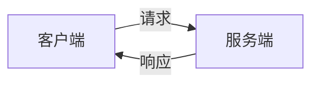
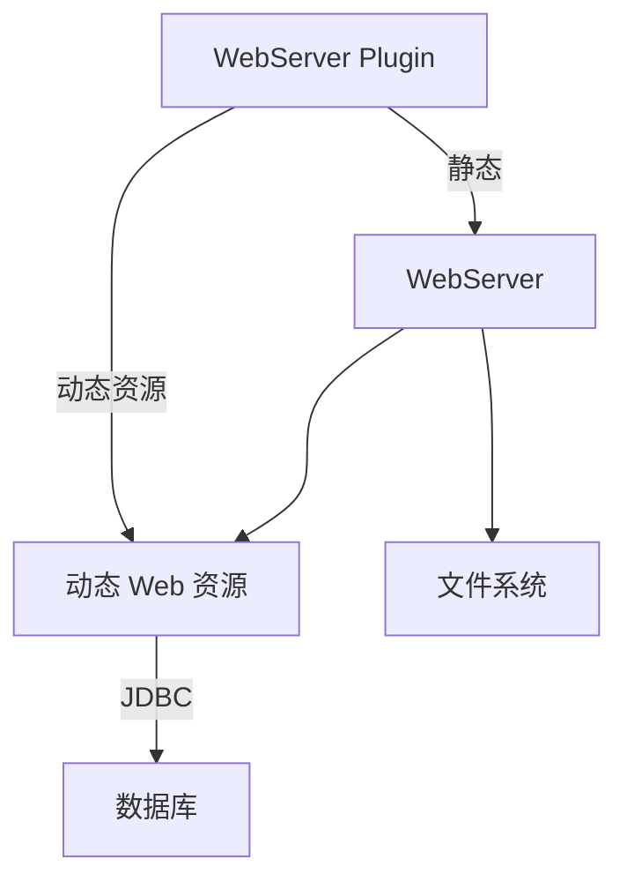

# 1. 基本概念

## 1.1 前言

Web 开发：
- Web 网页开发
- 静态 Web
- 动态 Web

一个 Web 应用由多个部分组成，包含静态 Web 和动态 Web 。

## 1.2 工作流程



服务端内又包含 Web 服务器和资源。由于静态 Web 不能和数据库交互，所以我们需要使用动态 Web 来和服务器端的资源交互。

服务器内的工作过程：



# 2. Web 服务器

## 2.1 使用 Tomcat 服务器

从 [官网](https://tomcat.apache.org/download-10.cgi) 上下载压缩包 `apache-tomcat-10.0.21-windows-x64.zip`，解压即可。

运行方式：进入 `bin/` 目录，下面的命令可以运行服务器：

```bash
startup
```

打开 `http://localhost:8080/` 进行测试，可以访问代表启动成功。

配置文件：`conf/server.xml`，如果需要修改服务器参数可以在此修改：

```xml
<!-- 修改服务器端口、协议 -->
<Connector port="8080" protocol="HTTP/1.1"
           connectionTimeout="20000"
           redirectPort="8443" />

<!-- 修改主机域名和应用名称 -->
  <Host name="localhost"  appBase="webapps"
        unpackWARs="true" autoDeploy="true">
```

网络服务过程：
1. 输入 URL，回车
2. 过滤域名
    - 如果本机有记录，则返回本机记录
    - 如果没有记录，查找 DNS
3. 请求到对应 IP

## 2.2 使用 Tomcat

如何发布一个网站？将网页资源文件放在 `webapps` 文件夹下面即可。

资源文件的目录结构：
- `webapps`
    - `ROOT`
    - `example`
        - `WEB-INF`
            - `classes`：Java 程序
            - `lib`：依赖的 `.jar` 包
            - `web.xml`：网站配置文件
        - `index.html`：主页
        - ...

# 3. HTTP 协议

> 关于 HTTP 的详细内容后面将会在计算机网络中详细讲解。

## 3.1 HTTP 协议介绍

HTTP（超文本传输协议）是简单的请求-响应协议，运行在 TCP 之上。

超文本意味着它可以传输：
- 文本：HTML、文档
- 超文本：媒体文件

HTTP 协议的默认端口是 80，HTTPS 默认端口是 443 。

HTTP 经历了两个时代：
- HTTP 1.0
    - `HTTP/1.0`，客户端与 Web 服务器连接后，只能获得一个 Web 资源
- HTTP 2.0
    - `HTTP/1.1`，客户端与 Web 服务器连接后，可以获得多个 Web 资源

## 3.2 HTTP 请求

请求包含三个部分，请求头和请求体使用空行隔开：
- 请求行  
    ```text
    POST https://zhihu-web-analytics.zhihu.com/api/v2/za/logs/batch HTTP/1.1
    ```
- 请求头  
    ```yaml
    Accept: */*
    Accept-Encoding: gzip, deflate, br
    Accept-Language: zh-CN,zh;q=0.9,en;q=0.8,en-GB;q=0.7,en-US;q=0.6,da;q=0.5,ja;q=0.4
    Cache-Control: no-cache
    Connection: keep-alive
    Content-Encoding: gzip
    Content-Length: 542
    Content-Type: application/x-protobuf
    DNT: 1
    Host: zhihu-web-analytics.zhihu.com
    Origin: https://zhuanlan.zhihu.com
    Pragma: no-cache
    Referer: https://zhuanlan.zhihu.com/p/66793637
    sec-ch-ua: " Not A;Brand";v="99", "Chromium";v="102", "Microsoft Edge";v="102"
    sec-ch-ua-mobile: ?0
    sec-ch-ua-platform: "Windows"
    Sec-Fetch-Dest: empty
    Sec-Fetch-Mode: cors
    Sec-Fetch-Site: same-site
    User-Agent: Mozilla/5.0 (Windows NT 10.0; Win64; x64) AppleWebKit/537.36 (KHTML, like Gecko) Chrome/102.0.5005.63 Safari/537.36 Edg/102.0.1245.30
    X-ZA-Batch-Size: 1
    X-ZA-ClientID: 289a4067-c478-4110-98f8-5ef95a73ede3
    X-ZA-Log-Version: 3.2.53
    X-ZA-Platform: DesktopWeb
    X-ZA-Product: Zhihu
    ```
- 请求体  
    （二进制数据）
    ```text
    \u001f\u008b\u0008\u0000\u0099b\u0000\u0003...
    ```

## 3.3 HTTP 响应

HTTP 响应也有三个部分，响应头和响应体用空行隔开：
- 状态行  
    ```text
    HTTP/1.1 200 OK
    ```
- 响应头  
    ```yaml
    Date: Fri, 03 Jun 2022 06:46:20 GMT
    Content-Type: text/html; charset=UTF-8
    Content-Length: 0
    Connection: keep-alive
    Set-Cookie: tgw_l7_route=fdfce69c1f50de9a2c02cc266c2964de; Expires=Fri, 03-Jun-2022 06:46:50 GMT; Path=/
    Server: openresty
    Access-Control-Allow-Origin: *
    X-Backend-Response: 0.003
    ```
- 响应体  
    （空）

请求方法：
- `GET`
- `POST`
- `HEAD`
- `DELETE`
- `PUT`
- ...

# 4. Maven

## 4.1 需求场景

在 Java 开发中，大量 `.jar` 包需要手动导入，如果有一个工具能够自动导入 `.jar` 包，自动管理依赖，那么 Maven 可以满足这种需求。

核心思想：约定大于配置。

## 4.2 IDEA 中使用 Maven

也可以使用 IDEA 自带的 Maven，建议下载并安装到本地。

Maven 项目目录：
- `project`：项目文件夹
    - `src/`
        - `main/`
            - `java/`
            - `resources/`
        - `test`
            - `java/`
    - `pom.xml`：Maven 配置

新建 Maven 项目，初始化为 Web 项目，标记对应文件夹的属性。

## 4.3 IDEA 中配置 Tomcat

Run/Debug Configurations 中设置 Tomcat Local，然后指定到项目路径，出现启动按钮代表配置成功。

`pom.xml` 配置如下：

```xml
<?xml version="1.0" encoding="UTF-8"?>
<project xmlns="...">
    <modelVersion>4.0.0</modelVersion>

    <groupId>top.alexsun</groupId>
    <artifactId>javaweb-demo</artifactId>
    <version>1.0-SNAPSHOT</version>
    <packaging>war</packaging>

    <name>javaweb-demo Maven Webapp</name>
    <url>https://example.com</url>
    <properties>
        ...
    </properties>
    <dependencies>
        ...
    </dependencies>
    <build>
        ...
    </build>
</project>
```

IDEA 中使用目录树功能可以快速查看 Maven 中的 `.jar` 包的结构。


