[Mermaid](https://github.com/mermaid-js/mermaid/blob/HEAD/README.zh-CN.md) 是用于在 MarkDown 中生成图标的 JS 库，本文是 Mermaid 的基本语法介绍，还包含了如何在 Hexo Fluid 主题内配置 Mermaid 的一份指南。

<!-- more -->

# 1. 使用 Mermaid

## 1.1 Mermaid 简介

Mermaid 是一个 JS 实现的一个三方库，浅显的理解就是 生成图表 的 “Markdown 语法” 用纯文本格式编写图表。

目前这个插件已经广受支持了，很多支持 Markdown 语法的编辑器也支持了 Mermaid，比如
- 掘金
- 语雀
- 印象笔记
- Typora

你可以在这里体验：[Mermaid 在线编辑器](https://mermaid-js.github.io/mermaid/) 。

好处：
- 你可以用代码生成任意你想要的流程图、状态图、甘特图、时序图、饼图、类图、关系图、旅程图
- 避免大规模引入图库带来的麻烦，这些方案很多需要图床、CDN 或 OSS 的支持
- 避免插入大量难以管理，且依赖第三方编辑器的 SVG

下面是一个示例：

```plaintext
sequenceDiagram
Alice->>John: Hello John, how are you?
loop Healthcheck
    John->>John: Fight against hypochondria
end
Note right of John: Rational thoughts!
John-->>Alice: Great!
John->>Bob: How about you?
Bob-->>John: Jolly good!
```

可以使用三个反引号包裹，然后标注语言为 `mermaid`，渲染结果：

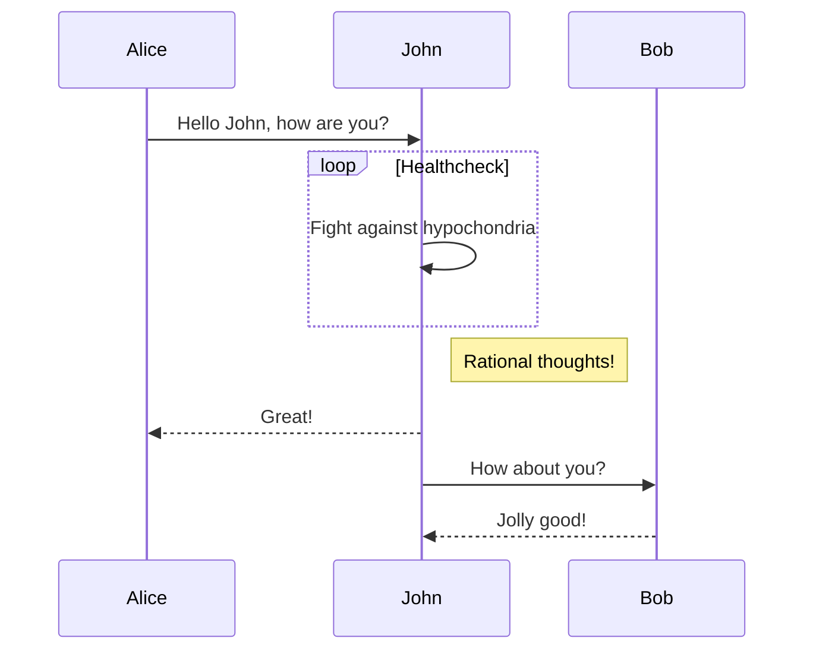

## 1.2 安装 Mermaid 支持

VS Code 使用 Mermaid 可以在插件商店中搜索，也可以直接安装：[mermaid 支持插件](https://link.juejin.cn/?target=https%3A%2F%2Fmarketplace.visualstudio.com%2Fitems%3FitemName%3Dbierner.markdown-mermaid) 。

前端开发可以以下面的方式使用：
- [npm 仓库地址](https://www.npmjs.com/package/mermaid)
- CDN 形式引入

## 1.3 在 Hexo 博客中使用

在 `_config.fluid.yml` 加入：

```yaml
post:
  mermaid:
    enable: true
    specific: true
    options:
```

如果你开启了 `specific: true`，那么包含 Mermaid 的文档必须在头上加上 `mermaid: true` 才能使用，推荐这样配置的原因是对于没有 Mermaid 依赖的文档可以加快加载速度。

其中 `options` 可以参考官方配置，官方配置代码如下：

```js
var config = {
  theme: 'default',
  logLevel: 'fatal',
  securityLevel: 'strict',
  startOnLoad: true,
  arrowMarkerAbsolute: false,

  er: {
    diagramPadding: 20,
    layoutDirection: 'TB',
    minEntityWidth: 100,
    minEntityHeight: 75,
    entityPadding: 15,
    stroke: 'gray',
    fill: 'honeydew',
    fontSize: 12,
    useMaxWidth: true,
  },
  flowchart: {
    diagramPadding: 8,
    htmlLabels: true,
    curve: 'basis',
  },
  sequence: {
    diagramMarginX: 50,
    diagramMarginY: 10,
    actorMargin: 50,
    width: 150,
    height: 65,
    boxMargin: 10,
    boxTextMargin: 5,
    noteMargin: 10,
    messageMargin: 35,
    messageAlign: 'center',
    mirrorActors: true,
    bottomMarginAdj: 1,
    useMaxWidth: true,
    rightAngles: false,
    showSequenceNumbers: false,
  },
  gantt: {
    titleTopMargin: 25,
    barHeight: 20,
    barGap: 4,
    topPadding: 50,
    leftPadding: 75,
    gridLineStartPadding: 35,
    fontSize: 11,
    fontFamily: '"Open Sans", sans-serif',
    numberSectionStyles: 4,
    axisFormat: '%Y-%m-%d',
    topAxis: false,
  },
};
mermaid.initialize(config);
```

# 2. Mermaid 语法

## 2.1 布局方向

其中可选值：
- `TB`（从上到下）
- `BT`（从下到上）
- `LR`（从左往右）
- `RL`（从右往左）

```plaintext
graph TB
  开始 --> 结束
```

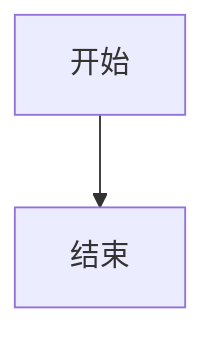

## 2.2 结点和形状

### 2.2.1 一次性结点

**一次性结点**：默认表现为矩形节点，其文本内容直接显示 `id` 的值。适合后续不会出现多次引用的情况。

```plaintext
graph TD
    id
```

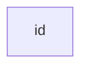

### 2.2.2 可重复结点

**可重复节点**：指定节点形状，其文本内容不再是 `id` 的值而是 `<node description>` 的值，适合后续出现多次引用相同节点的情况。

`id` 代表节点的唯一标识,当前节点的文本描述由 `<node description>` 的值指定。

一般格式：`id[node description]`，中括号表示节点是矩形形状 `"node description"` 是节点的描述文本。

```plaintext
graph LR
    id1[这是文本]
```

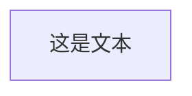

### 2.2.3 不同的形状

最外层代表主形状，内层辅助修饰。

- `[矩形]`
    - `[[暂不支持]]`
    - `[(圆柱)]`
    - `[{暂不支持}]`
    - `[/平行四边形/]`
    - `[\平行四边形\]`
    - `[/梯形\]`
    - `[\梯形/]`
- `(圆角矩形)`
    - `((圆形))`
    - `([体育场])`
    - `({暂不支持})`
- `{菱形}`
    - `{{六边形}}`
    - `{[暂不支持]}`
    - `{(暂不支持)}`
- `>不对称矩形]`

**圆角矩形**，圆弧较小：

```plaintext
graph LR
    id1(这是文本)
```


**体育场**，圆弧最大的圆角矩形：

```plaintext
graph LR
    id1([这是文本])
```


**圆柱**：

```plaintext
graph LR
    id1[(数据库)]
```

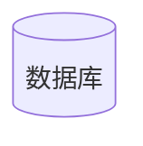

**圆形**

```plaintext
graph LR
    id1((这是圆))
```

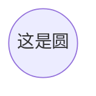

**不对称矩形**，条带形状：

```plaintext
graph LR
    id1>这是文本]
```


**菱形**：

```plaintext
graph LR
    id1{这是文本}
```

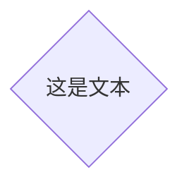

**平行四边形**：

```plaintext
graph TD
    id1[\这是文本\]
```

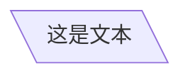

**梯形**：

```plaintext
graph TD
    A[/梯形\]
```

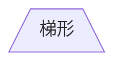

**倒梯形**：

```plaintext
graph TD
    B[\也是梯形/]
```


## 2.3 连接线

+ 线条
    - 实线 `--`
    - 虚线 `-.`
+ 箭头
    - `>`
    - `-`
+ 描述
    - 实线
        + `--描述文字`
        + `|描述文字|`
    - 虚线
        + `-.描述文字`
        + `|描述文字|`
+ 加粗
    - `==`
+ 组合形式
    - `-->`
    - `---`
    - `-.->`
    - `-.-`
    - 有描述实线有箭头
        + `--描述文字-->`
        + `-->|描述文字|`
    - 有描述实线无箭头
        + `--描述文字---`
        + `---|描述文字|`
    - 有描述虚线有箭头
        + `-.描述文字-.->`
        + `-.->|描述文字|`
    - 有描述虚线无箭头
        + `-.描述文字-.-`
        + `-.-|描述文字|`
    - `==>`
    - `===`
    - 有描述加粗实线有箭头
        + `==描述文字==>`
        + `==>|描述文字|`
    - 有描述加粗实线无箭头
        + `==描述文字===`
        + `===|描述文字|`

**箭头**：

```plaintext
graph LR
    A-->B
```

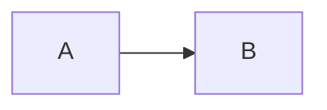

**无箭头**

```plaintext
graph LR
    A --- B
```

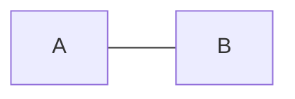

**箭头加上描述**：

```plaintext
graph LR
    A-->|text|B
```

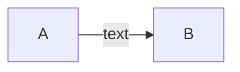

**连线加上描述**

```plaintext
graph LR
    A-- This is the text ---B
```

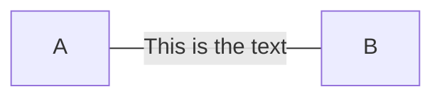

另一种形式，附加到右边：

```plaintext
graph LR
    A---|This is the text|B
```


**有箭头的虚线**

```plaintext
graph LR
   A-. text .-> B
```

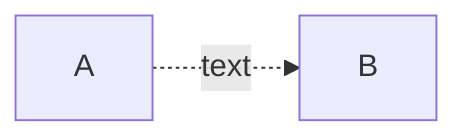

**有箭头的粗实线**

```plaintext
graph LR
   A ==> B
```

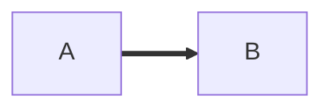

**有箭头的粗实线加描述**

```plaintext
graph LR
   A == text ==> B
```

```mermaid
graph LR
   A == text ==> B
```

另一个实例，附加到右边：

```plaintext
graph LR
   A ==>|text| B
```

```mermaid
graph LR
   A ==>|text| B
```

## 2.4 高级用法

## 2.5 小结

### 2.5.1 名词缩写

### 2.5.2 几何形状

### 2.5.3 有限语法

# 参考

[1] Mermaid，GitHub，<https://github.com/mermaid-js/mermaid/blob/develop/docs/Setup.md>

[2] 时间管理、头脑风暴、阅读、会议记录神器-Mermaid，掘金，<https://juejin.cn/post/6971426277261574152>

[3] 雪之梦的 GitHub 博客，github.io，<https://snowdreams1006.github.io/write/mermaid-flow-chart.html>
