[Mermaid](https://github.com/mermaid-js/mermaid/blob/HEAD/README.zh-CN.md) 是用于在 MarkDown 中生成图表的 JS 库，本文是 Mermaid 的基本语法介绍，还包含了如何在 Hexo Fluid 主题内配置 Mermaid 的一份指南。

<!-- more -->

# 1. 使用 Mermaid

## 1.1 Mermaid 简介

MarkDown 的宗旨是 **重内容，重结构，轻排版**。如果我们恰好同时对 Markdown 的 *标记式* 记录方法高度认可的话，那么有没有想过使用类似 Markdown 形式的语言，快速 *写* 一个 **流图** 出来？

Mermaid 是一个 JS 实现的一个三方库，浅显的理解就是 生成图表 的 “Markdown 语法” 用纯文本格式编写图表。

目前这个插件已经广受支持了，很多支持 Markdown 语法的编辑器也支持了 Mermaid，比如
- 掘金
- 语雀
- 印象笔记 Markdown 笔记
- Typora
- 有道云笔记
- MWeb
- VSCode + Mermaid 插件
- Atom + Mermaid 插件

你可以在这里体验：[Mermaid 在线编辑器](https://mermaid-js.github.io/mermaid/) 。

好处：
- 你可以用代码生成任意你想要的流程图、状态图、甘特图、时序图、饼图、类图、关系图、旅程图
- 避免大规模引入图库带来的麻烦，这些方案很多需要图床、CDN 或 OSS 的支持
- 避免插入大量难以管理，且依赖第三方编辑器的 SVG

下面是一个示例：

```plaintext
sequenceDiagram
Alice->>John: Hello John, how are you?
loop Healthcheck
    John->>John: Fight against hypochondria
end
Note right of John: Rational thoughts!
John-->>Alice: Great!
John->>Bob: How about you?
Bob-->>John: Jolly good!
```

可以使用三个反引号包裹，然后标注语言为 `mermaid`，渲染结果：

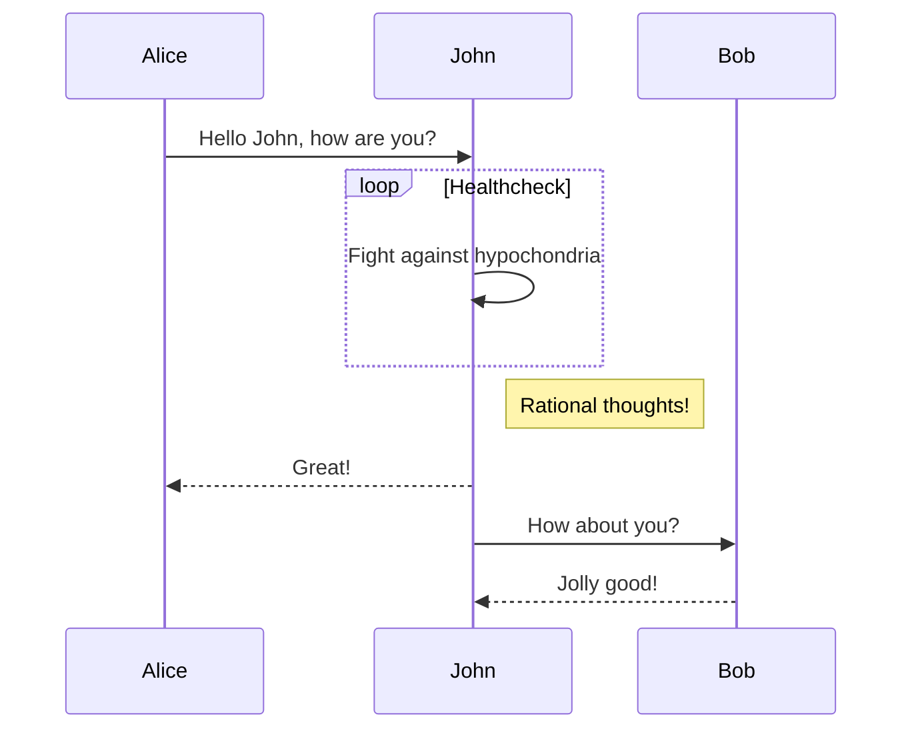

## 1.2 安装 Mermaid 支持

VS Code 使用 Mermaid 可以在插件商店中搜索，也可以直接安装：[mermaid 支持插件](https://link.juejin.cn/?target=https%3A%2F%2Fmarketplace.visualstudio.com%2Fitems%3FitemName%3Dbierner.markdown-mermaid) 。

前端开发可以以下面的方式使用：
- [npm 仓库地址](https://www.npmjs.com/package/mermaid)
- CDN 形式引入

## 1.3 在 Hexo 博客中使用

在 `_config.fluid.yml` 加入：

```yaml
post:
  mermaid:
    enable: true
    specific: true
    options:
```

如果你开启了 `specific: true`，那么包含 Mermaid 的文档必须在头上加上 `mermaid: true` 才能使用，推荐这样配置的原因是对于没有 Mermaid 依赖的文档可以加快加载速度。

其中 `options` 可以参考官方配置，官方配置代码如下：

```js
var config = {
  theme: 'default',
  logLevel: 'fatal',
  securityLevel: 'strict',
  startOnLoad: true,
  arrowMarkerAbsolute: false,

  er: {
    diagramPadding: 20,
    layoutDirection: 'TB',
    minEntityWidth: 100,
    minEntityHeight: 75,
    entityPadding: 15,
    stroke: 'gray',
    fill: 'honeydew',
    fontSize: 12,
    useMaxWidth: true,
  },
  flowchart: {
    diagramPadding: 8,
    htmlLabels: true,
    curve: 'basis',
  },
  sequence: {
    diagramMarginX: 50,
    diagramMarginY: 10,
    actorMargin: 50,
    width: 150,
    height: 65,
    boxMargin: 10,
    boxTextMargin: 5,
    noteMargin: 10,
    messageMargin: 35,
    messageAlign: 'center',
    mirrorActors: true,
    bottomMarginAdj: 1,
    useMaxWidth: true,
    rightAngles: false,
    showSequenceNumbers: false,
  },
  gantt: {
    titleTopMargin: 25,
    barHeight: 20,
    barGap: 4,
    topPadding: 50,
    leftPadding: 75,
    gridLineStartPadding: 35,
    fontSize: 11,
    fontFamily: '"Open Sans", sans-serif',
    numberSectionStyles: 4,
    axisFormat: '%Y-%m-%d',
    topAxis: false,
  },
};
mermaid.initialize(config);
```

# 2. Mermaid 流图

## 2.1 布局方向

其中可选值：
- `TB`（从上到下）
- `BT`（从下到上）
- `LR`（从左往右）
- `RL`（从右往左）

```plaintext
graph TB
  开始 --> 结束
```

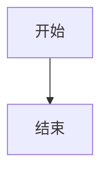

## 2.2 结点和形状

### 2.2.1 一次性结点

**一次性结点**：默认表现为矩形节点，其文本内容直接显示 `id` 的值。适合后续不会出现多次引用的情况。

```plaintext
graph TD
    id
```

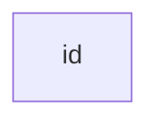

### 2.2.2 可重复结点

**可重复节点**：指定节点形状，其文本内容不再是 `id` 的值而是 `<node description>` 的值，适合后续出现多次引用相同节点的情况。

`id` 代表节点的唯一标识,当前节点的文本描述由 `<node description>` 的值指定。

一般格式：`id[node description]`，中括号表示节点是矩形形状 `"node description"` 是节点的描述文本。

```plaintext
graph LR
    id1[这是文本]
```

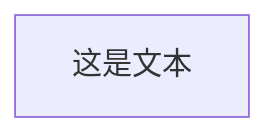

### 2.2.3 不同的形状

最外层代表主形状，内层辅助修饰。

- `[矩形]`
    - `[[暂不支持]]`
    - `[(圆柱)]`
    - `[{暂不支持}]`
    - `[/平行四边形/]`
    - `[\平行四边形\]`
    - `[/梯形\]`
    - `[\梯形/]`
- `(圆角矩形)`
    - `((圆形))`
    - `([体育场])`
    - `({暂不支持})`
- `{菱形}`
    - `{{六边形}}`
    - `{[暂不支持]}`
    - `{(暂不支持)}`
- `>不对称矩形]`

**圆角矩形**，圆弧较小：

```plaintext
graph LR
    id1(这是文本)
```


**体育场**，圆弧最大的圆角矩形：

```plaintext
graph LR
    id1([这是文本])
```


**圆柱**：

```plaintext
graph LR
    id1[(数据库)]
```

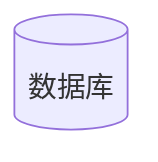

**圆形**

```plaintext
graph LR
    id1((这是圆))
```

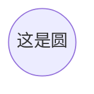

**不对称矩形**，条带形状：

```plaintext
graph LR
    id1>这是文本]
```

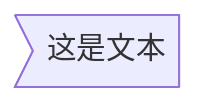

**菱形**：

```plaintext
graph LR
    id1{这是文本}
```

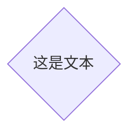

**平行四边形**：

```plaintext
graph TD
    id1[\这是文本\]
```

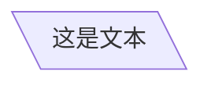

**梯形**：

```plaintext
graph TD
    A[/梯形\]
```

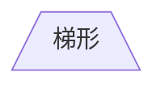

**倒梯形**：

```plaintext
graph TD
    B[\也是梯形/]
```


## 2.3 连接线

+ 线条
    - 实线 `--`
    - 虚线 `-.`
+ 箭头
    - `>`
    - `-`
+ 描述
    - 实线
        + `--描述文字`
        + `|描述文字|`
    - 虚线
        + `-.描述文字`
        + `|描述文字|`
+ 加粗
    - `==`
+ 组合形式
    - `-->`
    - `---`
    - `-.->`
    - `-.-`
    - 有描述实线有箭头
        + `--描述文字-->`
        + `-->|描述文字|`
    - 有描述实线无箭头
        + `--描述文字---`
        + `---|描述文字|`
    - 有描述虚线有箭头
        + `-.描述文字-.->`
        + `-.->|描述文字|`
    - 有描述虚线无箭头
        + `-.描述文字-.-`
        + `-.-|描述文字|`
    - `==>`
    - `===`
    - 有描述加粗实线有箭头
        + `==描述文字==>`
        + `==>|描述文字|`
    - 有描述加粗实线无箭头
        + `==描述文字===`
        + `===|描述文字|`

**箭头**：

```plaintext
graph LR
    A-->B
```

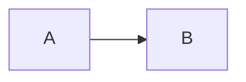

**无箭头**

```plaintext
graph LR
    A --- B
```

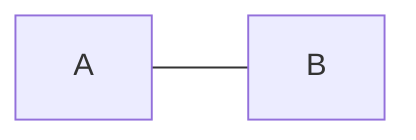

**箭头加上描述**：

```plaintext
graph LR
    A-->|text|B
```

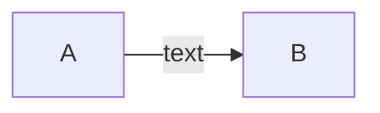

**连线加上描述**

```plaintext
graph LR
    A-- This is the text ---B
```

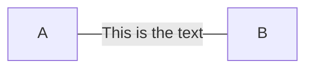

另一种形式，附加到右边：

```plaintext
graph LR
    A---|This is the text|B
```


**有箭头的虚线**

```plaintext
graph LR
   A-. text .-> B
```

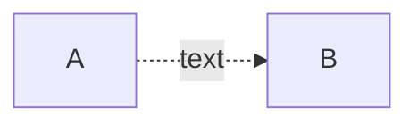

**有箭头的粗实线**

```plaintext
graph LR
   A ==> B
```

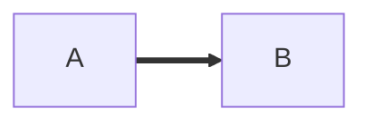

**有箭头的粗实线加描述**

```plaintext
graph LR
   A == text ==> B
```

```mermaid
graph LR
   A == text ==> B
```

另一个实例，附加到右边：

```plaintext
graph LR
   A ==>|text| B
```

```mermaid
graph LR
   A ==>|text| B
```

## 2.4 高级用法

+ `-->-->`：链式连接
+ `&`：共同连接
+ `""`：字符串
+ `%%`：注释
+ `subgraph`：子图

### 2.4.1 链式连接

支持链式连接方式，`A --> B --> C` 等价于 `A --> B` 和 `B --> C` 形式：

```plaintext
graph LR
   A -- text --> B -- text2 --> C
```

```mermaid
graph LR
   A -- text --> B -- text2 --> C
```

### 2.4.2 多节点共同连接

支持共同连接方式，`A --> B & C` 等价于 `A --> B` 和 `A --> C` 形式：

```plaintext
graph LR
   a --> b & c--> d
```

```mermaid
graph LR
   a --> b & c--> d
```

### 2.4.3 多节点相互连接

多节点共同连接的变体形式，`A & B --> C & D` 等价于 `A --> C`、`A --> D`、`B --> C` 和 `B --> D` 四种组合形式：

```plaintext
graph TB
    A & B--> C & D
```

```mermaid
graph TB
    A & B--> C & D
```

### 2.4.4 字符串包裹

字符串可以包裹特殊字符：

```plaintext
graph LR
    id1["This is the (text) in the box"]
```

```mermaid
graph LR
    id1["This is the (text) in the box"]
```

也可以包含 HTML 转义字符：

```plaintext
graph LR
    A["A double quote:#quot;"] -->B["A dec char:#9829;"]
```

```mermaid
graph LR
    A["A double quote:#quot;"] -->B["A dec char:#9829;"]
```

### 2.4.5 嵌套子流程图


```plaintext
graph TB
    c1-->a2
    subgraph one
        a1-->a2
    end
    subgraph two
        b1-->b2
    end
    subgraph three
        c1-->c2
    end
```

```mermaid
graph TB
    c1-->a2
    subgraph one
        a1-->a2
    end
    subgraph two
        b1-->b2
    end
    subgraph three
        c1-->c2
    end
```

# 3. Mermaid 序列图

# 4. Mermaid 类图

# 5. Mermaid 状态图

# 6. Mermaid E-R 图

<div class="note note-success">

实体-关系模型（或 E-R 模型）描述了特定知识领域中感兴趣的相互关联的事物。一个基本的 E-R 模型是由实体类型（对感兴趣的事物进行分类）和指定实体（这些实体类型的实例）之间可能存在的关系组成。

<cite>维基百科</cite>

</div>

**E-R 图** 最早由 Peter Chen 提出，E-R 图的中文名称叫 **实体-关系图**，是数据库设计所使用的重要模型。

提出来 E-R 图的时候，使用矩形表示实体集，椭圆形表示属性，菱形表示关系。类似于这样：

```mermaid
graph LR
A["A"]
B["B"]
C["C"]
R1{"R1"}
R2{"R2"}
p1(["p1"])
p2(["p2"])
p3(["p3"])
p4(["p4"])
p5(["p5"])
p1 & p2 --- A --- R1 --- B --- p3
R2 --- B & C
C --- p4 & p5
```

这种表示方法叫做 **Chen 方法**（陈氏表示法）。这个方法存在的最大问题就是当一个实体存在很多属性的时候，就是产生非常多的椭圆，导致图片非常混乱，不清晰明了。后来的一种比较有名的改进方法叫做 **乌鸦脚**（Crow’s Foot）方法，示例如图：

```mermaid
erDiagram
    CUSTOMER ||--o{ ORDER : places
    ORDER ||--|{ LINE-ITEM : contains
    CUSTOMER }|..|{ DELIVERY-ADDRESS : uses
```

各种 *脚* 的含义如下：

```mermaid
erDiagram
    A ||--o{ B : C
```

<svg xmlns="http://www.w3.org/2000/svg" xmlns:xlink="http://www.w3.org/1999/xlink" version="1.1" width="241px" viewBox="-0.5 -0.5 241 121" style="max-width:100%;max-height:121px;"><defs/><g><rect x="0" y="0" width="240" height="120" fill="#ffffff" stroke="none" pointer-events="all"/><path d="M 50 110 L 70 110 Q 80 110 83.71 100.72 L 116.29 19.28 Q 120 10 130 10 L 150 10" fill="none" stroke="#000000" stroke-miterlimit="10" pointer-events="stroke"/><ellipse cx="138" cy="10" rx="3" ry="3" fill="#ffffff" stroke="#000000" pointer-events="all"/><path d="M 150 6 L 142 10 L 150 14" fill="none" stroke="#000000" stroke-miterlimit="10" pointer-events="all"/><path d="M 130 110 L 150 110 Q 160 110 163.71 100.72 L 196.29 19.28 Q 200 10 210 10 L 230 10" fill="none" stroke="#000000" stroke-miterlimit="10" pointer-events="stroke"/><path d="M 222 14 L 222 6 M 230 6 L 222 10 L 230 14" fill="none" stroke="#000000" stroke-miterlimit="10" pointer-events="all"/><path d="M 90 110 L 110 110 Q 120 110 123.71 100.72 L 156.29 19.28 Q 160 10 170 10 L 190 10" fill="none" stroke="#000000" stroke-miterlimit="10" pointer-events="stroke"/><path d="M 186 14 L 186 6 M 182 14 L 182 6" fill="none" stroke="#000000" stroke-miterlimit="10" pointer-events="all"/><path d="M 10 110 L 30 110 Q 40 110 43.71 100.72 L 76.29 19.28 Q 80 10 90 10 L 110 10" fill="none" stroke="#000000" stroke-miterlimit="10" pointer-events="stroke"/><ellipse cx="98" cy="10" rx="3" ry="3" fill="#ffffff" stroke="#000000" pointer-events="all"/><path d="M 106 14 L 106 6" fill="none" stroke="#000000" stroke-miterlimit="10" pointer-events="all"/></g></svg>

上面的四个符号分别代表：
- 0 个或 1 个
- 0 个或多个
- 1 个
- 1 个或多个

上面的符号可以自由组合，所以可以产生十六种不同的连接关系。但是一般情况下我们只讨论三种关系，M:N、M:1 和 1:1，根据能否等于 0 来确定是否需要画圈即可。

下面的示例和语法将对此作详细说明。

## 6.1 示例

```plaintext
erDiagram
    CUSTOMER ||--o{ ORDER : places
    ORDER ||--|{ LINE-ITEM : contains
    CUSTOMER }|..|{ DELIVERY-ADDRESS : uses
```

```mermaid
erDiagram
    CUSTOMER ||--o{ ORDER : places
    ORDER ||--|{ LINE-ITEM : contains
    CUSTOMER }|..|{ DELIVERY-ADDRESS : uses
```

实体名称通常是大写的，尽管在这方面没有公认的标准，而且在 Mermaid 中也没有要求。

实体之间的关系用线来表示，线的末端标记代表对应数值。Mermaid 使用最流行的 **乌鸦脚符号**。乌鸦脚直观地表达了它所连接的实体的许多实例的可能性。

E-R 图可以用于各种目的，从没有任何实现细节的抽象逻辑模型，到关系数据库表的物理模型。在 E-R 图中加入属性定义可以帮助理解实体的目的和意义。这些不一定要详尽，通常一个小的属性子集就足够了。Mermaid 允许定义其 `type` 和 `name` 。

```plaintext
erDiagram
    CUSTOMER ||--o{ ORDER : places
    CUSTOMER {
        string name
        string custNumber
        string sector
    }
    ORDER ||--|{ LINE-ITEM : contains
    ORDER {
        int orderNumber
        string deliveryAddress
    }
    LINE-ITEM {
        string productCode
        int quantity
        float pricePerUnit
    }
```

```mermaid
erDiagram
    CUSTOMER ||--o{ ORDER : places
    CUSTOMER {
        string name
        string custNumber
        string sector
    }
    ORDER ||--|{ LINE-ITEM : contains
    ORDER {
        int orderNumber
        string deliveryAddress
    }
    LINE-ITEM {
        string productCode
        int quantity
        float pricePerUnit
    }
```

在 E-R 图上包括属性时，你必须决定是否将外键作为属性包括在内。这可能取决于你试图表现关系表结构的紧密程度。

如果你的图是一个逻辑模型，并不是为了暗示关系的实现，那么最好不包括这些，因为关联关系已经传达了实体的关联方式。例如，一个 JSON 数据结构可以实现一对多的关系，而不需要外键属性，使用数组。同样地，面向对象的编程语言可以使用指针或对集合的引用。甚至对于那些旨在实现关系的模型，你可能会决定包含外键属性会重复已经被关系所描绘的信息，并且不会给实体增加意义。归根结底，这是你的选择。

## 6.2 语法

E-R 图的一般语法是：

```
<first-entity> [<relationship> <second-entity> : <relationship-label>]
```


# 7. Mermaid 旅程图

# 8. Mermaid 甘特图

# 9. Mermaid 饼状图

<div class="note note-success">

饼图是一种圆形的统计图形，它被分成若干片，以说明数字比例。在饼图中，每个片断的弧长（以及由此产生的中心角和面积）与它所代表的数量成正比。虽然它因类似于一个被切开的饼而被命名，但它的表现方式却有不同。最早的饼图一般归功于威廉·普莱费尔 1801 年的《统计手册》。

<cite>维基百科</cite>

</div>

## 9.1 示例

```plaintext
pie title Pets adopted by volunteers
    "Dogs" : 386
    "Cats" : 85
    "Rats" : 15
```

```mermaid
pie title Pets adopted by volunteers
    "Dogs" : 386
    "Cats" : 85
    "Rats" : 15
```

## 9.2 语法

绘制饼状图的语法比较简单：
- 用 `pie` 关键字开始画图
- `showData` 关键字用于在图例文本之后呈现实际的数据值，这是可选的
- 紧接着是 `title` 关键字和它的字符串值，给饼图一个标题，这也是可选的
- 后面的是数据集
    - 饼图中每个对象的标签都在引号（`" "`）内
    - 标签后面使用冒号（`:`）作为分隔符
    - 后面是正的数值（支持到小数点后两位）

下面是一个示例：

```plaintext
pie showData
    title Key elements in Product X
    "Calcium" : 42.96
    "Potassium" : 50.05
    "Magnesium" : 10.01
    "Iron" :  5
```

```mermaid
pie showData
    title Key elements in Product X
    "Calcium" : 42.96
    "Potassium" : 50.05
    "Magnesium" : 10.01
    "Iron" :  5
```

```plaintext

```

```mermaid

```

```plaintext

```

```mermaid

```

```plaintext

```

```mermaid

```

```plaintext

```

```mermaid

```

```plaintext

```

```mermaid

```

```plaintext

```

```mermaid

```

```plaintext

```

```mermaid

```

```plaintext

```

```mermaid

```

```plaintext

```

```mermaid

```

```plaintext

```

```mermaid

```

```plaintext

```

```mermaid

```

```plaintext

```

```mermaid

```

```plaintext

```

```mermaid

```

```plaintext

```

```mermaid

```

```plaintext

```

```mermaid

```

```plaintext

```

```mermaid

```

```plaintext

```

```mermaid

```

```plaintext

```

```mermaid

```

```plaintext

```

```mermaid

```

```plaintext

```

```mermaid

```

```plaintext

```

```mermaid

```

```plaintext

```

```mermaid

```

```plaintext

```

```mermaid

```

```plaintext

```

```mermaid

```

```plaintext

```

```mermaid

```

```plaintext

```

```mermaid

```

```plaintext

```

```mermaid

```

```plaintext

```

```mermaid

```


# 10. Mermaid 依赖图

# 11. Mermaid Git 图

# 12. 其他示例

# 参考

[1] Mermaid，GitHub，<https://github.com/mermaid-js/mermaid/blob/develop/docs/Setup.md>

[2] 时间管理、头脑风暴、阅读、会议记录神器-Mermaid，掘金，<https://juejin.cn/post/6971426277261574152>

[3] 雪之梦的 GitHub 博客，github.io，<https://snowdreams1006.github.io/write/mermaid-flow-chart.html>

[4] Mermaid：就像用 Markdown 码字一样高效制作简易流图，少数派，<https://sspai.com/post/63055#!>
