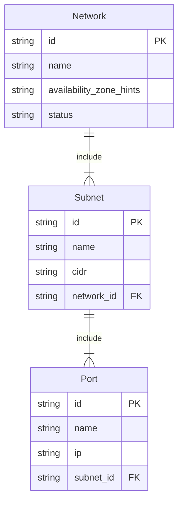
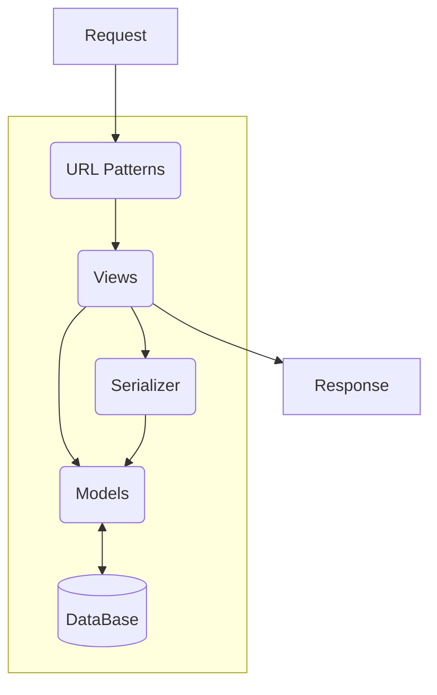

本文介绍 Python 课程设计的设计过程和具体实现。

<!-- more -->

# 1. 项目背景和课程目标

## 1.1 项目背景

随着 SDN 概念的提出和流行，越来越多的企业开始尝试使用将复杂网络结构定义为可编程的。云控制器将北向开放 RESTful API 给用户使用，南向接口负责接入不同厂商的设备，将不同的设备抽象为一致的接口，大大减少网络运行和维护的成本。

## 1.2 课程目标

本项目在云控制器项目的背景下，创建一个有代表性的、简单的场景，管理和分配不同的网络端口。

通过完成接口设计及接口实现达成以下目标：
- Python 语言在企业级项目中的使用
- Django 框架了解及使用
- RESTful API 了解及设计
- Postman 工具学习及使用

# 2. 课程设计内容

## 2.1 设计目标

使用 Django 实现一套 RESTful 风格的 API，能够支持 Port 的 CURD，并能够分配可用 IP 给 Port 。同时尽可能多地实现其他网络相关结构。

## 2.2 模型设计

模型 E-R 图结构：



创建数据库和表：

```sql
CREATE DATABASE IF NOT EXISTS `controller`;
USE `controller`;

DROP TABLE IF EXISTS `Network`;
CREATE TABLE `Network`(
    `id` VARCHAR(32),
    `name` VARCHAR(64),
    `availability_zone_hints` VARCHAR(32),
    `status` VARCHAR(32),
    PRIMARY KEY(`id`)
);

DROP TABLE IF EXISTS `Subnet`;
CREATE TABLE `Subnet`(
    `id` VARCHAR(32),
    `name` VARCHAR(64),
    `cidr` VARCHAR(32),
    `network_id` VARCHAR(32),
    PRIMARY KEY(`id`)
);

DROP TABLE IF EXISTS `Port`;
CREATE TABLE `Port`(
    `id` VARCHAR(32),
    `name` VARCHAR(64),
    `ip` VARCHAR(32),
    `subnet_id` VARCHAR(32),
    PRIMARY KEY(`id`)
);
```

模型关系约束：
- 相同 `availability_zone_hints` 下 `name` 不能重复
- 同一个 Network 下的 `Subnet.cidr` 不能重复
- 所有的 `id` 一律使用 UUID，并作为主键
- 网络的状态 `status` 只能是 `ACTIVE`（激活）、`INACTIVE`（未激活）或 `DISABLE`（禁用的）

## 2.3 接口设计

接口概览：

| 接口                      | 说明                    |
| ------------------------- | ----------------------- |
| `GET /v1/networks`        | 获取 Network 信息       |
| `GET /v1/networks/:id`    | 获取某个 Network 信息   |
| `POST /v1/networks`       | 新建 Network            |
| `DELETE /v1/networks/:id` | 删除 Network            |
| `PUT /v1/networks/:id`    | 更新某个 Network 的信息 |
| `GET /v1/subnets`         | 获取 Subnet 信息        |
| `GET /v1/subnets/:id`     | 获取某个 Subnet 信息    |
| `POST /v1/subnets`        | 新建 Subnet             |
| `DELETE /v1/subnets/:id`  | 删除 Subnet             |
| `PUT /v1/subnets/:id`     | 更新某个 Subnet 的信息  |
| `GET /v1/ports`           | 获取 Port 信息          |
| `GET /v1/ports/:id`       | 获取某个 Port 信息      |
| `POST /v1/ports`          | 新建 Port               |
| `DELETE /v1/ports/:id`    | 删除 Port               |
| `PUT /v1/ports/:id`       | 更新某个 Port 的信息    |

<div class="note note-warning">

**关于鉴权**

现阶段不涉及鉴权相关的内容，如果有鉴权需要，可以参考使用 JWT 授权，或者使用 OAuth 2.0 授权协议，需要确保通信是 SSL 连接。

</div>

## 2.2 接口设计

### 接口：`GET /v1/networks`

-   内容：获取网络信息
-   参数：  
    | 参数     | 含义                         |
    | -------- | ---------------------------- |
    | `offset` | 可选，指定返回记录的开始位置 |
    | `limit`  | 可选，限制请求数量           |
-   鉴权：无
-   请求示例：`GET /v1/networks?limit=10&offset=20`
-   返回示例  
    ```json
    {
        "code": 0,
        "error": "ok",
        "data": [
            {
                "id": "000006ac-ea63-4dd1-83e6-596e10a89366",
                "name": "network001",
                "status": "ACTIVE",
                "availability_zone_hints": "az1"
            },
            {
                "id": "0008f705-d071-4cb9-ba69-eaf97560bd1a",
                "name": "network002",
                "status": "ACTIVE",
                "availability_zone_hints": "az1"
            },
            {
                "id": "000f0e1d-7c8f-4321-ac02-78be25fce6b7",
                "name": "network003",
                "status": "ACTIVE",
                "availability_zone_hints": "az2"
            }
        ]
    }
    ```

### 接口：`GET /v1/networks/:id`

-   内容：获取某个网络信息
-   参数：无
-   鉴权：无
-   请求示例：`GET /v1/networks/000006ac-ea63-4dd1-83e6-596e10a89366`
-   返回示例  
    ```json
    {
        "code": 0,
        "error": "ok",
        "data": [
            {
                "id": "000006ac-ea63-4dd1-83e6-596e10a89366",
                "name": "network001",
                "status": "ACTIVE",
                "availability_zone_hints": "az1"
            }
        ]
    }
    ```

### 接口：`POST /v1/networks`

-   内容：新建一个网络
-   参数：  
    | 参数                      | 含义       |
    | ------------------------- | ---------- |
    | `name`                    | 网络的名称 |
    | `availability_zone_hints` | 网络区域   |
-   鉴权：无
-   请求示例：`POST /v1/networks`  
    ```json
    {
        "name": "network001",
        "availability_zone_hints": "az1"
    }
    ```
-   返回示例  
    ```json
    {
        "code": 0,
        "error": "ok",
        "data": [
            {
                "id": "000006ac-ea63-4dd1-83e6-596e10a89366",
                "name": "network001",
                "status": "ACTIVE",
                "availability_zone_hints": "az1"
            }
        ]
    }
    ```

### 接口：`DELETE /v1/networks/:id`

<div class="note note-warning">

删除操作是危险的，因为默认的删除是 **级联** 的，这将删除此网络下的所有子网和端口。

</div>

-   内容：删除一个网络
-   参数：无
-   鉴权：无
-   请求示例：`DELETE /v1/networks/000006ac-ea63-4dd1-83e6-596e10a89366`
-   返回示例  
    ```json
    {
        "code": 0,
        "error": "ok",
        "data": null,
        "affected": 1
    }
    ```

### 接口：`PUT /v1/networks/:id`

-   内容：修改一个网络的信息
-   参数：  
    | 参数                      | 含义       |
    | ------------------------- | ---------- |
    | `name`                    | 网络的名称 |
    | `availability_zone_hints` | 网络区域   |
    | `status`                  | 网络的状态 |
-   鉴权：无
-   请求示例：`PUT /v1/networks/000006ac-ea63-4dd1-83e6-596e10a89366"`  
    ```json
    {
        "name": "network001",
        "availability_zone_hints": "az1",
        "status": "ACTIVE"
    }
    ```
-   返回示例  
    ```json
    {
        "code": 0,
        "error": "ok",
        "data": [
            {
                "id": "000006ac-ea63-4dd1-83e6-596e10a89366",
                "name": "network001",
                "status": "ACTIVE",
                "availability_zone_hints": "az1"
            }
        ]
    }
    ```

### 接口：`GET /v1/subnets`

-   内容：获取网络信息
-   参数：
    | 参数         | 含义                         |
    | ------------ | ---------------------------- |
    | `offset`     | 可选，指定返回记录的开始位置 |
    | `limit`      | 可选，限制请求数量           |
    | `network_id` | 可选，从某个网络中查找       |
-   鉴权：无
-   请求示例：`GET /v1/subnets?limit=15&offset=10`
-   返回示例  
    ```json
    {
        "code": 0,
        "error": "ok",
        "data": [
            {
                "id": "000006ac-ea63-4dd1-83e6-596e10a89366",
                "name": "subnet001",
                "network_id": "0008f705-d071-4cb9-ba69-eaf97560bd1a",
                "cidr": "192.168.88.0/24"
            },
            {
                "id": "00da810c-ea63-0064-83e6-59a693de1066",
                "name": "subnet002",
                "network_id": "0008f705-d071-4cb9-ba69-eaf97560bd1a",
                "cidr": "192.168.34.0/24"
            }
        ]
    }
    ```

### 接口：`GET /v1/subnets/:id`

-   内容：获取某个子网的信息，返回信息包括可用 IP 数和可用 IP 地址，以 `[start, end]` 的形式给出
-   参数：无
-   鉴权：无
-   请求示例：`GET /v1/subnets/000006ac-ea63-4dd1-83e6-596e10a89366`
-   返回示例  
    ```json
    {
        "code": 0,
        "error": "ok",
        "data": [
            {
                "id": "000006ac-ea63-4dd1-83e6-596e10a89366",
                "name": "subnet001",
                "network_id": "0008f705-d071-4cb9-ba69-eaf97560bd1a",
                "cidr": "192.168.88.0/24",
                "total_ip_number": 32,
                "available_ip_number": 28,
                "available_ips": [
                    {
                        "start": "192.168.88.1",
                        "end": "192.168.88.25"
                    },
                    {
                        "start": "192.168.88.28",
                        "end": "192.168.88.32"
                    }
                ]
            }
        ]
    }
    ```

### 接口：`POST /v1/subnets`

-   内容：新建一个子网
-   参数：  
    | 参数         | 含义       |
    | ------------ | ---------- |
    | `name`       | 子网的名称 |
    | `network_id` | 网络 ID  |
    | `cidr`       | CIDR       |
-   鉴权：无
-   请求示例：`POST /v1/subnets`  
    ```json
    {
        "name": "subnet001",
        "network_id": "00016ac-ea63-42d1-83e6-8394819effa8",
        "cidr": "192.168.1.0/24"
    }
    ```
-   返回示例  
    ```json
    {
        "code": 0,
        "error": "ok",
        "data": [
            {
                "id": "00da810c-ea63-0064-83e6-59a693de1066",
                "name": "subnet002",
                "network_id": "0008f705-d071-4cb9-ba69-eaf97560bd1a",
                "cidr": "192.168.34.0/24"
            }
        ]
    }
    ```

### 接口：`DELETE /v1/subnets/:id`

<div class="note note-warning">

删除操作是危险的，因为默认的删除是 **级联** 的，这将删除此子网下的所有端口。

</div>

-   内容：删除一个子网
-   参数：无
-   鉴权：无
-   请求示例：`DELETE /v1/subnets/000006ac-ea63-4dd1-83e6-596e10a89366`
-   返回示例  
    ```json
    {
        "code": 0,
        "error": "ok",
        "data": null,
        "affected": 1
    }
    ```

### 接口：`PUT /v1/subnets/:id`

-   内容：修改一个子网的信息，修改时会重新分配此子网下的所有端口
-   参数：  
    | 参数         | 含义       |
    | ------------ | ---------- |
    | `name`       | 子网的名称 |
    | `network_id` | 网络的 ID  |
    | `cidr`       | CIDR       |
-   鉴权：无
-   请求示例：`PUT /v1/subnets/000006ac-ea63-4dd1-83e6-596e10a89366"`  
    ```json
    {
        "name": "subnet001",
        "network_id": "00016ac-ea63-42d1-83e6-8394819effa8",
        "cidr": "192.168.1.0/24"
    }
    ```
-   返回示例  
    ```json
    {
        "code": 0,
        "error": "ok",
        "data": [
            {
                "id": "00da810c-ea63-0064-83e6-59a693de1066",
                "name": "subnet002",
                "network_id": "0008f705-d071-4cb9-ba69-eaf97560bd1a",
                "cidr": "192.168.34.0/24"
            }
        ],
        "affected_ports": [
            {
                "id": "000006ac-ea63-4dd1-83e6-596e10a89366",
                "name": "port001",
                "subnet_id": "0008f705-d071-4cb9-ba69-eaf97560bd1a",
                "ip": "192.168.88.3"
            }
        ]
    }
    ```

### 接口：`GET /v1/ports`

-   内容：获取端口信息
-   参数：
    | 参数         | 含义                         |
    | ------------ | ---------------------------- |
    | `offset`     | 可选，指定返回记录的开始位置 |
    | `limit`      | 可选，限制请求数量           |
    | `subnet_id` | 可选，从某个子网中查找       |
-   鉴权：无
-   请求示例：`GET /v1/ports?limit=15&offset=10`
-   返回示例  
    ```json
    {
        "code": 0,
        "error": "ok",
        "data": [
            {
                "id": "000006ac-ea63-4dd1-83e6-596e10a89366",
                "name": "port001",
                "subnet_id": "0008f705-d071-4cb9-ba69-eaf97560bd1a",
                "ip": "192.168.88.3"
            }
        ]
    }
    ```

### 接口：`GET /v1/ports/:id`

-   内容：获取某个端口的信息
-   参数：无
-   鉴权：无
-   请求示例：`GET /v1/ports/000006ac-ea63-4dd1-83e6-596e10a89366`
-   返回示例  
    ```json
    {
        "code": 0,
        "error": "ok",
        "data": [
            {
                "id": "000006ac-ea63-4dd1-83e6-596e10a89366",
                "name": "port001",
                "subnet_id": "0008f705-d071-4cb9-ba69-eaf97560bd1a",
                "ip": "192.168.88.3"
            }
        ]
    }
    ```

### 接口：`POST /v1/ports`

-   内容：新建一个端口，系统将自动分配 IP 地址
-   参数：  
    | 参数        | 含义       |
    | ----------- | ---------- |
    | `name`      | 端口的名称 |
    | `subnet_id` | 子网 ID    |
-   鉴权：无
-   请求示例：`POST /v1/ports`  
    ```json
    {
        "name": "port001",
        "network_id": "00016ac-ea63-42d1-83e6-8394819effa8",
    }
    ```
-   返回示例  
    ```json
    {
        "code": 0,
        "error": "ok",
        "data": [
            {
                "id": "000006ac-ea63-4dd1-83e6-596e10a89366",
                "name": "port001",
                "subnet_id": "0008f705-d071-4cb9-ba69-eaf97560bd1a",
                "ip": "192.168.88.3"
            }
        ]
    }
    ```

### 接口：`DELETE /v1/ports/:id`

-   内容：删除一个端口
-   参数：无
-   鉴权：无
-   请求示例：`DELETE /v1/ports/000006ac-ea63-4dd1-83e6-596e10a89366`
-   返回示例  
    ```json
    {
        "code": 0,
        "error": "ok",
        "data": null,
        "affected": 1
    }
    ```

### 接口：`PUT /v1/ports/:id`

-   内容：修改一个端口的信息，系统将收回 IP 并重新分配
-   参数：  
    | 参数        | 含义       |
    | ----------- | ---------- |
    | `name`      | 端口的名称 |
    | `subnet_id` | 子网 ID    |
-   鉴权：无
-   请求示例：`PUT /v1/ports/000006ac-ea63-4dd1-83e6-596e10a89366"`  
    ```json
    {
        "name": "port001",
        "network_id": "00016ac-ea63-42d1-83e6-8394819effa8",
    }
    ```
-   返回示例  
    ```json
    {
        "code": 0,
        "error": "ok",
        "data": [
            {
                "id": "000006ac-ea63-4dd1-83e6-596e10a89366",
                "name": "port001",
                "subnet_id": "0008f705-d071-4cb9-ba69-eaf97560bd1a",
                "ip": "192.168.88.34"
            }
        ]
    }
    ```

# 3. 项目设计步骤

## 3.1 项目结构

下面我们将介绍如何使用 Django 创建一个 RESTful 风格的 Web 应用。



各个组件说明：
- Url Patterns，将请求路由到具体处理的视图
- View，处理 HTTP 请求并返回 `HTTPResponse` 对象
- Serializer，序列化 / 反序列化模型数据
- Models，模型，负责与数据库相关操作

与常用的的 Django 应用相比，RESTful 风格接口仅仅是多使用了 Serializer 组件。

## 3.2 创建项目

由于 Django 没有内置支持 RESTful 风格的接口，所以需要安装第三方库：

```bash
pip install djangorestframework
```

我们创建示例项目：

```bash
django-admin startproject controller
```

打开 `mysite/settings.py`，然后加入框架配置：

```python
INSTALLED_APPS = [
    'rest_framework',
    ...
]
```

新建示例应用：

```bash
cd mysite
python manage.py startapp netcontroller
```

和上面步骤一样，将 `'netcontroller.apps.NetcontrollerConfig'` 加入到 `INSTALLED_APPS` 配置中。

## 3.3 定义模型

在 `tutorials/models.py` 中添加 `Tutorial` 类：

```python
import uuid

from django.db import models


class Network(models.Model):
    id = models.UUIDField(primary_key=True, default=uuid.uuid4, editable=False)
    name = models.CharField(max_length=64)
    available_zone_hints = models.CharField(max_length=32)
    status = models.CharField(max_length=32)

    class Meta:
        constraints = [
            models.UniqueConstraint(
                fields=['available_zone_hints', 'name'],
                name='zone_name_unique'
            )
        ]

    def __str__(self):
        return self.name


class Subnet(models.Model):
    id = models.UUIDField(primary_key=True, default=uuid.uuid4, editable=False)
    name = models.CharField(max_length=64)
    cidr = models.CharField(max_length=64)
    network_id = models.ForeignKey(Network, on_delete=models.CASCADE)

    class Meta:
        constraints = [
            models.UniqueConstraint(
                fields=['cidr', 'network_id'],
                name='cidr_network_id_unique'
            )
        ]

    def __str__(self):
        return self.name


class Port(models.Model):
    id = models.UUIDField(primary_key=True, default=uuid.uuid4, editable=False)
    name = models.CharField(max_length=50)
    mac = models.CharField(max_length=50, default=None, null=True)
    ip = models.CharField(max_length=50)
    subnet_id = models.ForeignKey(Subnet, on_delete=models.CASCADE)

    def __str__(self) -> str:
        return self.name
```

然后执行数据迁移：

```bash
python manage.py makemigrations netcontroller
```

这时数据库就会将表创建完成。

<div class="note note-success">

**如何使用 UUID 作为主键？**

如果你在定义模型时没有显式的指定主键，那么 Django 会为你定义一个自增的 `id` 主键，相当于：

```python
from django.db import models

class SomeModel(models.Model):
    id = models.AutoField(primary_key=True)
```

这个 `id` 主键从 `1` 开始计数，每有一条新的数据则加一，保证了主键不重复。

下面是使用 UUID 定义主键 ID：

```python
import uuid

from django.db import models

class SomeModel(models.Model):
    id = models.UUIDField(primary_key=True, default=uuid.uuid1, editable=False)
```

关于库 `uuid` 的用法可以参考 [Python 标准库：`uuid`](https://docs.python.org/zh-cn/3/library/uuid.html) 。

</div>

## 3.4 创建序列化类

需要创建不同的 `Serializer` 类来管理序列化 / 反序列化 JSON 数据。目标类需要继承至 `rest_framework.serializers.ModelSerializer` 。父类将自动获取字段集合和验证器。新建 `netcontroller/serializers.py` 文件：

```python
from django.http.response import JsonResponse
from rest_framework import serializers

from .models import Network, Port, Subnet


def json_response(data, code=0, error='ok', **kwargs):
    '''
    将数据序列化为 JSON 格式，并返回
    @param `data`: `dict` or `list`
    @param `code`: `int`
    @param `error`: `str`
    @return: `HttpResponse`
    '''
    res_data = {
        'code': code,
        'error': error,
        'data': data,
        **kwargs
    }
    return JsonResponse(res_data, status=200, safe=False)


class NetworkSerializer(serializers.ModelSerializer):
    class Meta:
        model = Network
        fields = '__all__'


class SubnetSerializer(serializers.ModelSerializer):
    class Meta:
        model = Subnet
        fields = '__all__'


class PortSerializer(serializers.ModelSerializer):
    class Meta:
        model = Port
        fields = '__all__'
```

在 `netcontroller` 文件夹下新建 `urls.py` 文件：

```python
from django.urls import path
from . import views

urlpatterns = [
    path('', views.index, name='index'),
    path('networks/', views.networks, name='networks'),
    path('subnets/', views.subnets, name='subnets'),
    path('ports/', views.ports, name='ports'),
]
```

把 APP 的路由添加到项目的 `urlpatterns` 中：

```python
from django.contrib import admin
from django.urls import include, path

urlpatterns = [
    path('admin/', admin.site.urls),
    path('', include('netcontroller.urls')),
]
```

## 3.5 编写 API 视图

编写 `netcontroller/views.py`：

```python
from django.http import HttpRequest, HttpResponse
from django.http.response import JsonResponse
from rest_framework import status
from rest_framework.decorators import api_view
from rest_framework.parsers import JSONParser

from .models import Network, Port, Subnet
from .serializers import (NetworkSerializer, PortSerializer, SubnetSerializer,
                          json_response)


@api_view(['GET'])
def index(request: HttpRequest) -> HttpResponse:
    return JsonResponse({
        'code': 0,
        'error': 'Hello World!',
        'data': request.GET
    })


@api_view(['GET', 'POST', 'DELETE', 'PUT'])
def networks(request: HttpRequest) -> HttpResponse:
    if request.method == 'GET':
        limit = request.GET.get('limit', None)
        offset = request.GET.get('offset', None)
        
        networks = Network.objects.all()
        serializer = NetworkSerializer(networks, many=True)
        return json_response(serializer.data)

    elif request.method == 'POST':
        data = JSONParser().parse(request)
        serializer = NetworkSerializer(data=data)
        if serializer.is_valid():
            serializer.save()
            return JsonResponse(serializer.data, status=status.HTTP_201_CREATED)
        return JsonResponse(serializer.errors, status=status.HTTP_400_BAD_REQUEST)

    elif request.method == 'DELETE':
        pass
    elif request.method == 'PUT':
        pass


@api_view(['GET', 'POST', 'DELETE', 'PUT'])
def subnets(request: HttpRequest) -> HttpResponse:
    if request.method == 'GET':
        limit = request.GET.get('limit', None)
        offset = request.GET.get('offset', None)


@api_view(['GET', 'POST', 'DELETE', 'PUT'])
def ports(request: HttpRequest) -> HttpResponse:
    if request.method == 'GET':
        limit = request.GET.get('limit', None)
        offset = request.GET.get('offset', None)
```

<div class="note note-warning">

**注意**

- 在编写视图中使用装饰器 `@api_view` 限定请求方法
- 使用 `JsonResponse` 将字典序列化为字符串并返回结果
- 使用 `JSONParser().parse(request)` 方法从表单中反序列化，该方法的返回值为字典

</div>

下面启动应用进行测试即可：

```bash
python manage.py runserver
```

# 附录 A：什么是 CIDR

将 IP 地址分为 A 类、B 类、C 类后，会造成 IP 地址的部分浪费。例如，一些连续的 IP 地址，一部分属于 A 类地址，另一部分属于 B 类地址。为了使这些地址聚合以方便管理，出现了 CIDR（无类域间路由）。

无类域间路由（Classless Inter-Domain Routing，CIDR）可以将路由集中起来，在路由表中更灵活地定义地址。它不区分 A 类、B 类、C 类地址，而是使用 CIDR 前缀的值指定地址中作为网络 ID 的位数。

这个前缀可以位于地址空间的任何位置，让管理者能够以更灵活的方式定义子网，以简便的形式指定地址中网络 ID 部分和主机 ID 部分。

CIDR 标记使用一个斜线 `/` 分隔符，后面跟一个十进制数值表示地址中网络部分所占的位数。例如，`205.123.196.183/25` 中的 `25` 表示地址中 `25` 位用于网络 ID，相应的掩码为 `255.255.255.128` 。

使用 `netwox` 工具列出有多少可用 IP：

```bash
netwox 213 -i 192.168.1.32/27
```

输出：

```bash
192.168.1.32
192.168.1.33
192.168.1.34
...
...
192.168.1.61
192.168.1.62
192.168.1.63
```

获得掩码和地址段：

```bash
netwox 24 -i 192.168.1.32/27
```

输出：

```bash
192.168.1.32-192.168.1.63
192.168.1.32/27
192.168.1.32/255.255.255.224
...
```

你可以使用 [在线 CIDR 计算器](https://purecalculators.com/ip-subnet-calculator) 来计算。

# 附录 B：Python 计算可用 IP 信息

那么 Python 如何计算 CIDR 的可用 IP 数和相关信息呢？这里仅讨论 IPv4

对于标准库，Python 提供了 `ipaddress` 来计算 IP 信息：

```python
import ipaddress

cidr = '192.168.1.32/27'
network = ipaddress.IPv4Network(cidr)
available_ips = list(ip.compressed for ip in network.hosts())

print('可用 IP 数量:', network.num_addresses)
print('网络地址 IP:', network.network_address)
print('子网掩码:', network.netmask)
print('所有可用 IP:', available_ips)
print('广播地址:', network.broadcast_address)
```

注意：可用地址数组内不包含网络的地址和广播地址，这里的广播地址是指掩码运算后的部分全为 `1` 的 IP 地址。

# 参考

[1] CIDR（无类域间路由）是什么？，<http://c.biancheng.net/view/6409.html>

[2] 手把手教你用 Django 实现 RESTful 接口，知乎，<https://zhuanlan.zhihu.com/p/356405945>

[3] Django 知识库：UUID 作为模型主键，知乎，<https://zhuanlan.zhihu.com/p/139525123>
