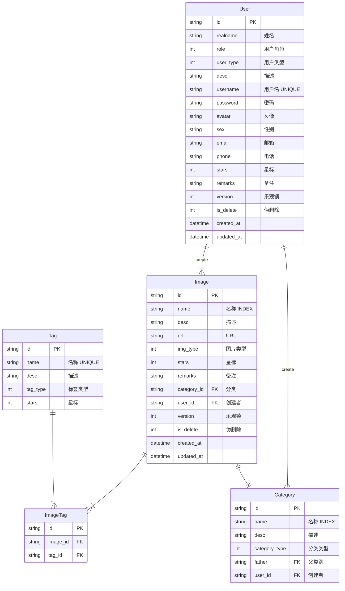

一个图像的数据库设计方案简述。

<!-- more -->

# 1. 需求分析

| 类别   | 使用                                | 路径              |
| ------ | ----------------------------------- | ----------------- |
| 原图   | 只有管理员和厂家可见                | `upload/original` |
| 打码图 | 格式为 `.jpg`，打码并加水印，详情图 | `upload/regular`  |
| 缩略图 | 用于显示搜索结果                    | `upload/thumb`    |
| 临时图 | 临时上传使用，对外不可见            | `upload/temp`     |

# 2. 数据库设计



`Tag` 表示标签，可自行创建无需删除，标签可以用于增强搜索能力和提示词。

`Category` 表示分类，分类将提前创建并用于可视化，分类允许分出父类和子类。

# 3. 前端设计

## 3.1 前端项目搭建

本项目基于 Vue3 + TypeScript + Vite，使用原生组件。

|    组件    |            依赖库             |
| :--------: | :---------------------------: |
|    存储    |            `pinia`            |
| 存储持久化 | `pinia-plugin-persistedstate` |
|    路由    |         `vue-router`          |
|    请求    |            `axios`            |
|  RSA 加密  |          `jsencrypt`          |
|  事件总线  |            `mitt`             |

这里使用 `pnpm` 作为包管理器。如果你没有安装 `pnpm` 请使用下面的命令安装：

```bash
npm i -g pnpm
```

然后创建项目：

```bash
pnpm create vite
```

输入项目名称 `img-dbmgr`，回车。选择框架 `vue`，然后选择模板 `vue-ts`，回车即完成创建。

进入开发模式：

```bash
cd img-dbmgr
pnpm i
pnpm run dev
```

整个过程快如闪电，不到一分钟项目已经创建好了。

安装依赖：

```bash
pnpm i
```

开发模式：

```bash
pnpm run dev
```

打包为生产版本：

```bash
pnpm run build
```

预览测试：

```bash
pnpm run preview
```

## 3.2 设置开发配置和依赖

### 3.2.1 设置监听地址端口

为了能在手机上调试，需要设置从网络中访问。编辑 `vite.config.js` 文件：

```ts
// https://vitejs.dev/config/
export default defineConfig({
  plugins: [vue()],
  server: {
    host: '0.0.0.0',
    port: 3000
  }
})
```

保存后自动监听：

```text
下午2:46:23 [vite] server restarted.

  ➜  Local:   http://localhost:3000/
  ➜  Network: http://192.168.0.71:3000/
```

### 3.2.2 设置别名

为了项目访问路径的便利，一般设置 `@` 为 `/src`：

```ts
// https://vitejs.dev/config/
export default defineConfig({
  plugins: [vue()],
  server: {
    host: '0.0.0.0',
    port: 3000
  },
  resolve: {
    alias: {
      '@': '/src'
    }
  }
})
```

设置代理开发服务器：

```ts
// https://vitejs.dev/config/
export default defineConfig({
  plugins: [vue()],
  server: {
    host: '0.0.0.0',
    port: 3000,
    proxy: {
      '/api': {
        target: 'http://localhost:8081',
        rewrite: path => path.replace(/^\/api/, '')
      }
    }
  },
  resolve: {
    alias: {
      '@': '/src'
    }
  }
})
```

### 3.2.3 安装和设置 Vue-Router

安装 `vue-router`：

```bash
pnpm install vue-router@4
```

### 3.2.4 安装和设置 Pinia

```bash
pnpm i pinia
```

### 3.2.5 安装其他模块

```bash
pnpm i axios
pnpm i jsencrypt
pnpm i mitt
```

## 3.3 开发模块

这个系统分为这几个模块：

- 主页
- 搜索图片
- 登录
- 上传图片
- 管理图片
- 管理分类

# 4. 后端设计


# 5. 部署和维护


