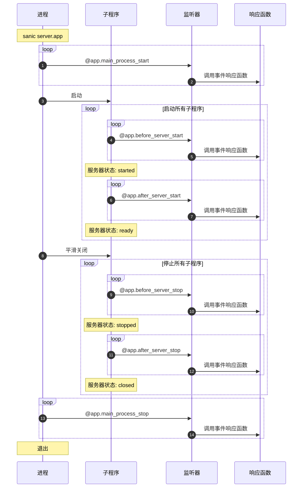

本文主要是入坑 Sanic 开发介绍，一些开发参考和最佳实践。

<!-- more -->

<div class="note note-warning">

**版本建议**

本文所使用的 Python 是 Python3.9，本文建议的版本也是 3.9 或更新的版本，如果你的依赖库不高于 Python3.9，可以下载对应版本的 Python 。

</div>

# 1. Sanic 简介

## 1.1 Sanic 是什么

下面引用自官网的介绍：

<div class="note note-success">

Sanic 是 Python3.7+ **Web 服务器和 Web 框架**，旨在提高性能。它允许使用 Python3.5 中添加的 `async` / `await` 语法，这使得您的代码有效的避免阻塞从而达到提升响应速度的目的。

> Sanic 的目标是提供一种简单且快速，集创建和启动于一体的方法，来实现一个易于修改和拓展的 HTTP 服务。

注意：Sanic 和其他的异步 Python 库并不是让程序执行速度变得更快，只是让它们的组织方式变得更为高效而已。

</div>

Sanic 的官方文档在 [readthedocs.io](https://sanic.readthedocs.io/) 上可以访问。

Sanic 的特征：
- 内置极速 Web Server
- 生产准备就绪
- 极高的拓展性
- 支持 ASGI
- 简单直观的 API 设计
- 社区保障

Sanic 的写法类似于 Flask，但它们的设计理念不同。Sanic 不仅仅是 Web 框架，也是 Web 服务器，Sanic 自带服务器，直接可用于生产环境。

经过近几年的发展，Sanic 已经发展到完全可用于生产环境的高性能 Python Web 框架。

<div class="note note-success">

**Sanic 性能如何**

像 SpringBoot 一样，Sanic 自带高性能服务器，其性能也不低于 SpringBoot 。虽然 Python 在很多方面速度不如 Java，但动态语言的优势已经被一些框架充分挖掘。基准测试表明，常规任务下的 Sanic 速度和 Go 开发的 Web 服务接近。

**Sanic 社区如何？**

Sanic 社区越来越大，而且用户也越来越多，截至目前（2022-06-19），[Sanic 的月下载量](https://pepy.tech/project/sanic) 已经达到 855k，周下载量达到 200k 。

</div>

## 1.2 快速开始

安装 Sanic：

```bash
pip install sanic
```

Hello World：

```python
from sanic import Sanic
from sanic.response import text

app = Sanic("MyHelloWorldApp")

@app.get("/")
async def hello_world(request):
    return text("Hello, world.")

if __name__ == "__main__":
    app.run(host="0.0.0.0", port=8000)
```

Sanic 支持完整的类型注解，我们大力推荐 Python3.9 以上版本使用：

```python
from sanic.response import HTTPResponse, text
from sanic.request import Request

@app.get("/typed")
async def typed_handler(request: Request) -> HTTPResponse:
    return text("Done.")
```

<div class="note note-warning">

**注意事项**

- 除非您有一个明确的需求和完善的使用方法，否则的话，请尽量使用 `async` 来声明响应函数
- `request` 对象始终是响应函数的第一个参数，不同于 Flask 等框架，请求是 **显式传递** 的
- **必须** 使用 `Response` 或继承自 `Response` 的类作为响应类型

</div>

## 1.3 扩展和工具

Sanic 有许多由社区构建和维护的第三方插件。但是，为了帮助 API 开发者，Sanic 组织维护了一个名为 [Sanic Extensions](https://sanic.dev/zh/plugins/sanic-ext/getting-started.html) 的项目来提供各种易用的功能，包括:
- OpenAPI 使用 Redoc 和 Swagger 的文档
- CORS 保护
- 依赖注入路由处理程序
- `Request` 参数检查
- 自动创建 `HEAD`、`OPTIONS` 和 `TRACE` 响应函数
- 响应序列化

安装它的首选方法是与 Sanic 一起安装，当然您也可以单独安装，单独安装的命令为：

```bash
pip install sanic-ext
```

从 v21.12 开始，只要安装了 `sanic-ext`，Sanic 将自动设置 Sanic 扩展。您可以通过以下的两种方式来进行访问拓展功能:
- `app.extend()`：用于配置 Sanic 拓展
- `app.ext`：注入到应用程序的扩展实例

请查看 [插件文档](https://sanic.dev/zh/plugins/sanic-ext/getting-started.html) 来了解如何使用拓展插件。

# 2. Sanic 入门

## 2.1 Sanic 开发配置

第一步是

## 1.4 Sanic 应用

### 1.4.1 应用实例

`Sanic()` 是最基础的组成部分，通常我们会在一个名为 `server.py` 的文件中将其实例化：

```python
from sanic import Sanic

app = Sanic("My hello world app")
```

### 1.4.2 应用上下文

### 1.4.3 应用注册表

### 1.4.4 应用配置

## 1.5 响应函数

响应函数就是我们通常所说的 **视图**（Views）。在 Sanic 中，响应函数可以是任何一个可调用程序，它至少以一个 `request` 实例作为参数，并返回一个 `HTTPResponse` 实例或一个执行其他操作的协同程序作为响应。

也就是说，响应函数既可以是同步函数，也可以是异步函数。

由于异步任务的特点，在一些异步任何中混入一个同步任务将极大地减慢整个系统的速度。因此，你的工具链和组件最好全部是异步的，例如 MySQL 或 Redis 的驱动，消息队列和其他中间件的驱动库等。

在 [Awesome Sanic](https://github.com/mekicha/awesome-sanic) 中有许多性能优秀的 Sanic 异步工具，您可以在那里找到合适自己的异步工具。

Sanic 的测试套件（`sanic-testing`）充分的发挥了 `httpx` 的性能。如果需要异步的网络请求库或测试库可以参考 [异步网络库对比]()<!-- TODO：new 文章？ --> 。

## 1.6 请求

### 1.6.1 请求体

| 属性            | 含义               |
| --------------- | ------------------ |
| `request.json`  | 解析后的 JSON 对象 |
| `request.body`  | 正文的原始字节     |
| `request.form`  | 表单数据           |
| `request.files` | 上传的文件         |

`request.form` 对象和`request.files` 都是字典之一，每个值都是一个列表。这是因为 HTTP 同样允许单个键名被重用以发送多个文件。

它们的值获取方式也一样，大多数情况下您只需要使用 `.get()` 方法来获取列表中的第一个元素即可，如果您想获取列表中的全部元素，那么请使用 `.getlist()` 方法。

### 1.6.2 上下文

`request.ctx` 对象是存储请求相关信息的地方。

Sanic 本身并不使用上下文，这是为扩展应用设计的。这里通常被用来存储服务端通过某些验证后需要临时存储的身份认证信息以及专有变量等内容。更多的具体内容我们将在 [中间件](https://sanic.dev/zh/guide/advanced/middleware.html) 这一章节进行更多的描述，下面是一个简单的例子。

```python
@app.middleware("request")
async def run_before_handler(request):
    request.ctx.user = await fetch_user_by_token(request.token)

@app.route('/hi')
async def hi_my_name_is(request):
    return text("Hi, my name is {}".format(request.ctx.user.name))
```

最典型的用法就是将从数据库获取的用户对象存储在` request.ctx` 中。所有该中间件之后的其他中间件以及请求期间的处理程序都可以对此进行访问。

> 在 HTTP 协议要求通过 [keep alive](https://sanic.dev/zh/guide/deployment/configuration.html#keep-alive-timeout) 请求头来减少频繁连接所造成的时间浪费。

当多个请求共享一个连接时，Sanic 将提供一个上下文对象来允许这些请求共享状态。

```python
@app.on_request
async def increment_foo(request):
    if not hasattr(request.conn_info.ctx, "foo"):
        request.conn_info.ctx.foo = 0
    request.conn_info.ctx.foo += 1

@app.get("/")
async def count_foo(request):
    return text(f"request.conn_info.ctx.foo={request.conn_info.ctx.foo}")
```

### 1.6.3 路由参数

从路径提取的路由参数将作为参数（或更具体地作为关键字参数）传递到处理程序中。更多的详细内容我们将在 [路由](https://sanic.dev/zh/guide/basics/routing.html) 这一章节进行详细说明。

```python
@app.route('/tag/<tag>')
async def tag_handler(request, tag):
    return text("Tag - {}".format(tag))
```

### 1.6.4 请求参数

在 `request` 中，您可以通过两种属性来访问请求参数：
1. `request.args`
2. `request.query_args`

```python
>>> request.args
{'key1': ['val1', 'val3'], 'key2': ['val2']}
>>> request.args.get("key1")
'val1'
>>> request.args.getlist("key1")
['val1', 'val3']
>>> request.query_args
[('key1', 'val1'), ('key2', 'val2'), ('key1', 'val3')]
```

和上述的​ `request.form`、`request.files` 对象一样，`request.args` 同样是少数几种字典之一，每个值都是一个列表。这是因为 HTTP 允许单个键名被重用以发送多个值。

## 1.7 响应

所有的 [响应函数](https://sanic.dev/zh/guide/basics/handlers.html) 都必须返回一个 `Response` 对象，[中间件](https://sanic.dev/zh/guide/basics/middleware.html) 可以自由选择是否返回 `Response` 对象。

下面的响应函数都在 `sanic.response` 包下面：

| 对象类型头                  | 函数            | 响应码 |
| --------------------------- | --------------- | ------ |
| `text/plain; charset=utf-8` | `text()`        | 200    |
| `text/html; charset=utf-8`  | `html()`        | 200    |
| `application/json`          | `json()`        | 200    |
| N/A                         | `file`          | 200    |
| `text/plain; charset=utf-8` | `stream()`      | 200    |
| N/A                         | `file_stream()` | 200    |
| `application/octet-stream`  | `raw()`         | 200    |
| `text/html; charset=utf-8`  | `redirect()`    | 302    |
| N/A                         | `empty()`       | 204    |

请求返回的状态码可以使用 `status` 自定：

```python
@app.post("/")
async def create_new(request):
    new_thing = await do_create(request)
    return json({"created": True, "id": new_thing.thing_id}, status=201)
```

# 1. Sanic 应用配置

## 1.1 基础应用配置

Sanic 会将配置保存在应用程序对象的 `config` 属性中，它是一个可以通过字典的形式或者属性的形式进行操作的对象。

```python
app = Sanic("myapp")
app.config.DB_NAME = "appdb"
app.config["DB_USER"] = "appuser"
```

可以使用 `update()` 方法来更新其属性：

```python
db_settings = {
    'DB_HOST': 'localhost',
    'DB_NAME': 'appdb',
    'DB_USER': 'appuser'
}
app.config.update(db_settings)
```

<div class="note note-warning">

**命名规范**

配置的名称最好全部是大写的，使用 **大写字母加下划线** 命名规范，小写的配置名称可能产生预期外的结果。

</div>

## 1.2 加载配置

### 1.2.1 从环境变量加载

任何使用 `SANIC_` 作为前缀的环境变量都会被加载并应用于 Sanic 配置。例如，在环境变量中设置 `SANIC_REQUEST_TIMEOUT` 环境变量：

```bash
export SANIC_REQUEST_TIMEOUT=10
```

将会被应用程序自动加载，并传递到 `REQUEST_TIMEOUT` 配置变量中。

```python
>>> app.config.REQUEST_TIMEOUT
10
```

要禁用此规则，使用：

```python
app = Sanic(__name__, load_env=False)
```

如果需要自定义前缀，可以使用：

```python
app = Sanic(__name__, load_env='MYAPP_')
```

### 1.2.2 从脚本中加载

## 1.3 内置配置

## 1.4 超时配置

## 1.5 代理配置


# 2. Sanic 项目

## 2.1 项目结构

由于 Sanic 没有规范的项目结构安排，所以一定程度上项目的结构划分取决于自己的喜好，本文所列举的编排方式也是业界一般的使用方式，也可以根据自己的需要自己改编。

- `project_name/`
    - `docs/`
    - `src/`
        - `config/`
            - `__init__.py`
            - `config.py`
        - `static/`
        - `templates/`
        - `views/`
            - `__init__.py`
        - `run.py`
    - `[tests/]`
    - `requirements.txt`

项目相关的说明文档放在 `docs/` 文件夹下。

`src/` 则为源码，其中启动文件为 `run.py`（当然 `server.py` 或者 `main.py` 也是可以的，按照自己习惯均可），其中包含启动方法。有两个包 `config` 和 `views` 。

`config` 主要存放配置文件，以 Python 格式为主，即使以 `.yml` 或者 `.json` 格式定义的配置，也需要通过此处的配置类来导入。

`views` 则是视图包，所有的视图需要以 **蓝图**（Blueprint）的形式构建，下面会详细讲解蓝图的使用方式。

模板存放于 `templates/` 文件夹内，模板引擎推荐使用 `jinja2` 。推荐使用 `sanic-jinja2` 模块来渲染模板以简化操作，下面我们将详细对比。

<div class="note note-info">

**模板争端**

如果你的接口偏向于前端渲染（例如完全的 RESTful API 风格），那么你很可能不使用任何模板。

虽然近年来的趋势是前后端分离，服务更加靠近微服务和云原生，但是如果你不希望前后端完全分离，也可以继续使用模板。

使用模板的一个好处是对搜索引擎查找到有效内容有帮助，而且可以帮助用户加快加载速度（大部分情况下如此，因为请求更少，服务端已经帮助用户渲染了一部分数据）。

</div>

## 2.2 RESTful 风格的 API


## 2.3 使用模板

目前最好的、最快的渲染引擎当属 `jinja2`，安装 `sanic-jinja2` 的命令如下：

```bash
pip install sanic-jinja2
```

`sanic-jinja2` 的包很小，它主要依赖于 `jinja2` 。安装 `sanic-jinja2` 的同时也会安装 `jinja2` 。

# 3. 最佳实践

## 3.1 使用蓝图

**蓝图**（Blueprint）是应用中可以作为子路由的对象。蓝图定义了同样的添加路由的方式，您可以将一系列路由注册到蓝图上而不是直接注册到应用上，然后再以可插拔的方式将蓝图注册到到应用程序。

### 3.1.1 创建蓝图

首先，您必须先创建一个蓝图。蓝图对象有着和 `Sanic` 对象十分相似的方法，它也提供了相同的装饰器来注册路由。

```python
# my_blueprint.py
from sanic.response import json
from sanic import Blueprint

bp = Blueprint("my_blueprint")

@bp.route("/")
async def bp_root(request):
    return json({"my": "blueprint"})
```

接下来，将蓝图注册到你的应用上：

```python
from sanic import Sanic
from my_blueprint import bp

app = Sanic(__name__)
app.blueprint(bp)
```

蓝图也提供了 `@websocket()` 装饰器和 `add_websocket_route()` 方法来实现 WebSocket 通讯。

<div class="note note-success">

从 v21.12 开始，您可以在向蓝图中添加响应函数之前或之后注册蓝图。

```python
app.blueprint(bp)

@bp.route("/")
async def bp_root(request):
    ...
```

</div>

### 3.1.2 复制蓝图

使用 `copy()` 方法可以将蓝图以及附加到其上的所有内容复制到新实例中。唯一需要的参数是给它传递一个新的 `name` 。当然，您也可以使用它来覆盖旧蓝图中的任何值。

```python
v1 = Blueprint("Version1", version=1)

@v1.route("/something")
def something(request):
    pass

v2 = v1.copy("Version2", version=2)

app.blueprint(v1)
app.blueprint(v2)
```

## 3.2 异常处理

## 3.3 装饰器

## 3.4 日志

## 3.5 测试

请参见 Sanic 的测试套件 [`sanic-testing`](https://github.com/sanic-org/sanic-testing) 。


工作流程的生命周期如下：



